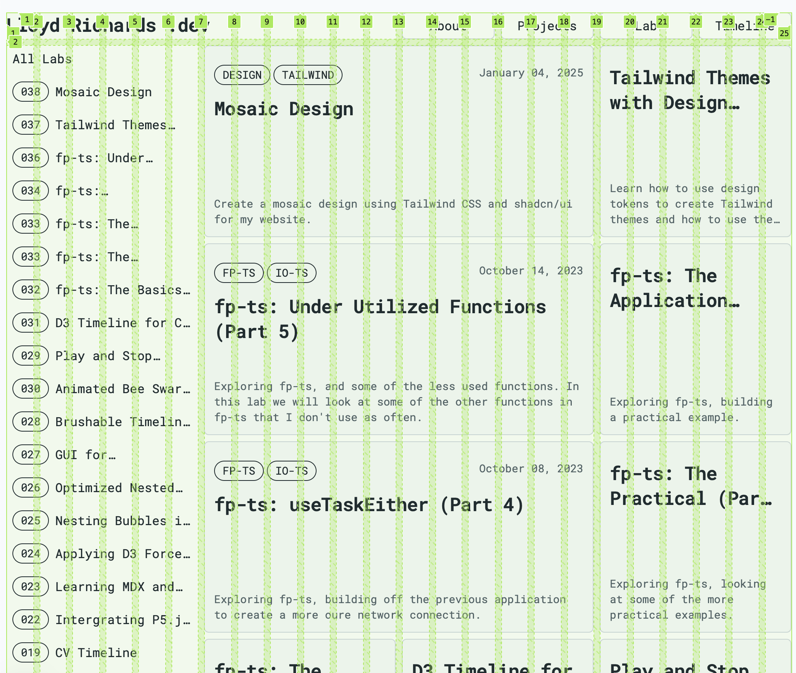
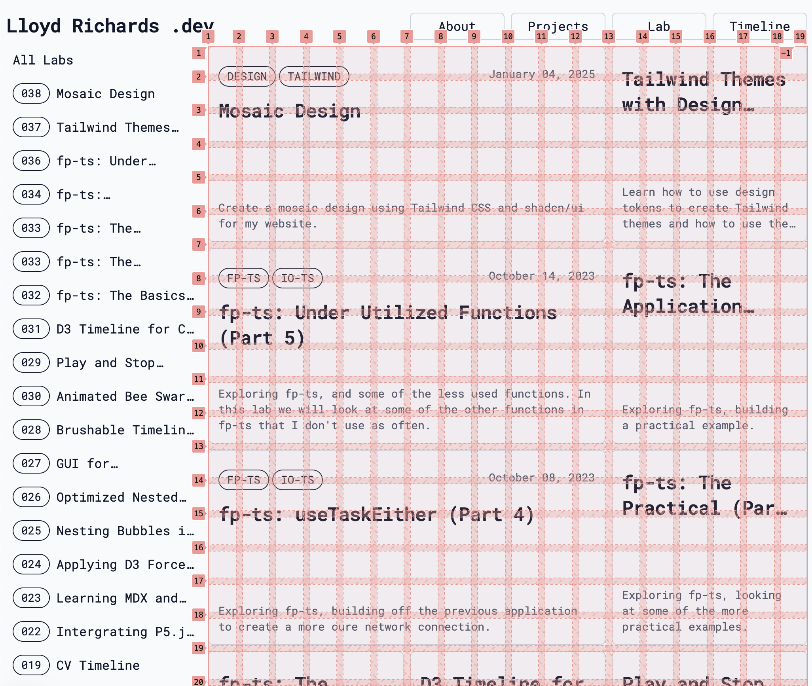

import Image from "next/image";
import { createOGImageMetadata } from "@/lib/seo";

export const metadata = createOGImageMetadata({
  id: "038",
  title: "Mosaic Design",
  date: "2025-01-04",
  isFeatured: true,
  description:
    "Create a mosaic design using Tailwind CSS for my website. A bento-style layout with a flexible grid system.",
  tags: ["design", "tailwind"],
});

For my website redesign, I want to create a mosaic design using Tailwind CSS. To
recycle as much of the existing design as possible, my idea is to create a
flexible grid system that can be used to create a bento-style layout.

> A **bento-style layout** is a design approach inspired by the
> compartmentalized structure of a bento box. In this layout, the webpage is
> divided into distinct, modular sections (or "compartments") that serve as
> containers for different types of content. Each compartment is neatly
> organized, creating a visually balanced and cohesive presentation.

## Design Concept

To make things responsive and flexible, I'm using a 12-column grid system with
three breakpoints: `sm`, `md`, and `lg`. But in order to be more flexible with
extra small components, I'm going to double up the columns and rows:

- `sm` (small): 4 columns (8 columns)
- `md` (medium): 8 columns (16 columns)
- `lg` (large): 12 columns (24 columns)

```text
lg (> 1024px)
----┳----┳----┳----┳----┳----┳----┳----┳----┳----┳----┳----┳----┳----
    ┃  1 ┃  2 ┃  3 ┃  4 ┃  5 ┃  6 ┃  7 ┃  8 ┃  9 ┃ 10 ┃ 11 ┃ 12 ┃
    ┣----╋----╋----╋----╋----╋----╋----╋----╋----╋----╋----╋----┫
    ┃    ┃    ┃    ┃    ┃    ┃    ┃    ┃    ┃    ┃    ┃    ┃    ┃
    ┣----╋----╋----╋----╋----╋----╋----╋----╋----╋----╋----╋----┫
    ┃    ┃    ┃    ┃    ┃    ┃    ┃    ┃    ┃    ┃    ┃    ┃    ┃
    ┣----╋----╋----╋----╋----╋----╋----╋----╋----╋----╋----╋----┫

md (> 768px)
    ┏----┳----┳----┳----┳----┳----┳----┳----┓
    ┃  1 ┃  2 ┃  3 ┃  4 ┃  5 ┃  6 ┃  7 ┃  8 ┃
    ┣----╋----╋----╋----╋----╋----╋----╋----┫
    ┃    ┃    ┃    ┃    ┃    ┃    ┃    ┃    ┃
    ┣----╋----╋----╋----╋----╋----╋----╋----┫
    ┃    ┃    ┃    ┃    ┃    ┃    ┃    ┃    ┃
    ┣----╋----╋----╋----╋----╋----╋----╋----┫

sm (< 768px)
    ┏----┳----┳----┳----┓
    ┃  1 ┃  2 ┃  3 ┃  4 ┃
    ┣----╋----╋----╋----┫
    ┃    ┃    ┃    ┃    ┃
    ┣----╋----╋----╋----┫
    ┃    ┃    ┃    ┃    ┃
    ┣----╋----╋----╋----┫
```

These boxes are then used as the base for creating and aligning elements on the
page. Using the `gap` utility class, I can create a consistent spacing between
the elements, while using the `col-span-*` utility class to define the size of
the elements.

```text
md (> 768px)
    ┏-----------------------------┳-----┳-----┳-----┓
    ┃  logo                       ┃ nav ┃ nav ┃ nav ┃
    ┣-----┳-----------------------┻-----╋-----┻-----┫
    ┃ nav ┃                             ┃           ┃
    ┣-----┫           box-md            ┃ square-md ┃
    ┃ nav ┃                             ┃           ┃
    ┣-----╋-----------┳-----------------┻-----------┫
    ┃ nav ┃           ┃                             ┃
    ┣-----┫ square-md ┃           box-md            ┃
    ┃ nav ┃           ┃                             ┃
    ┣-----╋-----------┻-----------------┳-----------┫

```

## Implementation

Initially, I'll create a basic grid system using CSS and planned to use the
`subgrid` feature to create the various parts of the elements. However it became
clear that the collapsible nature of the grid system would be difficult to work
with expanding content, better used with a `flex` system. The solution was a
combination of Tailwind utility classes and `subgrid` which could be implemented
when flexbox was not needed:

```css showLineNumbers {2-6} title="global.css"
@theme inline {
  --grid-auto-rows-lg: calc(
    min(100vw, var(--container-6xl)) / 24 - var(--spacing) * 48 / 23
  );
  --grid-auto-rows-md: calc(100vw / 16 - var(--spacing) * 32 / 15);
  --grid-auto-rows-sm: calc(100vw / 8 - var(--spacing) * 16 / 7);
}

@utility mosaic-rows {
  @apply auto-rows-sm md:auto-rows-md lg:auto-rows-lg gap-2;
}

@utility mosaic-columns {
  @apply grid-cols-8 gap-2 md:grid-cols-16 lg:grid-cols-24;
}
```

Calculating the `grid-auto-rows` based on the viewport width and the number of
columns, I can create a responsive grid system that can be used to create a
mosaic design. The `mosaic-rows` and `mosaic-columns` utility classes can be
used to apply the grid system to any element, and when combined with the
`subgrid` it makes sure everything is aligned correctly.



The resulting structure looks like this:

```htm showLineNumbers {5}  title="index.html"
<body className="mosaic-columns grid">
  <head className="col-span-full grid-cols-subgrid mosaic-rows grid" />
  <main className="col-span-full grid-cols-subgrid grid">
    <aside className="col-span-4 mosaic-rows grid" />
    <article className="col-[7/-1] mosaic-rows grid-cols-subgrid grid" />
  </main>
  <footer />
</body>
```

Where the `<article />` element is using the `subgrid` and `mosaic-rows`
utilities to create the aligned grid system. From here all the `Tile` components
can be added to create the mosaic design:



## Tile components

From this system its possible to create `Tile` components that can be used to
wrap content and create a mosaic design. These tiles can be responsive too, with
the ability to change the number of columns and rows based on the screen size.

| Tile Size    | `sm` | `md` | `lg` |
| ------------ | ---- | ---- | ---- |
| `box-xxs`    | 1x1  | 2x1  | 3x1  |
| `box-xs`     | 2x1  | 4x2  | -    |
| `box-md`     | 8x4  | 10x5 | 12x6 |
| `square-xxs` | 1x1  | 2x2  | 3x3  |
| `square-xs`  | 1x1  | 2x2  | 3x3  |
| `square-md`  | 4x4  | 4x4  | 6x6  |

Using the `@container` feature of CSS, I can create multiple layouts for content
that is able to adapt to the available space. This allows for a more flexible
design that can be used to create a variety of different layouts. The example
above shows how the same `LabCard` component can be used to create different
layouts based on if its a square or a box.

## Conclusion

Creating a mosaic design using Tailwind CSS is a great way to add visual
hierarchy to a website. By using a flexible grid system, I can create a
bento-style layout that is responsive and easy to maintain. This design helps as
a base for future ideas such as having Tiles that expand when clicked and taking
more advantage of the `@container` features of CSS. `;
