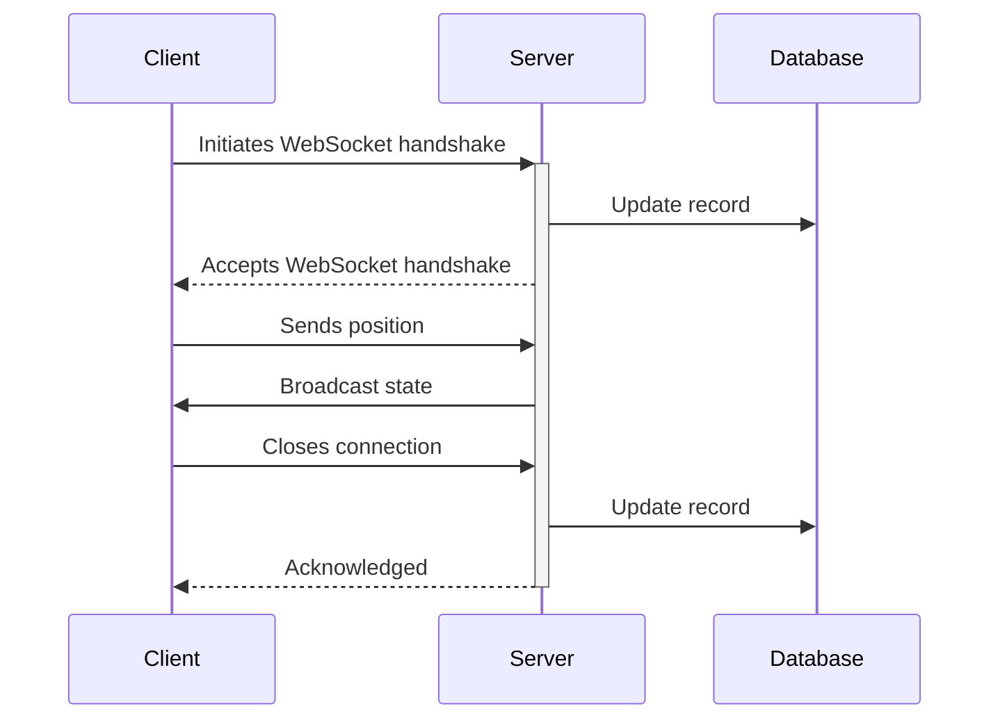
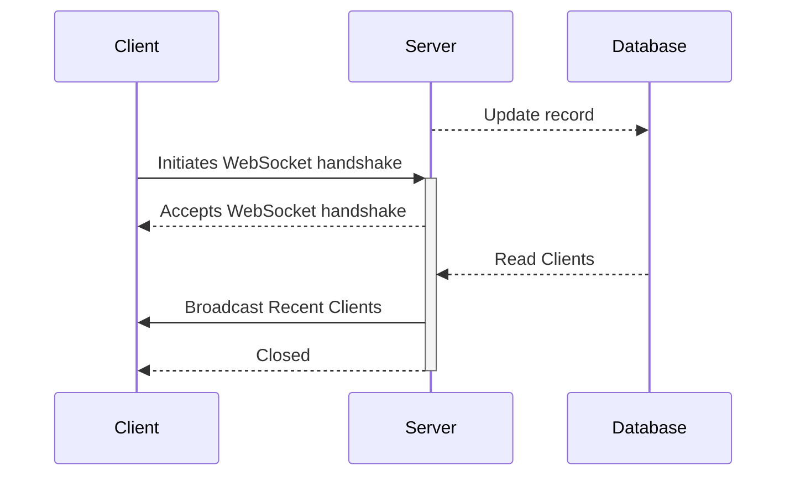

import { createOGImageMetadata } from "@/lib/seo";
export const metadata = createOGImageMetadata({
  id: "040",
  title: "Ghost Sockets",
  date: "2025-01-10",
  isFeatured: true,
  description:
    "Exploring web sockets with Go and React. Building a simple cursor application with web sockets.",
  tags: ["go", "web-sockets", "react"],
  repo: "https://github.com/lloydrichards/proj_ghost-sockets",
  href: "https://ghost.lloydrichards.dev/",
});

With this lab project I wanted to explore of the usage of WebSockets across both
the client and server side. The basic idea was to track cursor movements on the
client side, send the data to the server, then the server would then broadcast
the cursor movements to all connected clients. The result is a ghostly cursor
that follows the movements other users make on the page.

<iframe
  src="https://ghost.lloydrichards.dev/"
  className="my-8 h-160 w-full rounded-2xl border-4"
></iframe>

## Architecture

With websockets, the client initiates a connection with the server. The server
then broadcasts messages to all connected clients. The server also maintains a
connection to a database to store records of users that have connected.



In this way its possible to build multiple http routes for various clients data
streams, for example an Active User feed which would broadcast the most recent
users and if they are currently active.



## Implementation

Building the server in Go was a fun and interesting challenge. Since it was
dedicated to the handling of events coming in from the client it made much more
sense to use Go then Node.js. The server is built using the `gorilla/websocket`
package which provides a simple API for building a WebSocket servers and the
simplicity of Go modules made separating the logic between the server, database
and manager.

```text /main.go/#success /App.tsx/#success
.
├── 📁 client
│   └── 📁 src
│       ├── 📁 components
│       │   ├── 📁 ui
│       │   │   └── cursor.tsx  # Cursor component
│       │   └── Dashboard.tsx   # Main dashboard component
│       └── App.tsx             # Main entry point for the client
│
└── 📁 server
    ├── 📁 cmd
    │   └── 📁 api
    │       └── main.go         # Main entry point for the server
    └── 📂 internal
        ├── 📁 database
        │   ├── database.go     # Database connection and CRUD operations
        │   ├── migration.go    # Database migrations
        │   └── schema.go       # Database schema
        └── 📁 server
            ├── client.go       # Client connection and message handling
            ├── event.go        # Event handling
            ├── manager.go      # WebSocket manager
            ├── routes.go       # HTTP routes
            └── server.go       # Setting up the HTTP server
```

With the server built, the client was built using Vite, React and the
`useWebSocket` hook from `react-use-websocket`. The hook provides a simple API
for connecting to a WebSocket server and sending and receiving messages.

```tsx showLineNumbers title="Dashboard.tsx"
export const Dashboard: React.FC<DashboardProps> = ({ username }) => {
  const [players, setPlayers] = useState<Player[]>([]);

  const { sendJsonMessage, lastJsonMessage } = useWebSocket(
    "wss://ghost.lloydrichards.dev/ws",
    {queryParams: { username }}
  );

  const handleMouseMove = (e: React.MouseEvent<HTMLDivElement>) => {
    sendJsonMessage({
      type: "update_position",
      { x: e.clientX, y: e.clientY },
    });
  };

  return (
    <>
      <h1>Dashboard</h1>
      <Cursor client onMove={handleMouseMove} />
      <PlayerList players={players} />
    </>
  );
};
```

The important part was setting up a system between the client and server where
messages would have a type and payload. This allowed for the server to
differentiate between different types of messages and act accordingly. For the
time being this is just used to update the position, but can be easily expanded
to include other types of messages.

```go showLineNumbers title="manager.go"
type Manager struct {
	Clients ClientList
	db      database.Service
	sync.RWMutex

	handlers map[string]EventHandler
}

func (m *Manager) setupHandlers() {
	m.handlers["update_position"] = UpdatePosition
  // m.handlers["score"] = UpdateScore
  // m.handlers["chat"] = ChatMessage
}

func (m *Manager) routeEvent(event Event, c *Client) error {
	handler, ok := m.handlers[event.Type]
	if !ok {
		return errors.New("no handler for event type")
	}
	err := handler(event, c)
	if err != nil {
		return err
	}
	return nil
}
```

```go showLineNumbers title="event.go"
func UpdatePosition(event Event, c *Client) error {

	var update UpdatePositionEvent
	err := json.Unmarshal(event.Payload, &update)
	if err != nil {
		return err
	}

	log.Printf("Update: %s ->    x %d   y %d", c.username, int(update.X), int(update.Y))

	prevPos := Position{X: c.state.X, Y: c.state.Y}
	curPos := Position{X: update.X, Y: update.Y}

	vx, vy := velocity(prevPos, curPos, float64(update.Delta))
	ang := angle(prevPos, curPos)
	spd := speed(vx, vy)
	acc := acceleration(c.state.Spd, spd, float64(update.Delta))

	c.state.X = curPos.X
	c.state.Y = curPos.Y
	c.state.Vx = vx
	c.state.Vy = vy
	c.state.Ang = ang
	c.state.Spd = spd
	c.state.Acc = acc

	for client := range c.manager.Clients {
		broadcastState(client)
	}
	return nil
}
```

## Next Steps

Right now I'm pretty happy with the current state, but have lots of ideas for
what could be done with the technology. Some ideas include:

- **Force Driven Data Visualization** -> Users can push and pull data points on
  a map.
- **Maze Game** -> Users can navigate a maze together.
- **Real-time Chat Room** -> Users can chat with each other in real-time, but
  only when they are close to each other.

I'm excited to see where this project goes and what other ideas I can come up
with.
