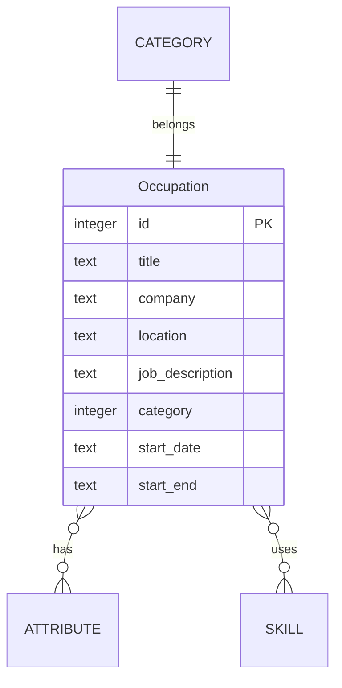

import { createOGImageMetadata } from "@/lib/seo";
export const metadata = createOGImageMetadata({
  id: "042",
  title: "Read-only Database in Next.js",
  date: "2025-01-17",
  description:
    "How I'm using SQLite in a Next.js app to create a read-only database.",
  tags: ["database", "drizzle", "sqlite"],
  isFeatured: true,
});

In the past, I've relied on frontmatter and MDX files to create the dataset for
my occupations and timeline. Since moving away from `contentLayer` this setup
has made less sense and since I'm not displaying any MDX content for the
occupations it's felt necessary to change this data layer.

I got this idea the other day to use SQLite as a read-only database in my
Next.js. I've had issues with this in the past since the edge-nature of Vercel
deployments makes creating stateful databases difficult. However, I'm not
looking to write to the database, only read from it. Maybe this will work.

## Database Setup

Borrowing heavily from the [T3 stack](https://create.t3.gg/), I've setup a new
service for the `db` and using [drizzle](https://orm.drizzle.team/) +
[@libsql/client](https://github.com/tursodatabase/libsql-client-ts) to interact
with a SQLite database.

I've build a few other application this way and enjoy a setting up a database
layer like this.

```text
📂 src
├── 📂 service
│   ├── 📁 api
│   └── 📁 db
│       ├── 📁 migrations  // <- output from drizzle.config.ts
│       ├── 📁 schema
│       │   ├── ...
│       │   └── index.ts  // <- schema definition
│       ├── seed.ts       // <- seed data
│       └── index.ts      // <- db setup
└── ...
```

Probably the most important part of the setup is the `/db/index.ts` file. This
is where the database is setup and the connection is established.

```typescript showLineNumbers {17} title="src/service/db/index.ts"
import { createClient, type Client } from "@libsql/client";
import { drizzle } from "drizzle-orm/libsql";

import { env } from "@/lib/env";
import * as schema from "./schema";
import path from "path";

const globalForDb = globalThis as unknown as {
  client: Client | undefined;
};

const initClient = () => {
  if (env.NEXT_RUNTIME === "edge") {
    // HACK: Skip database initialization in edge runtime
    return null as unknown as Client;
  }
  const dbPath = path.join(process.cwd(), env.DB_FILE_NAME);
  return globalForDb.client ?? createClient({ url: `file:${dbPath}` });
};

export const client = initClient();

if (env.NODE_ENV !== "production") globalForDb.client = client;

export const db = drizzle(client, { schema });
export type db = typeof db;
```

The part that makes this work with Vercel is the `dbPath` variable. This is
where the database file is stored. I've found that using `process.cwd()` is the
best way to get the root of the project. This way, the database file is stored
in the root of the project and can be accessed by the Next.js serverless
functions.

> ### Note
>
> While this works as expected when building out the application in Vercel for
> statically generated pages, I've been running into issues with the serverless
> functions. I'm not sure if this is a limitation of Vercel or if I'm doing
> something wrong. I'll need to investigate this further.

## Schema Definition

The schema for the occupations is pretty simple. I borrowed from the original
type definitions I had in the MDX files, but have added some relationships to
make data normalization easier.



Building the schema in drizzle is nice and simple, but the important part is how
the many-to-many relationships are setup.

```typescript {2, 15-19, 31-34}
export const skill = sqliteTable("skill", {
  id: integer().primaryKey({ autoIncrement: true }),
  name: text().notNull().unique(),
  description: text(),
});

export const occupationToSkill = sqliteTable(
  "occupation_to_skill",
  {
    occupation: integer("occupation_id")
      .notNull()
      .references(() => occupation.id, {
        onDelete: "cascade",
      }),
    skill: integer("skill_id")
      .notNull()
      .references(() => skill.id, {
        onDelete: "cascade",
      }),
  },
  (t) => [primaryKey({ columns: [t.occupation, t.skill] })],
);

export const occupationToSkillRelations = relations(
  occupationToSkill,
  ({ one }) => ({
    occupation: one(occupation, {
      fields: [occupationToSkill.occupation],
      references: [occupation.id],
    }),
    skill: one(skill, {
      fields: [occupationToSkill.skill],
      references: [skill.id],
    }),
  }),
);
```

The `occupation_to_skill` table is the many-to-many relationship between
`occupation` and `skill`, and the `occupationToSkillRelations` is the
relationship that drizzle uses to join the two tables. This is a very powerful
and makes creating the data layer very easy:

```typescript {4-8}
const occupations = await db.query.occupation.findMany({
  with: {
    category: true,
    skills: {
      with: {
        skill: true,
      },
    },
    attributes: {
      with: {
        attribute: true,
      },
    },
  },
});
```
