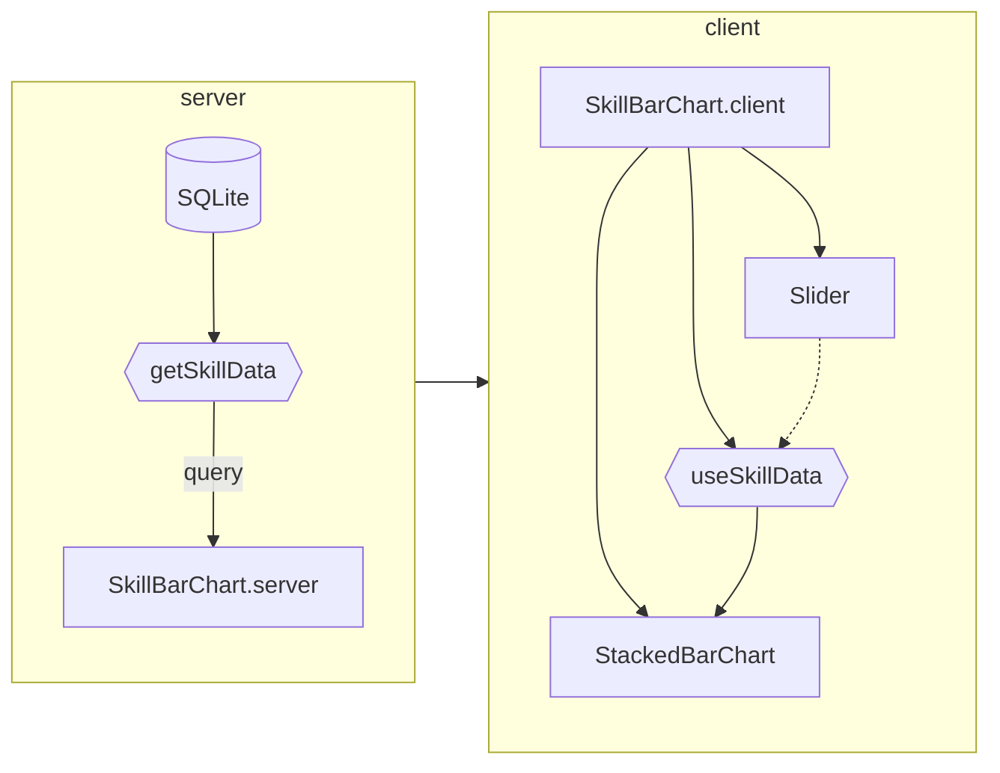
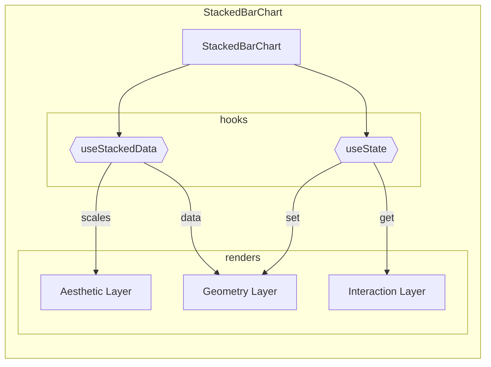

import { createOGImageMetadata } from "@/lib/seo";
export const metadata = createOGImageMetadata({
  id: "043",
  title: "Skill Bar Chart",
  date: "2025-01-26",
  description:
    "Create a bar chart that displays the my skills built from the Occupation and Skill tables.",
  tags: ["database", "drizzle", "sqlite"],
});

With the addition of the SQLite database to hold my occupation and skill data,
there was an opportunity to create an interesting visualization. With some
assumptions on how to calculate the skill level, I created a bar chart that
displays the skills I have built over time. Using SQL to query the data, I
grouped the skills by type and calculated the level based hours worked on each
skill.

import { SkillBarChart } from "@/components/organism/skill_bar_chart/skill_bar_chart.server";

<div className="h-120">
  <SkillBarChart />
</div>

## Dataset

Within the database, I have two tables, `occupation` and `skill`, with a many to
many relationship between them. The `occupation_to_skill` table is used to link
the two tables together. An interesting idea was to calculate the number of
hours worked on each skill by calculating the difference between the start and
end date of each occupation. In SQL this was fairly easy with a couple joins.

```sql
SELECT "skill.type",
       "skill.name",
       "skill.description",
       "occupation.start_date",
       "occupation.end_date"
       "occupation.pensum",
FROM   "occupation_to_skill"
       LEFT JOIN "skill"
              ON "skill"."id" = "occupation_to_skill"."skill_id"
       LEFT JOIN "occupation"
              ON "occupation"."id" = "occupation_to_skill"."occupation_id"
```

> Initially I wanted to do all the aggregations in SQL using the `GROUP BY` and
> `SUM` functions, but I found that SQLite does not have very good functions for
> calculating number of months between two dates. So I decided to do the
> calculations in Typescript instead.

With the data fetched it was then possible to group and aggregate the data using
the occupations start data, end date and pensum. Using an estimate of 160 hours
per month, I calculated the number of hours worked on each skill weighted by the
pensum of the occupation.

```typescript
const hours = data.reduce(
  (acc, { months, pensum }) => acc + months * (pensum / 100) * 160,
  0,
);
```

While not the most accurate way to calculate the number of hours worked on each
skill, it does give a rough estimate of the time spent on each skill. This data
was then used to create the bar chart, where the height of the bar represents
the number of hours worked on each skill.

## Architecture

I've slowly been building up a design system for data visualizations using React
Server Components (RFC) in which the server fetches the data and the client
renders the visualization. The server component is responsible for fetching the
data from a database and aggregating it to be used in the client component,
which is responsible for filtering, interactions and visualization.



This creates a clear separation of concerns between the data fetching and
aggregation and the visualization. In this way its easier to test and maintain
the code, as well as recycle the data visualization components in other
projects. This also creates a very uni-directional flow of data, where each
layer only depends on the layer above it.

## Implementation

For the `StackedBarChart`, I've used [D3.js](https://d3js.org/) to create the
visualization, with a structural pattern similar to that of Grammar of Graphics.
By separating the aesthetics, geometry and interaction, I can create a more
modular and reusable component. While not used in this example, the geometry
layer is very useful when creating primitive level marks like bars, dots, lines
etc.



Also encapsulated the data mapping logic in the `useStackedData` hook continues
to help separate concerns and make the code more modular. This hook alongside
the the `useState` hook are used to manage the state of the component as well as
any client side interactions.
