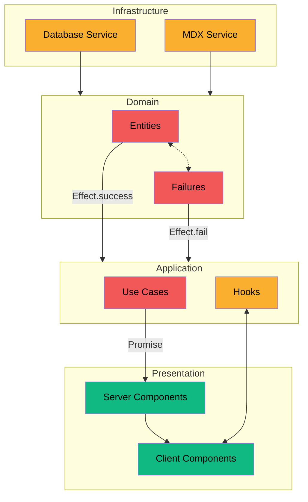

import { createOGImageMetadata } from "@/lib/seo";
export const metadata = createOGImageMetadata({
  id: "046",
  title: "Effect: Clean Architecture (Part 3)",
  description: "Thoughts on how to use Effect in a clean architecture.",
  tags: ["effect", "functional-programming", "clean-architecture"],
  date: "2025-02-07",
});

I think I was first introduced to Clean Architecture when I was working in
Flutter and using `fp-dart`. Separating the code into layers has been a great
way for me to rationalize my code and using Domain Driven Development (DDD) has
further helped me decouple the logic of the application from the limitation sof
the framework/technology.

I've noticed many times when introducing `fp-ts` to a project is amount of
pushback you get from other developers that are not familiar with the library.
Its hard to argue the benefits when you first need to teach or dictate a new way
of thinking about programming. `fp-ts` has a tendency to bleed into the rest of
the application. This means that regardless of the layering, there is still a
fundamental level of functional programming that is needed to understand any
part. In the past I've come up with strategies to mitigate this, so I would also
like to see how this works in `Effect`.

## Clean Architecture

> ### What is Clean Architecture?
>
> Clean Architecture is a software design pattern of separating the concerns of
> the application into layers. Keep the business logic separate from the
> implementation details of the application. This allows for the business logic
> to be tested and developed independently of the framework or technology used
> to build the application.

If the application is only build with a single framework then creating these
layers can be easy. However, when you start to introduce other frameworks or
technologies outside of the Infrastructure layer then it can get tricky. To
solve this problem, I've tried to keep "frameworks" like `React` and `Effect` to
only certain layers of a project. In the case of a NextJS application for this
site, I've tried to limit the use of `Effect` to the `Domain` and
`Application (Use Cases)` layers.



<div className="flex items-center justify-end gap-2 text-xs">
  <div className="flex gap-1">
    <div className="bg-destructive size-4" />
    <span>Effect</span>
  </div>
  <div className="flex gap-1">
    <div className="bg-warning size-4" />
    <span>Hybrid</span>
  </div>
  <div className="flex gap-1">
    <div className="bg-success size-4" />
    <span>React</span>
  </div>
</div>

In the diagram above, I've tried to show how the layers are separated. The
`Domain` layer contains a lot of `Effect` types such as `Schema`, `Context`, and
any `Error` that might need to be handled. The `Use Cases` in the `Application`
layer also use `Effect` to compose pipes that generate the data needed for the
`Presentation` layer.

### API Boundary

This boundary between the `Application` and `Presentation` is where I unwrap the
`Effect` into a `Promise` and run it with `Effect.runPromise`. This is done
using an exported map of functions that are used to fetch data from the
`Application` layer:

```ts {1-2} showLineNumbers title="api/index.ts"
const runEffect = <A, E>(effect: Effect.Effect<A, E, BunContext.BunContext>) =>
  Effect.runPromise(effect.pipe(Effect.provide(BunContext.layer)));

export const api = {
  labs: {
    fetchAllLabs: async () => runEffect(getAllLabs),
    fetchFeaturedLabs: async () => runEffect(getFeaturedLabs),
  },
  projects: {
    fetchAllProjects: async () => runEffect(getAllProjects),
    fetchFeaturedProjects: async () => runEffect(getFeaturedProjects),
    fetchProjectTeam: getTeamMembers,
    queryProjectBySlug: async (slug: string) =>
      runEffect(getProject(slug).pipe(Effect.either)),
    getProjectBySlug: async (slug: string) => runEffect(getProject(slug)),
  },
  occupations: {
    fetchAllOccupations: async () => runEffect(getAllOccupations),
  },
  skills: {
    fetchSkillData: async () => runEffect(getSkillData),
  },
} as const;
```

Creating the `runEffect()` is just a helper to be able to pass in the `Context`
in a single place. This is then used to run the `Effect` and return a `Promise`
that can be used in the `Presentation` layer.

Most in useful part here is that I have the opportunity to handle errors in
different ways while only defining the application logic once. For example; in
the `getProject` use case its possible for the effect to fail with either
parsing errors, importing, or simply not finding the project. In some of my api
functions I might want `React` and `Suspense` to handle these errors in a
graceful and performant way. But in other cases I might know that the error is
unexpected and want to crash the application by rejecting the promise.

```ts /getProject/#warning /getProject(slug)/#warning
const getProject = Effect.Effect<
  [ReactElement, Project], //                        Success
  SystemError | ParseError | MissingContentError, // Failure
  BunContext.BunContext //                           Context
>;

// Throw a rejected promise on error
const canThrow = (slug: string) => runEffect(getProject(slug));

// Handle the error in the presentation layer
const canCatch = (slug: string) =>
  runEffect(getProject(slug).pipe(Effect.either));

// Fall back to a default value on error
const canDefault = (slug: string) =>
  runEffect(getProject(slug).pipe(Effect.orElse(defaultProject)));

// Log the error and continue
const canLog = (slug: string) =>
  runEffect(getProject(slug).pipe(Effect.orElseLog(console.error)));
```

This is incredibly powerful because it allows me to define the error handling
strategy at the edge of the application where I need to pass the data to the
presentation layer. This means that I can handle the errors in a way that is
most appropriate for the context of the error.

### Graceful Error Handling

In the presentation layer, its then possible to leverage either the Promise or
the `Either` with the patterns in of both client and server side rendering. This
can be done with `Suspense` and `ErrorBoundary` to handle the promise rejection.
In the client components, the `Either` can be pattern matched on to handle the
error in a more explicit way or provide feedback to the user through the UI.

```tsx /ProjectPage/#warning
// Using Suspense and ErrorBoundary to handle the promise rejection
const ProjectPage = async ({ slug }) => {
  const result = await api.canThrow(slug);
  return {};
};

const SuspenseExample = async ({ slug }) => {
  return (
    <ErrorBoundary fallback={<Error />}>
      <Suspense fallback={<Loading />}>
        <ProjectPage slug={slug} />
      </Suspense>
    </ErrorBoundary>
  );
};
```

```tsx /ProjectPage/#warning
// Using Either to redirect to a 404 page
const ProjectPage = async ({ slug }) => {
  const result = await api.canCatch(slug);

  if (Either.isLeft(result)) {
    if (result.left._tag == "MissingContentError") {
      return notFound();
    }
    throw new Error(result.left._tag);
  }

  return {};
};
```

```tsx /ProjectPage/#warning
// Using default value to fall back to a default project
const ProjectPage = async ({ slug }) => {
  const result = await api.canDefault(slug);

  return {};
};
```

## Conclusion

Clean Architecture has been a great way for me to separate the concerns of my
application. Using `Effect` in the `Domain` and `Application` layers has allowed
me to take advantage of the functional programming features of `Effect` while
still being able to use `React` in the `Presentation` layer. This has allowed me
to handle errors in a way that is most appropriate for the context of the error.

I've been trying to implement as much of this in practise as possible with this
site, so if you want to dive more into the code you can check out the
[GitHub repository](https://github.com/lloydrichards/proj_portfolio-website) for
a closer look.
