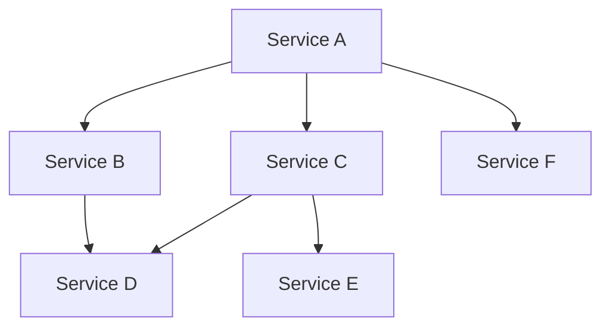
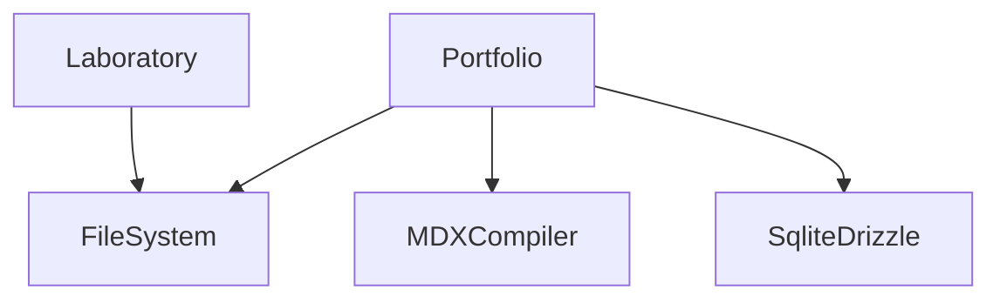

import { createOGImageMetadata } from "@/lib/seo";
export const metadata = createOGImageMetadata({
  id: "047",
  title: "Effect: Services (Part 4)",
  description: "Applying what I learns at Effect Days 2025",
  tags: ["effect", "functional-programming", "clean-architecture"],
  date: "2025-04-02",
  isFeatured: true,
});

While I've only been using `Effect` for around 2 months now, I'm already deeply
impressed by the library/framework. So much so that a couple weeks ago I
attended the [Effect Days 2025](https://effect.website/events/effect-days)
conference in Livorno, Italy. Was a wonderful event filled with inspiring talks
and very impressive developers, many of whom's libraries I've been using my
entire development career.

One particular part of the conference that I found very useful was the first day
workshop with Maxwell Brown and Tim Smart. The workshop
([repo](https://github.com/Effect-TS/effect-days-2025-workshop)) covered two
important topics: using `Effect.Service` to structure Effect applications, and
how to wrap existing API's in Effect. On the heels of this event I was inspired
to do some more refactoring of my website to apply what I had learnt.

## Effect.Service

I'm not going to go into too much detail about `Effect.Service` here, as I think
Maxwell did an amazing job of explaining it in the workshop and would recommend
anyone interested to check out the Effect
[docs](https://effect.website/docs/requirements-management/services/) on
services or wait for the workshop to get on
[YouTube](https://www.youtube.com/c/EFFECT-TS). However I will give a quick
example so you know what I'm referring too:

```ts
// Define the Errors of the Service
class CacheMissError extends Data.TaggedError("CacheMissError")<{
  readonly message: string;
}> {}

// Define the Shape of the Service
interface CacheShape {
  readonly set: (data: any) => Effect.Effect<string, never>;
  readonly get: (key: string) => Effect.Effect<string, CacheMissError>;
}

// Define the Service
const Cache = Context.GenericTag<Cache, CacheShape>("app/Cache");

// Define the Service Implementation
const makeMockCache = Cache.of({
  set: (_data) => Effect.succeed("MockKey"),
  get: (_key) => Effect.fail(new CacheMissError({ message: "Mock missed" })),
});
```

This is a very simple example of a service that has two methods: `set` and `get`
with a mocked implementation that could be used for testing. This patterns lets
you define the interface for the repository in the domain of your application
without needing to worry about implementation details that could come from your
infrastructure layer.

But there is a bit of boilerplate to get this working, and I think the new
`Effect.Service` makes it a bit cleaner if you start to need a dependency graph.
Say you're making a Service that you know will require accessing another
service, having to manually type the interface can be a bit verbose.

```ts showLineNumbers title="@/services/LabApi.ts"
class Cache extends Effect.Service<Cache>()("app/Cache", {
  dependencies: [BunFileSystem.layer],
  effect: Effect.gen(function* () {
    const fs = yield* FileSystem.FileSystem;
    const random = yield* Random.Random;
    return {
      get: (key: string) => fs.readFile(key),
      set: (value: Uint8Array) =>
        random.next.pipe(
          Effect.map((key) => key.toString()),
          Effect.tap((key) => fs.writeFile(key, value)),
        ),
    };
  }),
}) {}
```

This is a lot cleaner and allows you to define the dependencies of the service
as a default and then define other implementations as methods on the class.

## Dependency Graphs

What really fascinated me about this pattern is how to define a graph of
dependencies and then figure out the interfaces between them. This might be
something like what database layer that shows up in multiple services, or an API
client that is used in multiple services.



This makes the code much more modular and allows for parts to be swapped in and
out of whole applications. Rather then building an application dependent on the
infrastructure, its possible to plan out how everything will work together
without writing a single line of implementation details.

For my own website this sort of looks like this:



## Mocking Services

One of the hardest parts of testing is mocking modules and dependencies. But
with this service structure it becomes incredible easy to mock out the
dependencies and test very isolated parts of the application. For example say I
want test the `Laboratory` which depends on the `FileSystem`:

```ts
//      ┌─── Layer.Layer<Laboratory, PlatformError | ImportError | ParseError, never>
const LaboratoryLayer = Laboratory.Default;

//      ┌─── Layer.Layer<FileSystem.FileSystem, never, never>
const StubFileSystemLayer = Layer.succeed(
  FileSystem.FileSystem,
  FileSystem.makeNoop({
    readDirectory: () => Effect.succeed(["mockFile.ts"]),
  }),
);

//      ┌─── Layer.Layer<Laboratory, PlatformError | ImportError | ParseError, never>
const MockLaboratory = Laboratory.DefaultWithoutDependencies.pipe(
  Layer.provide(StubFileSystemLayer),
);
```

I can now use the `MockLaboratory` layer to test how the methods function with
different `.readDirectory` implementations. This is a very powerful pattern that
allows me to to write unit tests that are very isolated.

## Conclusion

I think the new `Effect.Service` is a very powerful pattern that allows for
incredible modularity and testability. Designing the graph of services and
dependencies without needing to worry about the implementation details is very
important for domain driven design. In my quest for cleaner architecture and
more maintainable code, Effect has found a place in my toolkit.
