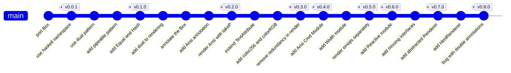
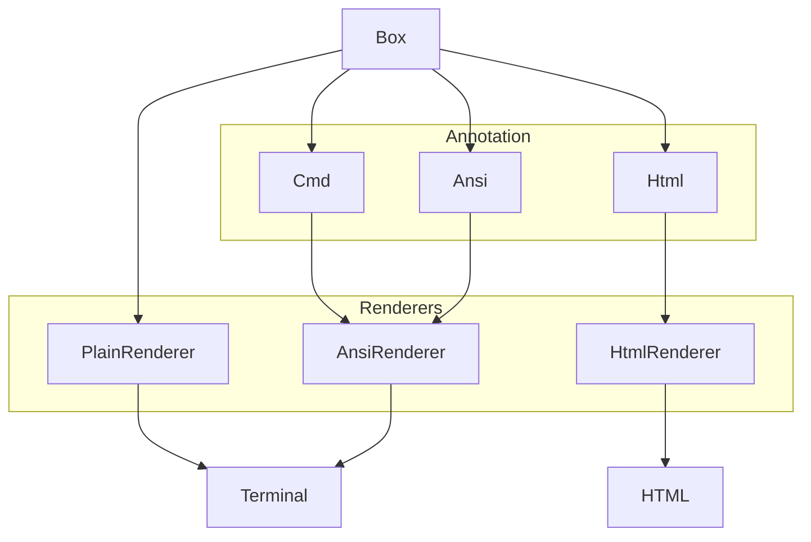

import { createOGImageMetadata } from "@/lib/seo";
export const metadata = createOGImageMetadata({
  id: "049",
  title: "Developing Effect Boxes",
  description:
    "The journey of building a pretty-printing library from Haskell port to Effect ecosystem integration.",
  tags: ["effect", "haskell", "pretty-printing", "typescript"],
  date: "2025-10-03",
  isFeatured: true,
  repo: "https://github.com/lloydrichards/proj_effect-boxes",
});

I recently was in need of a Terminal User Interface (TUI) library for a project
that would interface nicely with Effect. After some research I found nothing
that quite fit the bill, so I decided to build my own. This has been a very
interesting rabbit hole to go down, and I thought it would be fun to share some
of the journey so far.

This is the story of how `effect-boxes` went from a direct Haskell translation
to something capable of building both TUI and HTML layouts, as well as some of
the unique challenges that came up along the way.



## The Origin Story

The journey starts with
[Haskell's boxes library](https://github.com/lloydrichards/proj_effect-boxes)
and its recursive rendering model for pretty-printing text layouts. I've not
used Haskell before but coming from `fp-ts` and typescript it pretty easy to
understand the type signatures. What I started with looked something like this:

```haskell
-- | The basic data type.  A box has a specified size and some sort of contents.
data Box = Box { rows    :: Int
               , cols    :: Int
               , content :: Content
               }
  deriving (Show)

-- | Contents of a box.
data Content = Blank        -- ^ No content.
             | Text String  -- ^ A raw string.
             | Row [Box]    -- ^ A row of sub-boxes.
             | Col [Box]    -- ^ A column of sub-boxes.
             | SubBox Alignment Alignment Box
                            -- ^ A sub-box with a specified alignment.
  deriving (Show)

-- | Glue a list of boxes together, with the given alignment.
vcat :: Foldable f => Alignment -> f Box -> Box
hcat :: Foldable f => Alignment -> f Box -> Box

-- | Render a 'Box' as a String, suitable for writing to the screen or a file.
render :: Box -> String
```

With a bit back and forth, I was able to get the entire library ported to
TypeScript
([v0.0.1](https://github.com/lloydrichards/proj_effect-boxes/releases/tag/v0.0.1))
and working with basic layouts. This was a great start, and was an important
proof of concept for being able to build out things like tables, something the
existing `@effect/printer` library wan't able to do.

## Enhancements and Refactoring

While the first version worked, it still wasn't the Effect-first API that I was
looking for, not when compared with that could be integrated with things like
the `@effect/cli` library. So I started looking into the core packages off
effect for inspiration on what patterns I could apply. In the end I came up with
a few key features that were missing:

- **Ansi styling** for colors and text styles
- **Ansi control** sequences for cursor movement
- **Reactive updates** for terminal content

This meant I needed a more sophisticated Annotation system which could handle
both styling and control sequences. I also needed a more robust rendering system
that could handle escape sequences and terminal capabilities.

```ts title="Box.ts"
/**
 * The Box data type, representing a rectangular area of text with various combinators for layout and alignment.
 */
export interface Box<A = never>
  extends Pipeable, Equal.Equal, Hash.Hash, Inspectable.Inspectable {
  readonly [BoxTypeId]: BoxTypeId;
  readonly rows: number;
  readonly cols: number;
  readonly content: Content<A>;
  readonly annotation?: Annotation<A>;
}
```

```ts title="Annotation.ts"
/**
 * Generic annotation wrapper with branded type safety.
 *
 * Annotations provide a way to attach arbitrary data to boxes without
 * affecting their layout properties. This abstraction allows styling
 * systems (like ANSI colors) to work with the Box layout system.
 */
export interface Annotation<A = never>
  extends Pipeable, Equal.Equal, Hash.Hash {
  readonly [AnnotationTypeId]: "annotation";
  readonly data: A;
}
```

This generic annotation system allowed me to build out both the Ansi styling
system and Cmd control system as separate modules that could be composed
together. This was a big win as it meant I could keep the core Box system simple
while still allowing for powerful extensions.

## The Width of a String

At about this point I was running into a few bugs when adding emojis into my
examples. The rendering algorithm was based on the assumption that each
character in a string was one column wide, which turns out to be very wrong. I
went down a very deep rabbit hole learning about all the nuances of Unicode and
East Asian character widths, which resulted in adding the Width module.

```ts title="Width.ts"
/**
 * Calculate the visual width of a string, accounting for:
 * - ANSI escape sequences (stripped by default)
 * - Multi-character emojis (width 2)
 * - East Asian wide characters (width 2)
 * - Zero-width characters (width 0)
 * - Control characters (width 0)
 */
export const ofString: (input: string) => number;

// Basic ASCII strings
Width.ofString("hello"); // => 5
Width.ofString("Hello, world!"); // => 13

// ANSI escape codes are stripped automatically
Width.ofString("\x1b[31mred\x1b[0m"); // => 3 (color codes ignored)
Width.ofString("\x1b[1;32mbold\x1b[0m"); // => 4 (style codes ignored)

// East Asian characters are 2 columns wide
Width.ofString("你好"); // => 4 (2 Chinese characters)
Width.ofString("こんにちは"); // => 10 (5 Japanese characters)
Width.ofString("hello你好"); // => 9 (5 ASCII + 4 wide chars)

// All emojis are treated as 2 columns wide
Width.ofString("👋"); // => 2 (simple emoji)
Width.ofString("👩‍💻"); // => 2 (complex multi-char emoji)
Width.ofString("👍🏻"); // => 2 (emoji with skin tone)
Width.ofString("hello 👋"); // => 8 (text + emoji)

// Zero-width and combining characters
Width.ofString("café"); // => 4 (precomposed)
Width.ofString("cafe\u0301"); // => 4 (decomposed é with combining mark)
```

With this module in place, the rendering algorithm could now correctly calculate
the width of strings containing a mix of normal characters, emojis, and East
Asian characters. This was a crucial step towards making the library usable in
real-world scenarios.

With the release of
[v0.5.0](https://github.com/lloydrichards/proj_effect-boxes/releases/tag/v0.5.0)
I would now work on what I had initially set out to do which was start to build
some TUI components that could be used in an Effect application.

## Terminal Styling and Reactivity

The first couple examples I build were mostly focuses on being able to update an
existing content with new data in a reactive way. At first this meant just
clearing the terminal and re-rendering the entire box, but I quickly realized
that this wasn't going to work as it resulted in slight flickering. With the
`Cmd` module it was possible to move the cursor around and only update the parts
of the terminal, but getting the position was a manual process. What resulted
was a new annotation type that could be used to return back a Map of cursor
positions after rendering:

```ts title="Reactive.ts"
/**
 * Map of reactive IDs to their positions in the rendered output.
 *
 * Contains the calculated positions and dimensions of all reactive boxes
 * after layout processing. Essential for implementing cursor navigation,
 * click handling, and other interactive features in terminal applications.
 */
export type PositionMap = HashMap.HashMap<
  string, // Reactive ID
  {
    readonly row: number; // 0-based row position
    readonly col: number; // 0-based column position
    readonly rows: number; // height of the box
    readonly cols: number; // width of the box
  }
>;

/**
 * Annotates a box with a reactive identifier for position tracking.
 *
 * Transforms any box into a reactive box by adding position tracking
 * capabilities. Supports both data-first and data-last calling patterns
 * for flexible composition. The resulting box can be tracked in the
 * position map after rendering.
 */
export const makeReactive: {
  (id: string): <A>(self: Box<A>) => Box<Reactive>;
  <A>(self: Box<A>, id: string): Box<Reactive>;
};

/**
 * Collects positions of reactive annotations from a box.
 *
 * Traverses a box layout and extracts the calculated positions of all
 * reactive elements, returning a position map that can be used for
 * cursor navigation and interactive features. Essential for implementing
 * click handling, keyboard navigation, and dynamic updates.
 */
export const getPositions: <A>(self: Box<A>) => PositionMap;
```

With this it was possible to just annotate what I wanted to change and then get
back its position in the final layout to be able to move the cursor there:

```ts
// Create a simple layout with a reactive button
const layout = Box.vcat(
  [
    Box.text("Welcome to the App"),
    Box.hcat(
      [
        Box.text("Click here: "),
        Reactive.makeReactive(Box.text("[ OK ]"), "ok-button"),
      ],
      Box.top
    ),
  ],
  Box.left
);

// Get positions of all reactive elements
const positions = Reactive.getPositions(layout);

// Find the position of our button
console.log(positions);
// HashMap containing: "ok-button" -> { row: 2, col: 12, rows: 1, cols: 6 }

// Get cursor command to navigate to the button
const moveToButton = Reactive.cursorToReactive(positions, "ok-button");
if (Option.isSome(moveToButton)) {
  console.log(Box.render(moveToButton.value)); // Outputs ANSI cursor movement
}
```

## The Renderer

The final piece (so far) was the rendering engine itself. So far I only had two
types of rendering:

- Plain layout without any annotations
- Pretty printing with ANSI styles and cursor movements

But this wasn't very flexible and required a lot of boilerplate to get working.
First I reworked the rendering into the Renderer module which used
Effect.Context to handle the Renderer as a dependency which could be made and
injected separately.

```ts title="Renderer.ts"
export class Renderer extends Context.Tag("Renderer")<
  Renderer,
  {
    readonly renderContent: <A>(box: Box.Box<A>) => Effect.Effect<string[]>;
    readonly postProcess: <A>(
      lines: string[],
      annotation?: Annotation.Annotation<A>
    ) => Effect.Effect<string[]>;
    readonly processor: R.TextProcessor;
  }
>() {}
```

This allowed me to define different renderers for different output formats. The
first two I built were the `PlainRenderer` and the `AnsiRenderer`, but soon I
was able to use the same system to build an `HtmlRenderer` as well. And using
`Effect.Service` to define and override the `RendererConfig` so it was possible
to create slight variations on the same renderer.

```ts title="Renderer.ts"
export const HtmlRendererLive: Layer.Layer<Renderer> = makeHtmlRenderer.pipe(
  Layer.provideMerge(HtmlRenderConfig.Default)
);

export const HtmlPrettyRendererLive: Layer.Layer<Renderer> =
  makeHtmlRenderer.pipe(
    Layer.provide(
      Layer.succeed(
        HtmlRenderConfig,
        HtmlRenderConfig.make({
          indent: true,
          indentSize: 2,
          preserveWhitespace: true,
        })
      )
    )
  );
```

## Architecture Evolution

This latest addition allowed the same box layouts to be more abstractly thought
of a tree data structure and the rendering could be targeted to different output
formats. What started as a way to print columns of text in a terminal had now
evolved into a more general graph-printing system that could be used to render
flexible layouts for the terminal, or HTML for the DOM, or even potentially
things like XML for providing structured data to LLMs.

At its core, there are some important layers that can be easily exampanded in
the future:



Since Renderers can use multiple Annotations, it is possible to build out more
complex renderers that can handle multiple annotation types that better enrich
the output.

## Lessons Learned

Building `effect-boxes` has been a learning experience in many ways. Here are
some of the key takeaways so far:

1. **Simple, But Plan for Complexity** The initial Haskell port worked for basic
   cases, but real-world usage revealed countless edge cases. Unicode support
   alone required three major refactors.
2. **Effect Scales Beautifully** As the library grew more complex, Effect's
   patterns for dependency injection, error handling, and composition became
   invaluable. Features that would have been nightmarish to test became
   straightforward.
3. **Terminal Programming is Deep** What seemed like "just printing text" turned
   into a rabbit hole of Unicode standards, terminal capabilities, and ANSI
   control sequences.
4. **Functional Composition Wins Long-Term** The box algebra that seemed
   over-complicated initially proved its worth as features were added. New
   capabilities could be built by composing existing primitives.

## Looking Forward

The library is still very much a work in progress, but I'm excited about the
potential. Some of the next steps I'm considering:

- Build out a simple TUI component library on top of `effect-boxes` for common
  UI patterns like forms, tables, and dialogs.
- Explore integration with `@effect/cli` by rebuilding the `Prompt` module using
  `effect-boxes` for richer layouts.
- Add more renderers for other output formats like Markdown or XML.

Ultimately, I'm hopeful that `effect-boxes` can become a foundational library
that could be integrated into the main Effect ecosystem along side the other
`@effect/printer` but for the time being I would like to wait for the pending
`effect-smol` (v4.0) release in order to avoid this getting lost in the shuffle.
