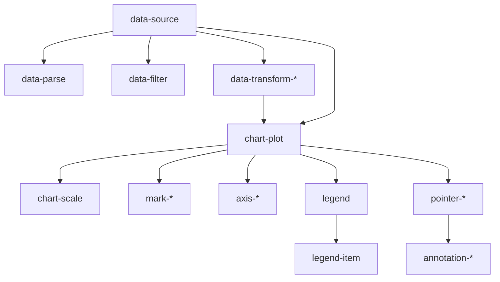

import { createOGImageMetadata } from "@/lib/seo";

export const metadata = createOGImageMetadata({
  id: "050",
  title: "Grammar of Graphics with Web Components (Part 1)",
  description:
    "Exploring a declarative approach to data visualization by building a Grammar of Graphics-inspired component system using web components instead of JavaScript composition.",
  tags: ["web-components", "visualization", "grammar-of-graphics", "lit"],
  date: "2025-01-22",
  isFeatured: true,
});

Since I started building data visualization components, I've been thinking about
ways of structuring data visualizations as a system. Working from the start
using D3 and react has always been an exploration of the best intersection
between declarative and imperative code (even explored different patterns with
[proj_d3-react-patterns](https://github.com/lloydrichards/proj_d3-react-patterns)).

Recently I've been exploring a new idea: **What if we could build data
visualizations using HTML as the composition language, rather than JavaScript?**

I've already explored web components for UI with
[Lit and Tailwind](/labs/039-lit-with-tailwind), and I wanted to see if the same
principles could apply to data visualization. This led me to build a small
component system inspired by the Grammar of Graphics, where each part of the
visualization is represented as a web component.

## The JavaScript Composition Problem

The typical D3 + React pattern looks like this:

```typescript
const LineChart = ({ data }) => {
  const svgRef = useRef();

  useEffect(() => {
    const svg = d3.select(svgRef.current);
    const xScale = d3.scaleTime().domain(...).range(...);
    const yScale = d3.scaleLinear().domain(...).range(...);
    const line = d3.line().x(d => xScale(d.date)).y(d => yScale(d.value));

    svg.append('path').datum(data).attr('d', line);
    svg.append('g').call(d3.axisBottom(xScale));
    svg.append('g').call(d3.axisLeft(yScale));
  }, [data]);

  return <svg ref={svgRef} />;
};
```

The issues:

1. **Imperative setup**: Lots of code to set up scales, axes, and marks
2. **Mixed concerns**: Data processing, scales, and rendering intertwined
3. **Hard to read**: The overall structure is buried in code

On top of this, we have to manage state, props, and re-renders in React, which
adds more complexity. And of course, every time we make a new chart tons of
boilerplate is needed to set up the same basic structure.

## Grammar of Graphics: Crash Course

The Grammar of Graphics (popularized by Wilkinson and `ggplot2`) breaks
visualizations into composable layers:

- **Data**: The information to visualize
- **Aesthetics**: Mapping data to visual properties (x, y, color, size)
- **Geometries**: Visual marks (points, lines, bars)
- **Scales**: Transformations from data space to visual space

In pure JS and D3 this is done via method chaining:

```typescript
chart()
  .data(dataset)
  .scale("x", scaleTime().domain([min, max]))
  .scale("y", scaleLinear().domain([0, maxValue]))
  .geometry(line().x("date").y("value"))
  .render();
```

This is declarative in spirit, but the structure is hidden behind method calls.

## Rethinking Composition: HTML as the Grammar

My thinking goes something like:

> **Doesn't web components offer a more natural way to compose visualizations?**

Instead of tons of JS boilerplate, what if we encapsulated each part of the
visualization as a web component? The overall structure would be visible in the
HTML itself.

```html
<data-source src="data.csv">
  <chart-plot width="800" height="400">
    <!-- Scales: Data → Visual mapping -->
    <chart-scale name="x" type="time" domain="date" />
    <chart-scale name="y" type="linear" domain="value" />

    <!-- Geometry: The visual mark -->
    <mark-line x-accessor="date" y-accessor="value" />

    <!-- Aesthetics: Axes -->
    <axis-x />
    <axis-y />
  </chart-plot>
</data-source>
```

The entire chart structure is immediately visible. No imperative setup, just a
nested tree describing the visualization.

## Component Architecture: Thinking in Layers

The component system organizes into four distinct layers:

**Layer 1: Data Management** - Handle data loading, parsing, and transformation
**Layer 2: Visualization Container** - Orchestrate rendering and manage scales
**Layer 3: Visual Elements** - Render the actual chart marks, axes, and legends
**Layer 4: Interaction** - Handle user interactions and annotations

The component tree looks like this:

```
                                -- Data Layer --
<data-source>                   [Root data provider]
├─ <data-parse>                 [Field type conversion]
├─ <data-filter>                [Row filtering]
├─ <data-transform-*>           [Data reshaping]
│
│                               -- Container Layer --
└─ <chart-plot>                 [Chart container]
    ├─ <chart-scale>            [Scale definitions]
    ├─ <axis-x>                 [Chart axes]
    ├─ <axis-y>                 [Chart axes]
    ├─ <legend-wrapper>         [Color/size legends]
    │   └─ <legend-item>
    │
    │                           -- Element Layer --
    ├─ <mark-*>                 [Visual marks]
    │   ├─ <mark-line>
    │   ├─ <mark-bar>
    │   └─ <mark-area>
    │
    │                           -- Interaction Layer --
    └─ <pointer-*>              [Mouse tracking]
        └─ <annotation-*>       [Interactive overlays]
```

And the relationships flow like this:



## Data Flow: Props Down, Events Up

In Frank Chimero's essay
[The Web's Grain](https://frankchimero.com/blog/2015/the-webs-grain/), he
explores how the web's natural structure is about linked documents and flowing
content—about working _with_ the medium rather than against it. This resonates
deeply with how web components are designed to work.

Web components follow the grain of the web by using **props down, events up**:

**Downward (Properties):**

```typescript
// Parent provides context to children
child.dataContext = this.dataContext;
child.scaleMap = this.scaleMap;
```

Properties flow down the component tree like water flowing downhill—natural and
unidirectional.

**Upward (Events):**

```typescript
// Child notifies parent of changes
this.dispatchEvent(new CustomEvent("scale-changed", {
  detail: { name: "x", ... },
  bubbles: true, // Bubble up DOM
  composed: true, // Cross shadow DOM boundaries
}));
```

Events bubble up through the DOM like air bubbles rising to the surface—they
traverse shadow boundaries and reach any ancestor listening.

This pattern isn't imposed—it's the web's natural grain. We're not fighting the
platform; we're working with it. Data flows down, actions flow up, and the DOM
tree becomes a natural communication channel.

## The Accessor Pattern

In normal D3 pattern is to use accessor functions to extract values from data:

```typescript
// D3 accessor functions
const xScale = d3.scaleTime().domain(d3.extent(data, (d) => d.date)); // accessor: d => d.date

const line = d3
  .line()
  .x((d) => xScale(d.date)) // accessor: d => d.date
  .y((d) => yScale(d.value)); // accessor: d => d.value
```

The accessor `d => d.date` tells D3 how to reach into each datum and extract the
date value.

In a declarative HTML approach, we need the same concept but without JavaScript
functions. The solution is **accessor attributes** that specify the data field
path:

```html
<!-- Instead of functions, use field names -->
<mark-line x-acc="date" y-acc="value" />
```

The `x-acc="date"` attribute serves the same purpose as `d => d.date` - it tells
the component which field to use for the x position. I'm still playing around
with the idea of using something like `x="2024-01-01"` when literal values are
used, but for now the accessor pattern works well.

This pattern extends to all visual mappings:

```html
<!-- Field: d => d.date -->
<mark-line x-acc="date" y-acc="value" stroke-acc="category" />
```

For nested data structures, dot notation works just like JavaScript property
access:

```html
<!-- Nested field: d => d.metrics.temperature -->
<mark-line x-acc="date" y-acc="metrics.temperature" />
```

This keeps the declarative nature of HTML while preserving the flexibility of
accessor functions.

## Components Communicate

The key is the event-based discovery pattern:

**1. Scales announce themselves:**

```typescript
// Scale creates its D3 scale, then notifies parent
this.dispatchEvent(
  new CustomEvent("scale-ready", {
    detail: { name: "x", scaleFunction },
    bubbles: true,
  }),
);
```

**2. Plot collects scales:**

```typescript
// Plot listens and builds scale registry
this.addEventListener("scale-ready", (e) => {
  this.scaleMap.set(e.detail.name, e.detail.scaleFunction);
});
```

**3. Plot provides context to marks:**

```typescript
// Marks receive scales via properties
mark.scaleMap = this.scaleMap;
mark.dataContext = this.dataContext;
```

**4. Marks render using provided context:**

```typescript
// Mark uses scales and accessors
const xScale = this.scaleMap.get("x");
const yScale = this.scaleMap.get("y");
// ... render with D3
```

The beauty here is that there is **no coupling** between layers. Components
discover and communicate through events and properties.

## Building a Line Chart

Now lets put it all together:

**The Data:** We'll use a simple CSV file with date, value, and category fields.

```csv title="data.csv" showLineNumbers
date,value,category
2024-01-01,100,Sales
2024-02-01,150,Sales
2024-03-01,130,Sales
```

**The Composition:** We want to first load and parse the data, then create a
chart plot with scales, a line mark, and axes.

```html title="index.html"
<data-source src="/data.csv">
  <!-- Parse date field -->
  <data-parse key="date" type="date" />
  <chart-plot width="800" height="400">
    <!-- Scales: map data domains to visual ranges -->
    <chart-scale name="x" type="time" domain="date" />
    <chart-scale name="y" type="linear" domain="value" />

    <!-- Visual mark -->
    <mark-line x-acc="date" y-acc="value" stroke="steelblue" stroke-width="2" />

    <!-- Axes -->
    <axis-x scale="x" />
    <axis-y scale="y" />
  </chart-plot>
</data-source>
```

The most powerful part is how the entire structure of the chart is visible in
the HTML. In fact the way we define the chart closely mirrors how we would
describe it in language.

## Next Steps

At the moment I've built out some basic components and been able to create this
conceptually, but there's still a lot to do:

- Implement more mark types (bars, areas, points)
- Add interaction components (tooltips, brushing)
- Optimize performance for large datasets
- Explore theming and styling options

I'm excited about the potential of this approach to make data visualization more
declarative and accessible. Using web components allows me to rethink the
problem of composition in a way that feels more natural to the web platform. I'm
hoping this exploration will lead to a new way of building visualizations that
is both powerful and easy to use.
