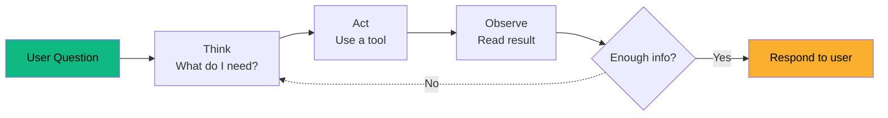
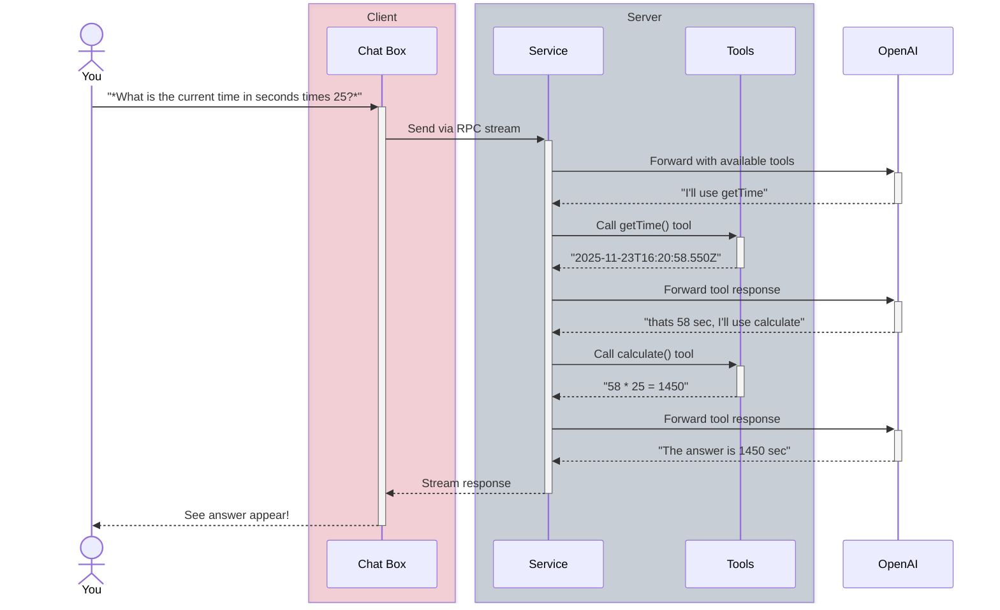
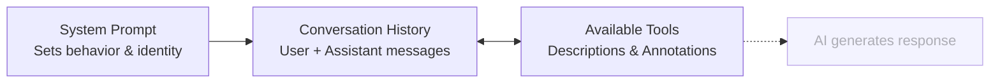

import { createOGImageMetadata } from "@/lib/seo";

export const metadata = createOGImageMetadata({
  id: "051",
  title: "Agentic Loops & Context Engineering",
  description:
    "Understanding how AI agents think, act, and learn through iterative loops and carefully crafted context.",
  tags: ["agentic-loop", "context-engineering", "llm"],
  date: "2025-11-30",
  isFeatured: true,
});

Building on recent work with web components, I wanted to explore how LLMs could
be used to help create, modify and debug a component system and even generate
in-chat visualizations. To do this I wanted to explore building an agentic loop
system[^4][^5] that could use tools to help fetch data, read documentation and
generate specs.

I've always used system-thinking when it came to building applications, so with
agentic design patterns I had a great chance to get some experience with how
indeterminism could be used safely in production applications.

## The Agentic Loop

At the core of any agentic system is the **agentic loop** - a pattern that makes
the LLM feel like an intelligent agent that can think, act, and learn from
results in a repeating cycle.

The loop follows a simple **Think → Act → Observe** pattern based on the ReAct
research paper[^1]:



**Each iteration has three phases:**

1. **Think** - The AI reasons about what information it needs
2. **Act** - The AI calls a specific tool with parameters
3. **Observe** - The AI reads the result and decides what to do next

Let's walk through what happens when you ask: _"What is the current time in
seconds times 25?"_



The AI made **two tool calls** to solve this problem - first getting the time,
then calculating the result. This is the power of the agentic loop: the AI can
chain multiple tools together to solve complex problems.

## Context Engineering

Context engineering is how we shape the AI's behavior through carefully crafted
instructions and conversation history. Think of it as giving the AI a "job
description" and "work context" before it starts helping users.

### The System Prompt

Every conversation starts with a **system prompt** that sets the AI's role and
behavior:

```ts title="ChatService.ts"
const SYSTEM_PROMPT =
  "You are a helpful AI assistant with access to tools. " +
  "Think step-by-step and use available tools when appropriate. " +
  "Always explain what you're doing and why. " +
  "Format your responses in markdown for better readability.";
```

This prompt tells the AI its identity ("You are a helpful AI assistant"), its
capabilities ("with access to tools"), reasoning style ("Think step-by-step"),
decision criteria ("use tools when appropriate"), transparency expectations
("explain what you're doing"), and output format ("use markdown").

### Building Context

Each request includes three types of messages:



**System Prompt** → defines role and behavior before any interaction

**Conversation history** → provides context from previous iterations or
responses

**Available Tools** → tells AI what actions it can take, what the params mean,
what the response can be

Good context engineering means the LLM knows its role (not a general chatbot),
tool use is intentional (explaining why it's using a tool), responses are
structured (markdown makes output readable), and behavior is consistent (same
instructions every conversation).

### Three Approaches to Context

Through experimentation, I discovered three distinct approaches to managing
context:

**Full Context** - Load the entire documentation into the system prompt with
prompt caching. Fast single-shot generation but inflexible and expensive.

**Minimal + Tools** - Small context, force all operations through structured
tool calls. Transparent and debuggable but requires more iterations.

**RAG-lite** - Start with minimal context and fetch documentation chunks
on-demand. Balances context size with information access.

Each approach has trade-offs in terms of cost, speed, and flexibility.

## Determinism vs Indeterminism

I find the whole topic of creating deterministic systems with LLMs fascinating.
There is always a trade off between using the LLM's reasoning capabilities and
using deterministic tools to provide context or perform operations. In this
project I wanted to explore how tool use could be used to enhance the LLM's
capabilities without over-relying on them.

Simple examples like getting the current time or performing calculations were
perfect candidates for tool use, while more complex reasoning about component
design could be left to the LLM.

The introduction of deterministic tools allows for more quality context to be
injected into the LLM's prompt, which can help guide its reasoning and reduce
the chances of hallucinations or errors. It's a balancing act, and I found that
careful prompt engineering and tool selection were key to achieving the desired
outcomes.

I found that data operations (fetching, parsing, transforming) should always be
deterministic - the LLM shouldn't guess at data formats. Calculations, anything
with a "right answer", should use tools. Validation should leverage TypeScript
and Effect Schema[^3]. External integrations like API calls and database queries
are too risky to let the LLM improvise.

On the other hand, reasoning about data, identifying patterns, and making
recommendations is where LLMs excel. Natural language formatting, explaining
concepts, and adapting to user intent works well. Creative decisions like
choosing chart types or color schemes can be left to the LLM's training. Problem
decomposition often surprises me - the LLM finds approaches I didn't anticipate.

The main takeaway: **use tools to provide facts, let the LLM provide judgment**.

## Agentic Workflows

The basic agentic loop is just one building block. Anthropic's Building
Effective Agents[^2] describes a taxonomy of workflow patterns that combine
these building blocks in different ways.

Anthropic distinguishes between **workflows** (LLMs orchestrated through
predefined code paths) and **agents** (LLMs that dynamically direct their own
processes). In practice, I found myself building workflows - structured patterns
where the code controls the flow, but the LLM makes decisions within that
structure.

The main patterns include:

**Prompt Chaining** decomposes a task into sequential steps, where each LLM call
processes the output of the previous one. Good for tasks that can be cleanly
broken into subtasks, trading latency for accuracy.

**Parallelization** runs multiple LLM calls simultaneously and aggregates
results - either by sectioning (independent subtasks) or voting (multiple
perspectives on the same task). Useful when speed matters or multiple
perspectives improve confidence.

**Evaluator-Optimizer** uses one LLM to generate while another evaluates and
provides feedback in a loop. Best when clear evaluation criteria exist and
iterative refinement adds measurable value. Produces highest quality but most
expensive.

**Routing** classifies inputs and directs them to specialized agents.
**Orchestrator-workers** has a coordinator dynamically delegate to specialist
agents for complex tasks where subtasks can't be predicted.

The key insight: start with the simplest solution and only add complexity when
it demonstrably improves outcomes. In my experiments, I built six different
personas to explore these patterns in practice.

---

[^1]:
    [ReAct: Synergizing Reasoning and Acting in Language Models](https://arxiv.org/pdf/2210.03629) -
    The original Think → Act → Observe pattern

[^2]:
    [Building Effective Agents](https://www.anthropic.com/engineering/building-effective-agents) -
    Anthropic's guide to workflow patterns

[^3]:
    [Effect Documentation](https://effect.website/docs) - Core functional
    programming patterns

[^4]:
    [Effect AI Module](https://effect.website/docs/ai/introduction/) - Building
    agentic applications with Effect

[^5]:
    [Building Effect-ive Agents](https://www.youtube.com/watch?v=pQA0fakReas) -
    Maxwell Brown's introduction
