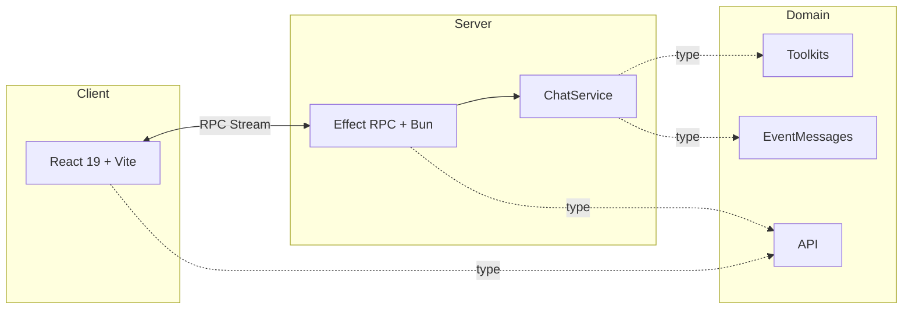
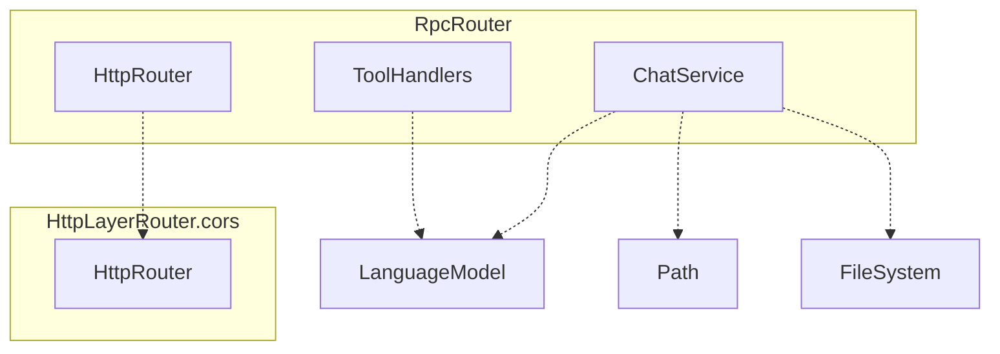
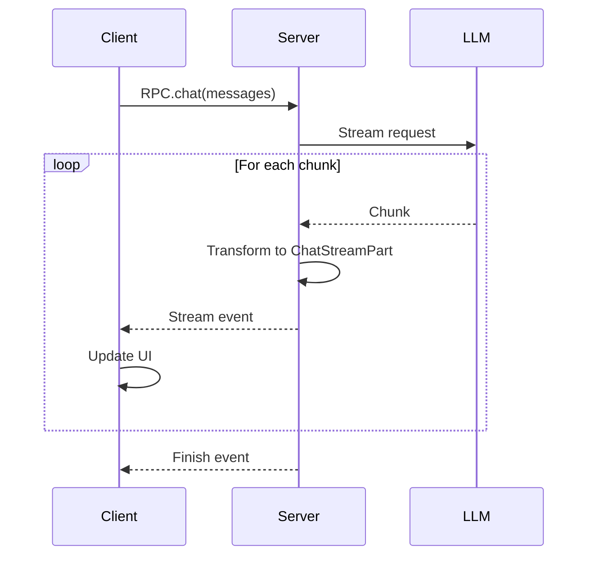

import { createOGImageMetadata } from "@/lib/seo";

export const metadata = createOGImageMetadata({
  id: "053",
  title: "Building an Agentic Chat Application",
  description:
    "Full-stack implementation with Effect RPC streaming, monorepo architecture, and type-safe AI integration from domain to UI.",
  tags: ["effect", "rpc", "monorepo", "effect-ai"],
  date: "2025-12-09",
  isPublished: false,
});

Building agentic applications requires more than just understanding LLM APIs. I
needed a solid full-stack architecture that could handle streaming, state
management, and type safety across client and server.

This is how I built a production-ready agentic chat application using the bEvr
stack[^1] (Bun + Effect + Vite + React), with streaming responses, multiple
agent personas, and end-to-end type safety.

**Live demo:**
[sszvizero.lloydrichards.dev](https://sszvizero.lloydrichards.dev/)

## The bEvr Stack

The stack was something I put together to optimize for developer experience when
building full-stack Effect applications:

- **Bun** provides a fast runtime with built-in TypeScript support.
- **Effect** brings functional patterns with dependency injection.
- **Vite** offers lightning-fast HMR and modern build tooling.
- **React** is the familiar UI layer, enhanced with `@effect-atom` for state
  management.



This matters because I can define schemas once in `packages/domain`, and server
and client share the same types. Runtime validation happens automatically with
Effect Schema, and when I change the schema, both sides update automatically.

## Domain-First Architecture

Everything starts in `packages/domain` - this is our single source of truth for
types, schemas, and API contracts.

```ts title="packages/domain/src/Api.ts"
export const ChatMessage = Schema.Struct({
  message: Schema.String,
  role: Schema.Union(
    Schema.Literal("user"),
    Schema.Literal("assistant"),
    Schema.Literal("system")
  ),
});

export const ChatStreamPart = Schema.Union(
  Schema.Struct({
    type: Schema.Literal("text"),
    text: Schema.String,
  }),
  Schema.Struct({
    type: Schema.Literal("tool-call"),
    name: Schema.String,
    args: Schema.Unknown,
  }),
  Schema.Struct({
    type: Schema.Literal("tool-result"),
    result: Schema.Unknown,
  }),
  Schema.Struct({
    type: Schema.Literal("finish"),
    usage: Schema.Struct({
      inputTokens: Schema.Number,
      outputTokens: Schema.Number,
    }),
  })
);

export class EventRpc extends RpcGroup.make(
  Rpc.make("chat", {
    payload: Schema.Array(ChatMessage),
    success: ChatStreamPart,
    stream: true,
  })
) {}
```

This gives me TypeScript types generated from schemas, runtime validation on
both client and server, discriminated unions for type-safe event handling, and a
single source of truth for API contracts.

## Server Architecture

The server uses `Effect.Service`[^2] for all major components, making dependency
injection explicit and testable.

### Service Composition



All services follow the same pattern:

```ts
export class ChatService extends Effect.Service<ChatService>()("ChatService", {
  dependencies: [Config.Config, SharedService.Default],
  effect: Effect.gen(function* () {
    const config = yield* Config.Config;
    const shared = yield* SharedService;

    // Define personas here
    const persona = yield* Effect.fn("persona")(function* (params: {}) {});

    return {
      persona,
      valueB,
    } as const;
  }),
}) {}
```

### Toolkit Composition

Each persona uses different combinations of toolkits:

```ts title="toolkits.ts"
// Craftsman: Force tool use
const CraftsmanToolkit = Toolkit.merge(
  ASTToolkit,
  DateTimeToolkit,
  DatasetToolkit
);

// Vega: Charting focus
const VegaToolkit = Toolkit.merge(ChartToolkit, DatasetToolkit);

// Librarian: On-demand docs
const LibrarianToolkit = Toolkit.merge(
  DatasetToolkit,
  DateTimeToolkit,
  ResourceToolkit
);

// Oracle: Minimal tools, full context
const OracleToolkit = DatasetToolkit;
```

Creating a new persona was just a matter of mixing different toolkits with
different system prompts.

## RPC Streaming

Streaming is where the magic happens[^3][^4] - real-time updates from the server
to the client with full type safety.

### The Event Stream



### Server-Side Streaming

```ts title="apps/server/src/index.ts"
export const EventRpcLive = EventRpc.toLayer(
  Effect.gen(function* () {
    const chat = yield* ChatService;

    return EventRpc.of({
      chat: (messages) =>
        chat.persona(messages).pipe(
          Stream.filterMap((part) => {
            // Transform AI events to ChatStreamPart
            if (part.type === "text-delta") {
              return Option.some({
                type: "text" as const,
                text: part.delta,
              });
            }
            if (part.type === "tool-call") {
              return Option.some({
                type: "tool-call" as const,
                name: part.toolName,
                args: part.args,
              });
            }
            return Option.none();
          }),
          Stream.orDie // Convert errors to defects
        ),
    });
  })
);
```

The key patterns here are `Stream.filterMap` to transform and filter events,
`Option.some` / `Option.none` for conditional emission, and `Stream.orDie` to
crash on unhandled errors. The discriminated union ensures all cases are
handled.

## Client State Management

The client uses `@effect-atom`[^5] to manage async state with the same Effect
patterns as the server.

### Creating Streaming Atoms

```ts title="packages/domain/src/ChatResponse.ts"
export const ChatResponse = Schema.Union(
  // Initial state - no data yet
  Schema.TaggedStruct("initial", {}),

  // Streaming state - actively receiving data
  Schema.TaggedStruct("streaming", {
    segments: Schema.Array(MessageSegment),
    thinking: Schema.optional(Schema.String),
    currentIteration: Schema.NullOr(Schema.Number),
  }),

  // Complete state - successfully finished
  Schema.TaggedStruct("complete", {
    segments: Schema.Array(MessageSegment),
    usage: Schema.optional(UsageMetadata),
    finishReason: Schema.String,
  }),

  // Error state - failed with partial data
  Schema.TaggedStruct("error", {
    segments: Schema.Array(MessageSegment),
    error: ErrorMetadata,
  })
);
```

```ts title="apps/client/src/lib/atoms/chatAtom.ts"
const runtime = Atom.runtime(RpcClient.Default);

export const chatAtom = runtime.fn((messages: ChatMessage[]) =>
  Stream.unwrap(
    Effect.gen(function* () {
      const rpc = yield* RpcClient;
      return rpc.client.chat(messages);
    })
  ).pipe(
    Stream.scan(
      {
        _tag: "initial",
      },
      (state, part): ChatResponse => {
        // Accumulate stream parts into UI state
        if (part.type === "text-delta") {
          const updated = appendText(state, part.text);
          return { _tag: "streaming", ...updated };
        }
        if (part.type === "tool-call") {
          const updated = addToolCall(state, part);
          return { _tag: "streaming", ...updated };
        }
        if (part.type === "finish") {
          const updated = { ...state, isStreaming: false };
          return { _tag: "complete", ...updated };
        }
        return state;
      }
    ),
    Stream.drop(1), // Skip the initial seed emission
    Stream.catchAll((error: unknown) =>
      Stream.make({
        _tag: "error",
        error,
      })
    )
  )
);
```

`Stream.scan` accumulates incoming stream parts into a single UI state object,
handling text deltas, tool calls, and finish events. `Stream.catchAll` converts
errors into a structured error state.

### Using Atoms in Components

```tsx title="apps/client/src/components/chat-box.tsx"
export function ChatBox() {
  const [result, sendChat] = useAtom(chatAtom);
  const [input, setInput] = useState("");

  const handleSubmit = () => {
    const messages = [...history, { role: "user", message: input }];
    sendChat(messages);
    setInput("");
  };

  return Result.builder(result)
    .onSuccess((state) => (
      <>
        <Messages data={state.messages} />
        {state.isStreaming && <LoadingIndicator />}
        {state.toolCalls.map((call) => (
          <ToolCallBadge key={call.name} {...call} />
        ))}
      </>
    ))
    .onWaiting(() => <LoadingSpinner />)
    .onFailure((err) => <ErrorDisplay error={err} />)
    .orNull();
}
```

The `Result` type has four states: `Initial` (not yet called), `Waiting`
(streaming in progress), `Success` (stream active or completed), and `Failure`
(stream errored).

## Streaming UI with Markdown

The chat interface streams markdown responses from the LLM in real-time, showing
tool calls and the agent's thinking process directly in the UI. When the agent
uses a tool, the UI displays a badge with the tool name (like "getTime" or
"fetchData"), along with its arguments and results.

The agent's reasoning appears as it streams - text chunks arrive progressively,
tool calls appear as they're invoked, results update in real-time, and token
usage appears at completion. This transparency helps users understand what the
agent is doing and builds trust in the system.

## Developer Experience

Probably the best part of building this application was the developer experience
when working with Effect and the `@effect/ai` package.

The ability to define services and compose them together using abstractions made
it easy to build a robust backend for the agentic chat application. The
streaming capabilities provided by Effect's RPC system allowed for real-time
communication between the client and server, which was crucial for a smooth user
experience. And the `effect-atom` package made state management on the client
side a breeze.

The event-driven architecture made debugging incredibly transparent. Every tool
call, every text chunk, every token count appeared in real-time:

```
[Stream] text-delta: "I'll help you create"
[Stream] text-delta: " a line chart."
[Stream] tool-call: getTime()
[Stream] tool-result: "2025-01-30T14:23:10Z"
[Stream] tool-call: makeHtmlAST({ type: "line", ... })
[Stream] tool-result: { tagName: "ssz-line-chart", ... }
[Stream] text-delta: "Here's your chart:"
[Stream] finish: { inputTokens: 1234, outputTokens: 567 }
```

The hot reload workflow was seamless. Changing a service on the server triggered
Bun auto-reload, changing a component on the client triggered instant Vite HMR,
and changing a schema in domain rebuilt both sides automatically.

Type safety across RPC caught errors early. Misspelling an RPC method threw a
TypeScript error, wrong payload types triggered runtime validation errors, and
missing stream handlers were impossible because the discriminated union forced
me to handle all cases.

The pain points were real: learning Effect patterns took time, RPC debugging
required deep understanding of streams, Effect error messages felt cryptic at
first, and WASM files in production builds needed special handling. But the
great moments outweighed them - adding a new persona in under 10 minutes, KV
storage working on first try, type errors catching bugs before runtime, and
stream state management "just working."

## Lessons Learned

1. **Context engineering is critical.** The system prompt, tool descriptions,
   and conversation history shape everything the LLM does. Investing time in
   context paid off more than any other optimization.

2. **Tools provide guardrails.** Deterministic tools prevent hallucinations and
   provide high-quality context. The balance between what the LLM reasons about
   versus what tools handle is the core design decision.

3. **Iteration counts matter.** More iterations mean better results but higher
   costs. Tracking tokens and iterations helped me find the sweet spot for each
   persona.

4. **Effect made the hard parts easy.** Dependency injection meant ChatService,
   DatasetAnalysisService, and ChartRefinementService all composed cleanly.
   Streaming transformations with `Stream.mapAccum`, `Stream.filterMap`, and
   `Stream.tap` handled event processing elegantly. Error handling gave me
   structured errors across async boundaries with full type safety. And
   progressive enhancement let me add KV storage, observability, and new
   personas without refactoring existing code.

5. **Event-driven architecture helps debugging.** Streaming tool calls and
   responses in real-time made it much easier to understand what the LLM was
   thinking. Every tool call, every text chunk, every token count - all visible.

6. **The surprises were mostly pleasant.** Features could be added shockingly
   fast - a new persona in 10 minutes. Type safety caught bugs at compile time
   that would have been runtime errors. Effect.Service scaled identically from 1
   service to 10. The one unpleasant surprise was cost accumulation - more than
   I expected in a week of development.

## Try It Yourself

**Live demo:**
[sszvizero.lloydrichards.dev](https://sszvizero.lloydrichards.dev/)

**Example prompts:**

**For The Craftsman:**

```
Create a line chart showing Wahlberechtigte (eligible voters)
over the years. Use Jahr for the x-axis, Wahlberechtigte for
the y-axis, and color by Kreis.
```

**For The Oracle:**

```
Show me population trends by district as a bar chart.
```

**For The Critic:**

```
Analyze all available datasets and recommend the best one
for visualizing demographic changes.
```

## The Finished Application

The final application includes six agent personas, each with different workflow
patterns (tool-enforced, prompt caching, RAG-lite, minimal, evaluator-optimizer,
parallel analysis). The streaming UI displays tool calls, thinking process, and
markdown responses in real-time. The architecture shares schemas between client
and server with runtime validation throughout. Production features include
Docker deployment, cost tracking, observability, and proper error handling. And
the developer experience remained smooth with hot reload, type safety across
RPC, and Effect composition patterns.

The combination of Effect's compositional nature and the bEvr stack made it
possible to build a production-ready agentic application with multiple
sophisticated workflows in a single week.

---

[^1]:
    [bEvr Stack Template](https://github.com/lloydrichards/base_bevr-stack) -
    Starter template

[^2]:
    [Effect Services](https://effect.website/docs/requirements-management/services/) -
    Dependency injection patterns

[^3]:
    [Effect Platform](https://effect.website/docs/platform) - HTTP + RPC
    patterns used throughout

[^4]:
    [Effect RPC](https://effect.website/docs/ecosystem/rpc) - Streaming RPC
    implementation guide

[^5]:
    [@effect-atom](https://github.com/effect-ts/atom) - React state management
    with Effect
