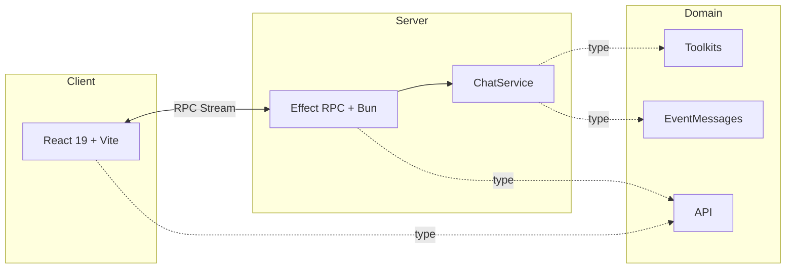
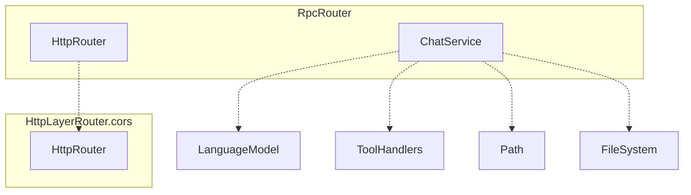
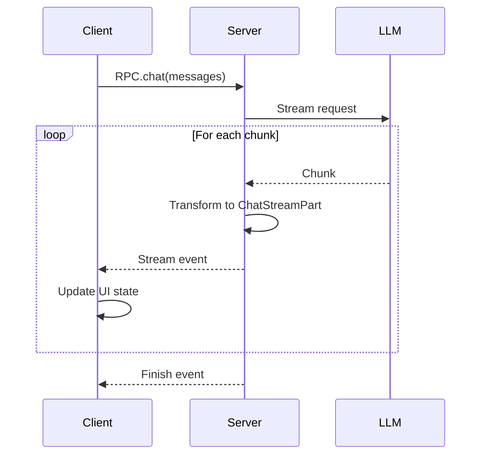

import { createOGImageMetadata } from "@/lib/seo";

export const metadata = createOGImageMetadata({
  id: "053",
  title: "Building an Agentic Chat Application",
  description:
    "Full-stack implementation with Effect RPC streaming, monorepo architecture, and type-safe AI integration from domain to UI.",
  tags: ["effect", "rpc", "monorepo", "effect-ai"],
  date: "2025-12-09",
  isFeatured: true,
});

Building agentic applications requires more than just understanding LLM APIs. I
needed a solid full-stack architecture that could handle streaming, state
management, and type safety across client and server.

This is how I built an agentic chat application using the bEvr stack[^1] (Bun +
Effect + Vite + React), with streaming responses, multiple agent personas, and
using effect for end-to-end type safety.

**Live demo:**
[sszvizero.lloydrichards.dev](https://sszvizero.lloydrichards.dev/)

## The bEvr Stack

The stack was something I put together to optimize for developer experience when
building full-stack Effect applications:

- **Bun** provides a fast runtime with built-in TypeScript support.
- **Effect** brings functional patterns with dependency injection.
- **Vite** offers lightning-fast HMR and modern build tooling.
- **React** is the familiar UI layer, enhanced with `@effect-atom` for state
  management.



The application is split between a client, server, and shared domain package.
The client and server communicate via Effect RPC with streaming support. The
domain package contains all shared types, schemas, and API contracts.

## Domain-First Architecture

Everything starts in `packages/domain`, the source of truth for types, schemas,
and API contracts. Separating the interface from the implementation made it easy
to design and reason about the interaction between services without getting too
bogged down in details.

```ts title="packages/domain/src/Api.ts"
export const ChatMessage = Schema.Struct({
  message: Schema.String,
  role: Schema.Union(
    Schema.Literal("user"),
    Schema.Literal("assistant"),
    Schema.Literal("system")
  ),
});

export const ChatStreamPart = Schema.Union(
  Schema.Struct({
    type: Schema.Literal("text"),
    text: Schema.String,
  }),
  Schema.Struct({
    type: Schema.Literal("tool-call"),
    name: Schema.String,
    args: Schema.Unknown,
  }),
  Schema.Struct({
    type: Schema.Literal("tool-result"),
    result: Schema.Unknown,
  }),
  Schema.Struct({
    type: Schema.Literal("finish"),
    usage: Schema.Struct({
      inputTokens: Schema.Number,
      outputTokens: Schema.Number,
    }),
  })
);

export class EventRpc extends RpcGroup.make(
  Rpc.make("chat", {
    payload: Schema.Array(ChatMessage),
    success: ChatStreamPart,
    stream: true,
  })
) {}
```

With this, I get types generation from schemas, runtime validation on both
client and server, discriminated unions for type-safe event handling, and a
single source of truth for API contracts.

## Server Architecture

The server uses `Effect.Service`[^2] for all major components, making dependency
injection explicit and testable. The `ChatService` handles the core logic of
interacting with the LLM and tools, typically exposing methods that return
streams of events through `Mailbox`.

### Service Composition

Using Effect's layering system, services are composed together in a way that
avoids leaking implementation details while at the same time controlling how the
application is wired at the very edge.



For example the `ChatService` depends on the `LanguageModelLive` service for LLM
access, as well as configuration from the `Config` service. Other services like
the ToolHandlers could be defined and composed in similarly to fulfil the
requirements of the persona.

```ts
export class ChatService extends Effect.Service<ChatService>()("ChatService", {
  dependencies: [Config.Config, LanguageModelLive],
  effect: Effect.gen(function* () {
    const config = yield* Config.Config;
    const chat = yield* LanguageModel.LanguageModel;

    // Define personas here
    const persona = yield* Effect.fn("persona")(function* (params: {}) {});

    return {
      persona,
    } as const;
  }),
}) {}
```

### Toolkit Composition

With the agentic loop, one of the key patterns is that each persona uses
different combinations of `Toolkit`. Using Toolkit it was possible to define and
merge `Toolkit` easily for each persona.

```ts title="toolkits.ts"
// Craftsman: Force tool use
const CraftsmanToolkit = Toolkit.merge(
  ASTToolkit,
  DateTimeToolkit,
  DatasetToolkit
);

// Vega: Charting focus
const VegaToolkit = Toolkit.merge(ChartToolkit, DatasetToolkit);

// Librarian: On-demand docs
const LibrarianToolkit = Toolkit.merge(
  DatasetToolkit,
  DateTimeToolkit,
  ResourceToolkit
);

// Oracle: Minimal tools, full context
const OracleToolkit = DatasetToolkit;
```

Creating a new persona was just a matter of mixing different `Toolkit` with
different system prompts.

## RPC Streaming

Between the server and the client it was important to stream in the conversation
from the LLM to provide ongoing feedback and transparency on whats was
happening. For this I used RPC streaming[^3][^4] to send events from the server
to the client and then map the accumulated stream into UI state.

### The Event Stream



### Server-Side Streaming

```ts title="apps/server/src/index.ts"
export const EventRpcLive = EventRpc.toLayer(
  Effect.gen(function* () {
    const chat = yield* ChatService;

    return EventRpc.of({
      chat: Effect.fn(function* (payload) {
        const mailbox = yield* Mailbox.make<typeof ChatStreamPart.Type>();
        yield* mailbox.offer({ _tag: "iteration-start" });

        yield* chat.persona(payload, mailbox); // Stream events into mailbox

        yield* mailbox.offer({ _tag: "finish" });
        return mailbox;
      }),
    });
  })
);
```

The key patterns here is using `Mailbox` to create a stream of events that can
be offered to as they occur in the `ChatService`. The `chat` RPC method returns
the `Mailbox` as a stream to the client.

## Client State Management

The client uses `@effect-atom`[^5] to manage async state with the same Effect
patterns as the server.

### Creating Streaming Atoms

```ts title="packages/domain/src/ChatResponse.ts"
export const ChatResponse = Schema.Union(
  // Initial state - no data yet
  Schema.TaggedStruct("initial", {}),

  // Streaming state - actively receiving data
  Schema.TaggedStruct("streaming", {
    segments: Schema.Array(MessageSegment),
    thinking: Schema.optional(Schema.String),
    currentIteration: Schema.NullOr(Schema.Number),
  }),

  // Complete state - successfully finished
  Schema.TaggedStruct("complete", {
    segments: Schema.Array(MessageSegment),
    usage: Schema.optional(UsageMetadata),
    finishReason: Schema.String,
  }),

  // Error state - failed with partial data
  Schema.TaggedStruct("error", {
    segments: Schema.Array(MessageSegment),
    error: ErrorMetadata,
  })
);
```

```ts title="apps/client/src/lib/atoms/chatAtom.ts"
const runtime = Atom.runtime(RpcClient.Default);

export const chatAtom = runtime.fn((messages: ChatMessage[]) =>
  Stream.unwrap(
    Effect.gen(function* () {
      const rpc = yield* RpcClient;
      return rpc.client.chat(messages);
    })
  ).pipe(
    Stream.scan(
      {
        _tag: "initial",
      },
      (state, part): ChatResponse => {
        // Accumulate stream parts into UI state
        if (part.type === "text-delta") {
          const updated = appendText(state, part.text);
          return { _tag: "streaming", ...updated };
        }
        if (part.type === "tool-call") {
          const updated = addToolCall(state, part);
          return { _tag: "streaming", ...updated };
        }
        if (part.type === "finish") {
          const updated = { ...state, isStreaming: false };
          return { _tag: "complete", ...updated };
        }
        return state;
      }
    ),
    Stream.drop(1), // Skip the initial seed emission
    Stream.catchAll((error: unknown) =>
      Stream.make({
        _tag: "error",
        error,
      })
    )
  )
);
```

`Stream.scan` accumulates incoming stream parts into a single UI state object,
handling text deltas, tool calls, and finish events. `Stream.catchAll` converts
errors into a structured error state.

### Using Atoms in Components

```tsx title="apps/client/src/components/chat-box.tsx"
export function ChatBox() {
  const [result, sendChat] = useAtom(chatAtom);
  const [input, setInput] = useState("");

  const handleSubmit = () => {
    const messages = [...history, { role: "user", message: input }];
    sendChat(messages);
    setInput("");
  };

  return Result.builder(result)
    .onSuccess((state) => (
      <>
        <Messages data={state.messages} />
        {state.isStreaming && <LoadingIndicator />}
        {state.toolCalls.map((call) => (
          <ToolCallBadge key={call.name} {...call} />
        ))}
      </>
    ))
    .onWaiting(() => <LoadingSpinner />)
    .onFailure((err) => <ErrorDisplay error={err} />)
    .orNull();
}
```

The `Result` type has four states: `Initial` (not yet called), `Waiting`
(streaming in progress), `Success` (stream active or completed), and `Failure`
(stream errored).

### Streaming UI with Markdown

While the chat is streaming, the `ChatResponse` state is updated with more and
more segments which are rendered into the UI. Each segment can be text, tool
calls, or tool results and using components for Badged, text and Markdown its
easy to render the ongoing conversation.

In particular, using the thinking option its possible to show the LLM's ongoing
thought process in real-time as it composes its response. This visibility into
the persona's processing could either be mapped from the LLM's own output or
injected via the `Mailbox`.

## Developer Experience

Probably the best part of building this application was the developer experience
when working with Effect and the `@effect/ai` package.

The ability to define services and compose them together using abstractions made
it easy to build a robust backend for the agentic chat application. The
streaming capabilities provided by Effect's RPC system allowed for real-time
communication between the client and server, which was crucial for a smooth user
experience. And the `effect-atom` package made state management on the client
side very easy to setup and maintain.

The event-driven architecture made debugging incredibly transparent. Every tool
call, every text chunk, every token count appeared in real-time:

```txt
[Stream] text-delta: "I'll help you create"
[Stream] text-delta: " a line chart."
[Stream] tool-call: getTime()
[Stream] tool-result: "2025-01-30T14:23:10Z"
[Stream] tool-call: makeHtmlAST({ type: "line", ... })
[Stream] tool-result: { tagName: "line-chart", ... }
[Stream] text-delta: "Here's your chart:"
[Stream] finish: { inputTokens: 1234, outputTokens: 567 }
```

Combined with type safety across RPC, making changes to the domain contracts
would quickly be reflected in both client and server code, reducing runtime
errors.

While there is the ongoing cost of learning Effect and reshaping mental models
to functional programming, the productivity gains in building complex
applications are significant. The biggest challenge is always in discovering new
and better ways of using the effect ecosystem to solve problems.

## Lessons Learned

1. **Context engineering is critical.** The system prompt, tool descriptions,
   and conversation history shape everything the LLM does. Investing time in
   context paid off more than any other optimization.

2. **Tools provide guardrails.** Deterministic tools prevent hallucinations and
   provide high-quality context. The balance between what the LLM reasons about
   versus what tools handle is the core design decision.

3. **Iteration counts matter.** More iterations mean better results but higher
   costs. Tracking tokens and iterations helped me find the sweet spot for each
   persona.

4. **Effect made the hard parts easy.** Dependency injection meant
   `ChatService`, `HttpLayerRouter`, and `FileSystem` all composed together
   easily. Streaming transformations with `Stream.scan`, `Stream.filterMap`, and
   `Stream.tap` handled event processing.

5. **Event-driven architecture helps debugging.** Streaming tool calls and
   responses in real-time made it much easier to understand what the LLM was
   thinking. Every tool call, every text chunk, every token count - all visible.

6. **Solid architecture worth investing in.** With the bEvr stack, features
   could be added fast with the architecture already in place. Adding new
   personas, tools, or UI features was straightforward and easy to communicate.

## Try It Yourself

**Live demo:**
[sszvizero.lloydrichards.dev](https://sszvizero.lloydrichards.dev/)

---

[^1]:
    [bEvr Stack Template](https://github.com/lloydrichards/base_bevr-stack) -
    Starter template

[^2]:
    [Effect Services](https://effect.website/docs/requirements-management/services/) -
    Dependency injection patterns

[^3]:
    [Effect Platform](https://effect.website/docs/platform/introduction/) -
    Platform-independent abstractions

[^4]:
    [Effect RPC](https://github.com/Effect-TS/effect/tree/main/packages/rpc) -
    Type-safe RPC with streaming support

[^5]:
    [@effect-atom](https://github.com/tim-smart/effect-atom) - React state
    management with Effect
