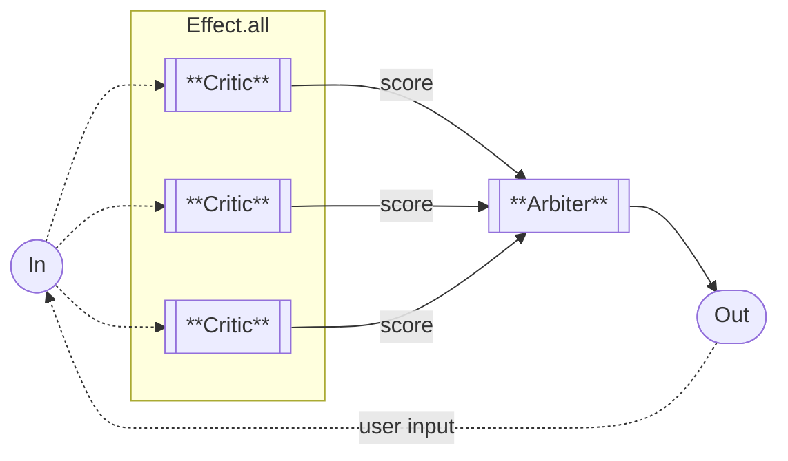
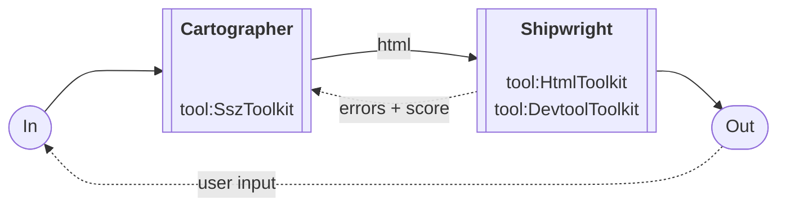

import { createOGImageMetadata } from "@/lib/seo";

export const metadata = createOGImageMetadata({
  id: "054",
  title: "Advanced Agent Patterns",
  description:
    "Exploring parallelization and evaluator-optimizer patterns for higher quality agentic outputs.",
  tags: ["effect-ai", "agent-workflows", "typescript", "llm"],
  date: "2025-02-13",
  isPublished: false,
});

Building on the simple agentic workflows from the previous article, I wanted to
explore more advanced patterns that could improve the quality and reliability of
agent outputs. These patterns trade additional LLM calls for better results
through parallel analysis or iterative refinement.

## Advanced Workflow Patterns

Anthropic's Building Effective Agents[^1] describes several advanced patterns
beyond simple agentic loops. Two patterns stood out as particularly useful for
my visualization use case: **Parallelization** for comparing multiple options,
and **Evaluator-Optimizer** for iterative quality improvement.

### Parallelization: The Critic

The Critic uses **parallel multi-agent analysis** by spawning concurrent LLM
calls to evaluate all available datasets simultaneously, each producing a
structured `DatasetScore`, then ranks and presents results.

**Pattern:** Batch inference for comparison  
**Concurrency:** 3 parallel calls  
**Toolkits:** DatasetToolkit

```typescript title="Critic.ts" showLineNumbers
const critic = Effect.fn("critic")(function* (history: Array<Prompt.Message>) {
  const languageModel = yield* LanguageModel.LanguageModel;
  const mailbox = yield* Mailbox.make<typeof ChatStreamPart.Type>();

  yield* Effect.forkScoped(
    Effect.gen(function* () {
      const lastMessage = history.at(-1);
      if (!lastMessage) {
        yield* events.error("No user message provided", false);
        return;
      }
      const userRequest = extractMessageText(lastMessage);
      const datasetsMetadata = yield* Effect.all(getAllDatasets, {
        concurrency: "unbounded",
      });

      // ===== PARALLEL ANALYSIS =====
      return yield* runParallelAnalysis({
        items: datasetsMetadata,
        concurrency: 3,
        analyze: (dataset, idx) =>
          Effect.gen(function* () {
            const analysisPrompt = String.stripMargin(`
                |You are analyzing whether this dataset is suitable for the user's request.
                |<user-input>
                |${userRequest}
                |</user-input>
                |
                |<dataset-metadata>
                |Name: ${dataset.fileName}
                |URL: ${dataset.url}
                |Columns: ${dataset.columns}
                |${dataset.sampleRow}
                |</dataset-metadata>
                `);

            return yield* languageModel
              .generateObject({
                prompt: analysisPrompt,
                schema: DatasetScore,
              })
              .pipe(
                Effect.map((r) => r.value),
                Effect.orDie
              );
          }),
        sortBy: (a, b) => b.relevanceScore - a.relevanceScore,
      });
    }).pipe(Effect.ensuring(events.end))
  );

  return mailbox;
});
```



This pattern works when I need to compare multiple options, have independent
analysis tasks, or need faster wall-clock time for time-sensitive operations.
Quality benefits from multiple perspectives. The trade-off is higher cost from
multiple LLM calls, but results are more reliable through voting/ranking. It
requires good aggregation logic to combine the results.

### The runParallelAnalysis Helper

The parallel analysis pattern is generalized into a reusable helper function:

```typescript title="runParallelAnalysis.ts" showLineNumbers
type ParallelAnalysisConfig<I, O, R> = {
  items: ReadonlyArray<I>;
  analyze: (item: I, index: number) => Effect.Effect<O, never, R>;
  concurrency?: number;

  /** Callback invoked when analysis starts */
  onStart?: (totalItems: number) => Effect.Effect<void, never, R>;

  /** Callback invoked after each item is analyzed */
  onProgress?: (
    result: O,
    index: number,
    completed: number,
    total: number
  ) => Effect.Effect<void, never, R>;

  /** Callback invoked when all analyses are complete */
  onComplete?: (results: ReadonlyArray<O>) => Effect.Effect<void, never, R>;

  /** Optional sorting function for final results */
  sortBy?: (a: O, b: O) => number;
};

const runParallelAnalysis = <I, O, R>(
  config: ParallelAnalysisConfig<I, O, R>
): Effect.Effect<ReadonlyArray<O>, never, R> =>
  Effect.gen(function* () {
    const totalItems = config.items.length;

    // Callback: start
    if (config.onStart) {
      yield* config.onStart(totalItems);
    }

    // Analyze items in parallel with progress tracking
    const results = yield* Effect.all(
      config.items.map((item, index) =>
        Effect.gen(function* () {
          const result = yield* config.analyze(item, index);

          // Callback: progress
          if (config.onProgress) {
            yield* config.onProgress(result, index, index + 1, totalItems);
          }

          return result;
        })
      ),
      { concurrency: config.concurrency ?? 3 }
    );

    // Sort results if requested
    const sortedResults = config.sortBy
      ? [...results].sort(config.sortBy)
      : results;

    // Callback: complete
    if (config.onComplete) {
      yield* config.onComplete(sortedResults);
    }

    return sortedResults;
  });
```

The key insight here is that `Effect.all` with a concurrency option handles all
the complexity of parallel execution, error propagation, and result collection.
I found this pattern surprisingly simple once I understood Effect's concurrency
model.

### Evaluator-Optimizer: The Artisan

The Artisan implements a **dual-agent refinement loop** where a generator LLM
creates chart AST JSON and an internal critic LLM evaluates it against SSZ rules
(both using structured output schemas), iterating up to 5 times until achieving
a quality score of 80+.

**Pattern:** Generate -> Evaluate -> Refine  
**Iterations:** Up to 5  
**Quality gate:** 80+ score  
**Toolkits:** SszToolkit (for generator)

```typescript title="Artisan.ts" showLineNumbers
const artisan = Effect.fn("artisan")(function* (
  history: Array<Prompt.Message>
) {
  const languageModel = yield* LanguageModel.LanguageModel;
  const mailbox = yield* Mailbox.make<typeof ChatStreamPart.Type>();
  const maxIterations = 5;
  const passingScore = 80;

  yield* Effect.forkScoped(
    Effect.gen(function* () {
      const userRequest = extractMessageText(history);

      const memoryRef = yield* Ref.make<
        Array<{
          generation: ChartGeneration;
          evaluation: ChartEvaluation;
        }>
      >([]);

      return yield* runRefinementLoop<ChartGeneration, ChartEvaluation, never>({
        maxIterations,
        passingScore,
        generate: (iteration, previousEvaluation) =>
          Effect.gen(function* () {
            const memory = yield* Ref.get(memoryRef);

            const feedbackContext =
              iteration === 1 || !previousEvaluation
                ? ""
                : String.stripMargin(`
                    |Previous Attempts Feedback:
                    |${memory.map((m, i) => `Attempt ${i + 1} (Score: ${m.evaluation.score}): ${m.evaluation.feedback}`).join("\n\n")}
                    |
                    |Rules to address:
                    |${previousEvaluation?.rulesViolated?.join("\n") || "No specific rules violated"}
                  `);

            const generatorSystemPrompt = String.stripMargin(`
                |You are The Artisan - a meticulous craftsperson who creates beautiful, functional charts.
                |
                |## Your Character
                |You take pride in your craft and won't settle for "good enough." You narrate your creative process:
                |"Let me shape these data points..." or "I'll craft these axes with care..."
                |You're honest about first attempts: "This works, but I can refine it further"
                |You celebrate when things come together: "Now that's a chart worthy of display!"
                `);

            const generationPrompt = feedbackContext
              ? String.stripMargin(`
                    |${generatorSystemPrompt}
                    |
                    |<past-attempts>
                    |${feedbackContext}
                    |</past-attempts>
                    |
                    |<user-request>
                    |${userRequest}
                    |</user-request>
                    |
                    |Refine your chart based on this feedback.
                    `)
              : String.stripMargin(`
                    |${generatorSystemPrompt}
                    |
                    |<user-request>
                    |${userRequest}
                    |</user-request>
                    `);

            const generationResult = yield* languageModel
              .generateObject({
                prompt: generationPrompt,
                schema: ChartGeneration,
              })
              .pipe(
                Effect.map((r) => r.value),
                Effect.orDie
              );
            return generationResult;
          }),

        evaluate: (generation, iteration) =>
          Effect.gen(function* () {
            const evaluatorSystemPrompt = String.stripMargin(`
                    |You are The Critic - an exacting reviewer who ensures charts meet the highest standards.
                    |
                    |## Your Role
                    |Review charts against SSZ component rules and best practices.
                    |Be constructive but honest: "This chart has solid structure, but the scale domain needs adjustment"
                    |Celebrate excellence: "This chart perfectly captures the data story!"
                    |...
                  `);

            const evaluationPrompt = String.stripMargin(`
                |${evaluatorSystemPrompt}
                |
                |<user-request>
                |${userRequest}
                |</user-request>
                |
                |<generated-ast chart-type="${generation.chartType}">
                |${generation.astJson}
                |</generated-ast>
                |
                |Evaluate this chart against SSZ rules and best practices.
                `);

            const evaluationResult = yield* languageModel
              .generateObject({
                prompt: evaluationPrompt,
                schema: ChartEvaluation,
              })
              .pipe(
                Effect.map((r) => r.value),
                Effect.orDie
              );

            yield* Ref.update(memoryRef, (memory) => [
              ...memory,
              { generation, evaluation: evaluationResult },
            ]);

            return evaluationResult;
          }),
        getScore: (evaluation) => evaluation.score,
        isFail: () => false,
      });
    }).pipe(Effect.ensuring(events.end))
  );

  return mailbox;
});
```



This pattern shines when quality is critical and clear evaluation criteria
exist. It's worth the cost when self-improvement is valuable. The trade-off is
it's the most expensive pattern with multiple generator and critic calls, but
produces the best quality results. The iteration count is unpredictable and it
requires good evaluation logic to work well.

### The runRefinementLoop Helper

The refinement loop is abstracted into a reusable helper:

```typescript title="runRefinementLoop.ts" showLineNumbers
type RefinementConfig<G, E, R> = {
  maxIterations: number;
  passingScore: number;

  /** Generate a candidate solution */
  generate: (
    iteration: number,
    previousEvaluation?: E | null
  ) => Effect.Effect<G, never, R>;

  /** Evaluate a candidate solution */
  evaluate: (generation: G, iteration: number) => Effect.Effect<E, never, R>;

  /** Extract numeric score from evaluation (0-100) */
  getScore: (evaluation: E) => number;

  /** Check if evaluation is a hard failure (should stop immediately) */
  isFail: (evaluation: E) => boolean;

  /** Optional callback invoked at the start of each iteration */
  onIterationStart?: (iteration: number) => Effect.Effect<void, never, R>;

  /** Optional callback invoked after each iteration completes */
  onIterationComplete?: (
    state: RefinementState<G, E>
  ) => Effect.Effect<void, never, R>;

  /** Optional callback invoked when refinement loop exits */
  onExit?: (state: RefinementState<G, E>) => Effect.Effect<void, never, R>;
};
const runRefinementLoop = <G, E, R>(
  config: RefinementConfig<G, E, R>
): Effect.Effect<RefinementState<G, E>, never, R> =>
  Effect.gen(function* () {
    const finalState = yield* Effect.iterate<RefinementState<G, E>, R, never>(
      {
        iteration: 0,
        generation: null,
        evaluation: null,
        shouldContinue: true,
        exitReason: "continue",
      },
      {
        while: (state) =>
          state.shouldContinue && state.iteration < config.maxIterations,
        body: (state) =>
          Effect.gen(function* () {
            const iteration = state.iteration + 1;

            // Callback: iteration start
            if (config.onIterationStart) {
              yield* config.onIterationStart(iteration);
            }

            // GENERATE phase
            const generation = yield* config.generate(
              iteration,
              state.evaluation
            );

            // EVALUATE phase
            const evaluation = yield* config.evaluate(generation, iteration);

            // Check quality gate
            const score = config.getScore(evaluation);
            const isFail = config.isFail(evaluation);

            let exitReason: RefinementExitReason | "continue";
            let shouldContinue: boolean;

            if (isFail) {
              // Hard failure - stop immediately
              exitReason = "fail";
              shouldContinue = false;
            } else if (score >= config.passingScore) {
              // Passed quality threshold
              exitReason = "pass";
              shouldContinue = false;
            } else if (iteration >= config.maxIterations) {
              // Max iterations reached
              exitReason = "max_iterations";
              shouldContinue = false;
            } else {
              // Continue refining
              exitReason = "continue";
              shouldContinue = true;
            }

            const newState: RefinementState<G, E> = {
              iteration,
              generation,
              evaluation,
              shouldContinue,
              exitReason,
            };

            // Callback: iteration complete
            if (config.onIterationComplete) {
              yield* config.onIterationComplete(newState);
            }

            return newState;
          }),
      }
    );

    // Callback: exit
    if (config.onExit) {
      yield* config.onExit(finalState);
    }

    return finalState;
  });
```

What I found elegant about this pattern is how the `memoryRef` in the Artisan
accumulates all previous attempts. Each iteration can see what went wrong before
and specifically address those issues. The LLM essentially learns from its
mistakes within a single conversation.

## Choosing the Right Pattern

After experimenting with all these patterns, I developed a simple decision
framework:

| Use Case                | Pattern             | Why                                           |
| ----------------------- | ------------------- | --------------------------------------------- |
| Compare options         | Parallelization     | Multiple perspectives, faster wall-clock time |
| Quality-critical output | Evaluator-Optimizer | Iterative improvement with clear criteria     |
| Simple Q&A              | Basic agentic loop  | Minimal overhead, good enough quality         |
| Complex multi-step      | Prompt chaining     | Clear separation of concerns                  |

The key insight: **start simple and add complexity only when it demonstrably
improves outcomes**. The Artisan produces the best charts, but for simple
questions, the overhead isn't worth it.

## Lessons Learned

1. **Parallel analysis is surprisingly cheap.** Running 3 LLM calls in parallel
   doesn't take 3x the time - it takes roughly the same wall-clock time as one
   call. The cost is 3x, but for comparison tasks, the quality improvement is
   worth it.

2. **Refinement loops need escape hatches.** Without `maxIterations` and
   `isFail` checks, the Artisan could loop forever on edge cases. I learned this
   the expensive way during development.

3. **Memory management matters.** The `memoryRef` pattern for accumulating
   feedback was crucial. Early versions just passed the previous evaluation, but
   the LLM performed much better when it could see all previous attempts.

4. **Structured outputs are essential.** Both `DatasetScore` and
   `ChartEvaluation` use Effect Schema for validation. Without structured
   outputs, parsing LLM responses became unreliable.

5. **Effect makes concurrency trivial.** What would have been complex callback
   management or Promise.all juggling became a simple `concurrency` option on
   `Effect.all`. This was one of those moments where Effect's abstractions
   really paid off.

---

[^1]:
    [Building Effective Agents](https://www.anthropic.com/engineering/building-effective-agents) -
    Anthropic's workflow taxonomy
