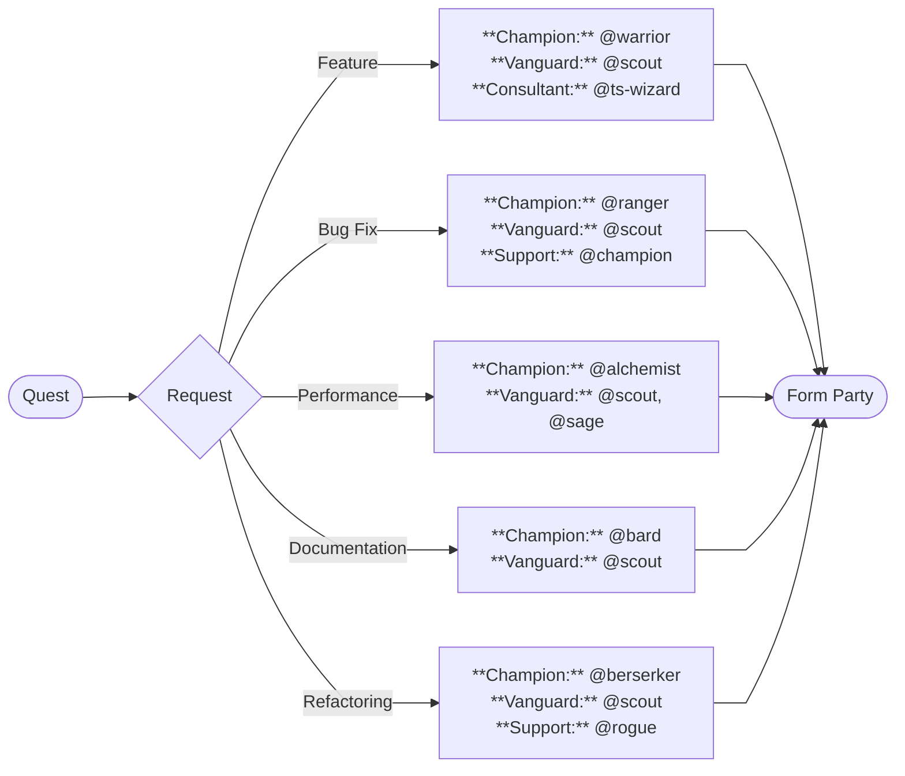

import { createOGImageMetadata } from "@/lib/seo";

export const metadata = createOGImageMetadata({
  id: "055",
  title: "Coding Party: A DnD Approach to Agentic Coding",
  description:
    "How fantasy-inspired personas have focused my AI coding agents into a balanced adventuring party with clear roles and boundaries.",
  tags: ["agentic-coding", "llm", "personas", "context-engineering"],
  date: "2025-12-18",
  status: "unpublished",
  repo: "https://github.com/lloydrichards/proj_dnd-coding-agents",
});

After a few months of experimenting with AI coding agents, I've found that
crafting personas and niche roles makes a real difference. What started as
simple job titles like `Tester` or `Documenter` evolved into something more
interesting when I stumbled on the `-wizard` suffix, creating specialized
consultants for specific technologies (e.g. `@react-wizard`, `@ts-wizard`).

Recently, I took this further by modeling my entire agent ecosystem after a
_Dungeons & Dragons_ adventuring party. It actually works better than expected.
The fantasy framing helps me think about compositional balance, leading to
clearer boundaries between agents.

## Why Personas Matter

GitHub's analysis of agent configuration files[^1] found a clear pattern: vague
prompts like "You are a helpful coding assistant" consistently underperformed
compared to specific roles. The best agents had a clear job, exact commands to
run, defined boundaries, and concrete examples.

When thinking about swarm intelligence, we would call this **designed
incompetence**, in which we deliberately limiting what an agent can do so it
excels at what it should do. An individual ant doesn't not understand its part
of a complex colony and lacks sophisticated decision-making, yet collectively
they solve complex optimization problems due to specialized roles and scoped
intelligence[^2]. A smart ant would spend too much time thinking if its doing
the right job without every doing it well.

Recent work suggests that **coordination scaling may rival model scaling**[^3],
meaning how agents work together matters as much as how capable they are
individually. The fantasy framing makes these constraints easier to remember.

## The Adventuring Party Model

In DnD, a balanced party typically needs a few key roles: someone to lead
(Champion), front-line fighters (Vanguard), helpers (Support), and specialists
for tricky situations (Consultants). No single character tries to do everything.

When forming a party for a quest, agents fill these roles:

```text
Party
├── Champion (0-1)           // Leads the quest, primary implementer
│   ├── @warrior             // Spec-driven implementation
│   ├── @paladin             // TDD-focused features
│   ├── @oracle              // Database work
│   └── @berserker           // Refactoring & tech debt
│
├── Vanguard (1-3)           // Core members, essential for completion
│   ├── @scout               // Codebase reconnaissance
│   ├── @cleric              // Test coverage
│   ├── @bard                // Documentation
│   ├── @warlock             // API contracts
│   ├── @tank                // Error handling & resilience
│   └── @thief               // Code discovery & attribution
│
├── Support (0-2)            // Secondary concerns
│   ├── @sage                // Research
│   ├── @scribe              // Git operations
│   ├── @alchemist           // Performance
│   ├── @armorer             // CI/CD & releases
│   ├── @champion            // Code review
│   ├── @ranger              // Bug hunting & debugging
│   └── @rogue               // Spec analysis & gap detection
│
└── Consultants (0-2)        // Specialized guidance (read-only)
    ├── @ts-wizard           // TypeScript types
    ├── @effect-wizard       // Effect-TS patterns
    ├── @react-wizard        // React architecture
    ├── @tw-wizard           // Tailwind CSS
    ├── @lit-wizard          // Web Components & Lit
    ├── @artisan             // CSS modernization
    ├── @monk                // State management
    └── @shepherd            // Accessibility (WCAG)
```

- **Champion** leads the quest as primary implementer. For spec-driven features, that's `@warrior`. For TDD work, `@paladin`. For database work, `@oracle`. For refactoring, `@berserker`.
- **Vanguard** are the core party members essential for completion: `@scout` for reconnaissance, `@cleric` for test coverage, `@bard` for documentation, `@warlock` for API contracts, `@tank` for resilience, `@thief` for code discovery.
- **Support** provides assistance and handles secondary concerns: `@champion` for code review, `@alchemist` for performance, `@scribe` for git operations, `@armorer` for CI/CD, `@ranger` for debugging, `@rogue` for spec analysis.
- **Consultants** are the Wizard agents called for specialized guidance. They're read-only by design—they advise but don't implement. Includes `@ts-wizard`, `@react-wizard`, `@effect-wizard`, `@tw-wizard`, `@lit-wizard`, `@artisan`, `@monk`, and `@shepherd`.

## Anatomy of an Agent

Each agent follows a structured format where section order matters since LLMs
weight information at the beginning and end of context more heavily. The
critical sections: Persona, Commands & Tools (must be early!), Core
Responsibilities, Operational Protocol, Constraints (✅ Always / ⚠️ Ask / 🚫
Never), and Agent Collaboration.

Here's what invoking an agent actually looks like:

```
> @scout "Where is authentication handled in this project?"

Scanning codebase for authentication patterns...

Found 3 relevant locations:
- src/auth/session.ts - Main session management
- src/middleware/auth.ts - Route protection
- src/lib/jwt.ts - Token utilities

Key patterns:
- JWT-based authentication with refresh tokens
- Middleware checks on protected routes
- Session stored in HTTP-only cookies
```

Let look at three of these agents that illustrate different design patterns:

### @scout - Designed for Speed, Not Depth

The Scout's persona draws from the Rogue subclass, optimized for speed and
reconnaissance. But the real design decisions are structural:

**Configuration choices:**

- **Model**: `claude-3-5-haiku` (fastest, cheapest)
- **Permissions**: `edit: deny`, `bash: deny`, `webfetch: deny`

**Boundaries:**

- ✅ **Always**: Use glob/grep for file discovery, synthesize findings into
  structured summaries
- 🚫 **Never**: Modify files, execute commands, make implementation decisions

The persona reinforces these constraints naturally: _"A nimble reconnaissance
specialist who maps unknown territories... Your keen eyes spot patterns in the
wilderness of code."_ The fantasy language makes the read-only constraint feel
like a character trait rather than an arbitrary limitation.

### @paladin - Methodology as Persona

The Paladin represents unwavering commitment to a code: the Red-Green-Refactor
cycle. Here, the persona directly encodes a methodology:

**Operational Protocol (embedded in agent definition):**

1. Write a failing test first (Red)
2. Write minimal code to pass (Green)
3. Refactor while tests guard (Refactor)
4. Never skip steps, never write implementation without a failing test

**Commands (early in definition):**

| Command                  | Purpose           |
| ------------------------ | ----------------- |
| `npm test -- --watch`    | TDD feedback loop |
| `npm test -- --coverage` | Verify coverage   |

The persona language reinforces the workflow: _"Your sacred oath is the
Red-Green-Refactor cycle: first summon the failing test (red), then forge code
to pass it (green)."_ The "oath" framing makes violating the process feel like
breaking character, creating a psychological guardrail that complements the
technical constraints.

### @champion - Separation of Review and Implementation

The Champion reviews code but never fixes it. This separation is the key design
decision since reviewers who can also implement tend to fix issues themselves
rather than provide actionable feedback.

**Configuration:**

- **Model**: `claude-haiku-4-5` (fast for quick assessments)
- **Permissions**: `edit: deny`, `bash: deny` (read-only)
- **Temperature**: Low (consistent, deterministic analysis)

**Boundaries:**

- ✅ **Always**: Analyze for security vulnerabilities, code clarity,
  architecture compliance
- 🚫 **Never**: Modify code, suggest "quick fixes" inline, skip the review
  checklist

The persona adds character without changing function: _"Like the Fighter
(Champion) archetype, your approach is straightforward and effective - you
identify threats, assess weaknesses, and deliver precise critiques."_ The
"defender" framing emphasizes vigilance over helpfulness.

## Party Composition in Practice

The `/form-party` command implements what Anthropic calls the **routing
workflow**[^4] which classifies an input and directs it to specialized agents.
As I explored in my
[previous article on agentic workflows](/labs/051-agentic-loop), routing works
well when distinct categories benefit from different handling.

The key insight from Anthropic: _"Without this workflow, optimizing for one kind
of input can hurt performance on other inputs."_ A generalist agent tuned for
bug fixing might become worse at documentation. Routing lets each category have
its own optimized team.



The command classifies the quest type and recommends a party - routing
development tasks to different agent combinations, just like Anthropic's example
of routing customer service queries to different processes.

For a typical feature quest, I might form a party with `@warrior` as Champion (implement the specification), `@scout` as Vanguard (map the relevant code), and `@ts-wizard` as Consultant (type design guidance), with `@champion` providing a final review. For TDD-focused work, `@paladin` would lead instead. The routing happens once at the start; after that, the party works through prompt chaining where each agent's output feeds the next.

## The Framing That Stuck

The DnD metaphor started as fun naming but became genuinely useful. "@paladin"
is more memorable than "@tdd-agent". "The Scout doesn't fight" feels natural
where "read-only permissions" feels like an arbitrary limitation. Party balance
maps well to agent specialization.

By relying of fundamental principles of role specialization, designed
incompetence, and clear boundaries, the adventuring party model creates a
cohesive system where each agent excels at its role without overstepping. The
fantasy framing makes these principles easier to remember and apply in practice.

The full agent definitions are available in the
[supporting repository](https://github.com/lloydrichards/proj_dnd-coding-agents).

---

[^1]:
    [How to write a great agents.md](https://github.blog/ai-and-ml/github-copilot/how-to-write-a-great-agents-md-lessons-from-over-2500-repositories/) -
    GitHub's analysis of 2,500+ agent configuration files

[^2]:
    [Swarm Intelligence: From Natural to Artificial Systems](https://global.oup.com/academic/product/swarm-intelligence-9780195131598) -
    Bonabeau, Dorigo & Theraulaz (1999), foundational text on stigmergy

[^3]:
    [SwarmSys: Multi-Agent System](https://arxiv.org/abs/2510.10047) - Li et al.
    (2025) on coordination scaling in LLM agents

[^4]:
    [Building Effective Agents](https://www.anthropic.com/engineering/building-effective-agents) -
    Anthropic's guide to agentic workflow patterns
