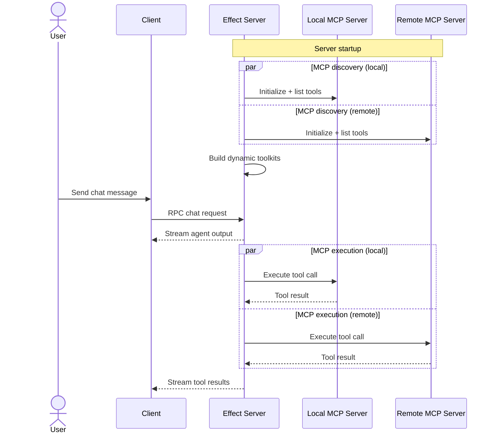

import { createOGImageMetadata } from "@/lib/seo";

export const metadata = createOGImageMetadata({
  id: "057",
  title: "Dynamic Tools: MCP-Powered Agentic Workflows",
  description:
    "My exploration of dynamic tools with effect. How dynamic tools can be used to create agentic workflows using external services through mcp.",
  tags: ["effect", "agentic workflows", "mcp", "tooling"],
  date: "2026-03-16",
  repo: "https://github.com/lloydrichards/edu_effect-dynamic-tool",
  href: "https://edu-effect-dynamic-tool.lloydrichards.dev",
});

With the release of [Effect v4-beta](https://effect.website/blog/releases/effect/40-beta/) last month, I wanted to try dynamic tools for [agentic workflows](/labs/051-agentic-loop). Dynamic tools let the tool schema be defined at runtime instead of compile time, so an agent can discover and use capabilities as they appear. This post walks through my MCP + Effect prototype and the parts that make it work, building on earlier loop foundations in [Agent Workflows & Personas](/labs/052-agent-workflows).

**Live demo:**
[edu-effect-dynamic-tool.lloydrichards.dev](https://edu-effect-dynamic-tool.lloydrichards.dev/) 

(ask it to summarize this website or tell a dad joke about effect)

## What are Dynamic Tools?

Why am I fussing over MCP + Effect? MCP gives you a portable tool discovery protocol for announcing and discovering tool contracts, and Effect gives you a runtime that can assemble those tools into safe, composable layers. Together, you can swap tool backends without changing your agent runtime.

In Effect, a tool is usually backed by a static schema that you define ahead of time. `Tool.dynamic` lets you defer that schema until runtime. Instead of shipping a fixed set of capabilities, you ask a remote MCP server what tools it exposes, then you build the toolkit from the response. This is a perfect fit for agentic workflows because the agent can discover capabilities on demand and the runtime can execute them through a single interface.

In this repo, I used the Model Context Protocol (MCP) as the discovery mechanism. The server announces its tools, each with a description and input schema. The Effect server then projects those into `Tool.dynamic` entries and wires handlers that call back to the MCP server when the LLM selects a tool.

Here is the high level topology I modeled:



- The server discovers tools at startup and builds dynamic toolkits.
- The client streams a chat session to the Effect server.
- The agentic loop selects tools and streams results back to the client (Think → Act → Observe, as described in [Agentic Loops & Context Engineering](/labs/051-agentic-loop)).

## Creating a Dynamic Toolkit with Effect

The core abstraction is a small helper that connects to an MCP endpoint and returns a `Toolkit` plus a Layer of tool handlers. I keep the MCP client in a layer so the tool handlers can use it without manual wiring.

The flow:

- Create an MCP client layer for a specific server URL.
- Start a session and list tools.
- Map every remote tool to `Tool.dynamic` using the server supplied schema.
- Build handlers that forward calls to `tools/call` and normalize errors.
- Expose a Toolkit + Layer bundle that can be merged with any other tools.

```typescript title="localMcpToolkit.ts" {5-15}#success {26-34}#success {69}#success showLineNumbers
export class LocalMcpToolkit extends ServiceMap.Service<LocalMcpToolkit>()(
  "LocalMcpToolkit",
  {
    make: Effect.gen(function* () {
    const mcpClientLayer = McpClient.layer({
      url: "http://localhost:9009/mcp",
    });
    const { session, tools } = yield* Effect.scoped(
      Effect.gen(function* () {
        const client = yield* McpClient;
        const session = yield* client.getSession();
        const tools = yield* client.listAllTools();
        return { session, tools };
      }).pipe(Effect.provide(mcpClientLayer)),
    );

    if (tools.length === 0) {
      return {
        toolkit: Toolkit.empty,
        layer: Layer.empty as Layer.Layer<any>,
        session,
        tools,
      } as const;
    }

    const dynamicTools = tools.map((tool) =>
      Tool.dynamic(`${options.namePrefix}${tool.name}`, {
        description: tool.description,
        parameters: tool.inputSchema,
        success: Schema.Unknown,
        failure: Schema.String,
        failureMode: "return",
      }),
    );

    const toolkit = Toolkit.make(...dynamicTools);

    const handlers = toolkit.of(
      Object.fromEntries(
        tools.map((tool) => [
          `${options.namePrefix}${tool.name}`,
          (input: unknown) =>
            Effect.gen(function* () {
              if (!isRecord(input)) {
                return yield* Effect.fail(
                  `MCP tool "${tool.name}" expected an object input.`,
                );
              }

              const client = yield* McpClient;
              const result = yield* client
                .callTool({
                  name: tool.name,
                  arguments: input,
                })
                .pipe(
                  Effect.mapError(
                    (error) =>
                      `MCP tool "${tool.name}" failed: ${error.message}`,
                  ),
                );

              if (result.isError) {
                return yield* Effect.fail(
                  `MCP tool "${tool.name}" failed: ${result.content}`,
                );
              }

              return result.structuredContent || result.content;
            }).pipe(
              Effect.provide(mcpClientLayer),
              Effect.catch((error) =>
                Effect.fail(
                  typeof error === "string"
                    ? error
                    : `MCP tool "${tool.name}" failed: ${error.message}`,
                ),
              ),
            ),
        ]),
      ),
    );

    return {
      toolkit,
      layer: toolkit.toLayer(handlers),
      session,
      tools,
    } as const;
  }),
  },
) {}
```

The real work is factored into `createMcpToolkit` where the dynamic tools are produced. The key is that `Tool.dynamic` accepts a runtime schema (`tool.inputSchema`) pulled directly from MCP. That means the LLM receives a tool contract that matches the remote server, without the Effect app needing to compile it ahead of time.

Here is a simplified example of the shape coming back from MCP:

```ts
{
  name: "fetchWeather",
  description: "Get forecast by city",
  inputSchema: {
    type: "object",
    properties: { city: { type: "string" } },
    required: ["city"]
  }
}
```

The handler pipeline also matters. It validates that input is an object, calls the remote server, and converts both MCP errors and transport failures into a consistent `failure` string. That keeps the agentic loop predictable: failures are surfaced as tool results instead of crashing the loop.

Failure behavior is deliberate: `failureMode: "return"` means tool failures become structured results. The model sees an error response it can recover from instead of a crashed stream.

### Tool discovery timing

One architectural decision needs to be made about when to discover tools: you can discover tools when a layer is created (server startup) or when a chat session begins. Startup discovery keeps chat latency low but risks stale tool lists if a server changes. Per-session discovery is fresher but adds tool listing to every chat. For most MCP servers, tools are stable enough that startup discovery is a good default.

### Local + Remote MCP Wiring

I kept the repo intentionally small, but the split mirrors a real deployment. The Effect server owns the agentic loop and merges three sources of tools: a local MCP server, a remote MCP server, and a small fixed sample toolkit. That gives a nice contrast between static tools and tools discovered at runtime.

- Local MCP server runs at `LOCAL_MCP_URL` (default `http://localhost:9009/mcp`).
- Remote MCP server is fetched from `https://remote.mcpservers.org/fetch/mcp`.
- Sample tools are a normal `Tool.make` bundle used to sanity check the loop.

The agentic loop is wired in `ChatService` where toolkits and layers are merged and then handed to `runAgenticLoop`. The loop listens for tool selection and tool parameter streaming from the model, executes via the toolkit, and emits incremental UI events. The toolkit composition mirrors the patterns in [Agent Workflows & Personas](/labs/052-agent-workflows), but swaps static toolkits for runtime discovery.

Agentic loop timeline:

- Model selects a tool and streams parameters as JSON.
- Parameters are parsed and execution starts.
- Tool result is streamed back to the client.


```txt
.
├── apps/
│   ├── client/             # React frontend (Vite + React)
│   ├── server/             # Bun + Effect backend API
│   └── server-mcp/         # Model Context Protocol server
├── packages/
│   ├── config-typescript/  # TypeScript configurations
│   └── domain/             # Shared Schema definitions
├── docker-compose.yaml     # Optional local deployment
├── package.json            # Root package.json with workspaces
└── turbo.json              # Turborepo configuration
```

### Key files

Start here if you want to trace the tool lifecycle end to end.

- [`apps/server/src/toolkits/McpToolkit.ts`](https://github.com/lloydrichards/edu_effect-dynamic-tool/blob/main/apps/server/src/toolkits/McpToolkit.ts) — builds the dynamic tools and handlers via `Tool.dynamic`.
- [`apps/server/src/toolkits/LocalMcpToolkit.ts`](https://github.com/lloydrichards/edu_effect-dynamic-tool/blob/main/apps/server/src/toolkits/LocalMcpToolkit.ts) — config-driven local MCP wiring.
- [`apps/server/src/toolkits/ExternalMcpToolkit.ts`](https://github.com/lloydrichards/edu_effect-dynamic-tool/blob/main/apps/server/src/toolkits/ExternalMcpToolkit.ts) — remote MCP wiring + refresh.
- [`apps/server/src/services/ChatService.ts`](https://github.com/lloydrichards/edu_effect-dynamic-tool/blob/main/apps/server/src/services/ChatService.ts) — merges toolkits and runs the loop.
- [`apps/server/src/workflows/agenticLoop.ts`](https://github.com/lloydrichards/edu_effect-dynamic-tool/blob/main/apps/server/src/workflows/agenticLoop.ts) — streaming tool selection + execution.

## Conclusion

Dynamic tools are a clean way to bridge Effect and MCP. The server can discover tool schemas at runtime, bind them to `Tool.dynamic`, and keep the agentic loop agnostic to where those tools live. You can point the same runtime at different MCP servers and the tool surface updates without redeploying your app.

I plan to explore this further with more complex systems and workflows that can benefit from runtime discovery. The combination of MCP's flexible protocol and Effect's composable layers feels like a powerful foundation for building agentic applications that can evolve over time or decouple the development of the agent from its tools and resources.

### Lessons Learned
- **Per-session discovery** added a noticeably longer first response because each chat paid the tool listing cost up front. Startup discovery keeps the first response fast, which matters more when tools rarely change.
- **Schema definition for failures** was still needed. I defaulted to `Schema.String`, but that means the model can't do structured error handling. A more complex schema would let the model react to different failure modes instead of just printing an error message.
- **McpClient complexity** was the most challenging part. Creating a client that could digest the MCP protocol, handle sessions, and provide a clean API for listing tools and calling them was non-trivial. Hopefully, a native solution will emerge in the future, but building it from scratch was a fun challenge.
