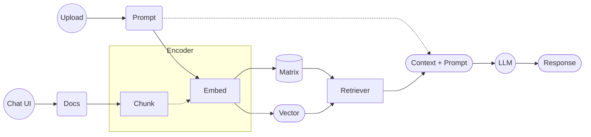
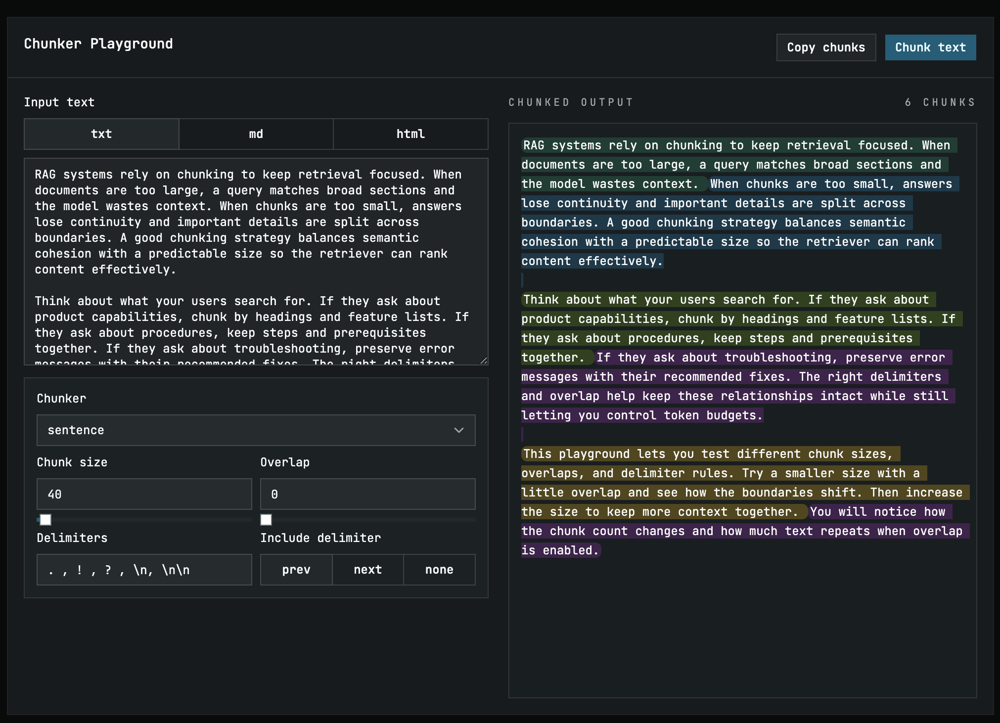

import { createOGImageMetadata } from "@/lib/seo";

export const metadata = createOGImageMetadata({
  id: "058",
  title: "RAG Builder: Chunkers and Tokenizers",
  description:
    "Explore the impact of chunkers and tokenizers on Retrieval-Augmented Generation (RAG) performance. This lab demonstrates how different chunking strategies can enhance the effectiveness of RAG systems, providing insights into optimizing agentic workflows.",
  tags: ["effect", "rag", "chunker", "tokenizer", "agentic workflows"],
  date: "2026-04-02",
  repo: "https://github.com/lloydrichards/edu_effect-rag-builder",
  href: "https://edu-effect-rag-builder.lloydrichards.dev",
  isFeatured: true,
});

Recently I've been working my way through the IBM RAG and Agentic AI Professional Certificate on Coursera[^1] and while it's been a great way to learn fundamental concepts around Retrieval-Augmented Generation (RAG) and agentic design patterns, I've been a bit disappointed with its focus on Python for implementation. With my passion for Effect (TypeScript), it's been part of the fun/challenge to translate the knowledge into building Effect-based RAG systems.

In this lab, I'll be specifically exploring the impact of chunkers and tokenizers on RAG performance, demonstrating how different chunking strategies can enhance the effectiveness of RAG systems, and providing insights into optimizing agentic workflows. I'll add more labs in the future that explore other aspects of RAG and agentic design patterns, but I thought this would be a good starting point for those interested in building RAG systems with Effect.

## What is Retrieval-Augmented Generation (RAG)?

RAG pairs a language model with a retrieval step. Instead of answering only from training data, the system fetches relevant context from your documents and feeds it into the prompt. The model then answers with fresher, more grounded context.



The system takes the data you want to retrieve (e.g. documents), encodes it into vectors, and stores it in a vector database. When a user inputs a prompt, it also gets encoded into a vector and the system retrieves the most relevant documents based on vector similarity. The retrieved documents are then combined with the original prompt to provide context for the LLM, which generates a response based on this enriched input.

That is the core loop.

## What's a Chunk?

While "Chunk" is only a small part of the overall RAG system, it can have a significant impact on performance and quality of responses. A chunk is essentially a piece of text that has been segmented from a larger document. The way you chunk your documents can affect how well the retriever can find relevant information and how effectively the LLM can use that information to generate responses.

There are a myriad of ways to chunk documents, and I found a great library called Chonkie [^2] that provides various chunking strategies. Unfortunately, it is primarily a Python library, but this gave me the opportunity to implement some of the chunking strategies in TypeScript using Effect.

```ts
const Chunk = Schema.Struct({
  text: Schema.String,
  startIdx: Schema.Number,
  endIdx: Schema.Number,
  tokenCount: Schema.Number,
  metadata: Schema.optional(Schema.Record(Schema.String, Schema.Unknown)),
});

class Chunker extends ServiceMap.Service<
  Chunker,
  {
    readonly name: string;
    chunk: (
      text: string,
    ) => Effect.Effect<Array<Chunk>, Schema.SchemaError | TokenizerError>;
  }
>()("Chunker") {}
```

Fundamentally, a `Chunker` takes in a block of text and returns an array of `Chunk` objects, where each `Chunk` contains the text of the chunk, its starting and ending indices in the original document, the token count, and any optional metadata.

So far I've managed to implement five different chunking strategies:

- **TokenChunker** ([code](https://github.com/lloydrichards/edu_effect-rag-builder/blob/main/packages/rag/src/chunker/TokenChunker.ts)): Chunks text based on a specified token limit, ensuring that each chunk does not exceed the maximum token count.
- **FastChunker** ([code](https://github.com/lloydrichards/edu_effect-rag-builder/blob/main/packages/rag/src/chunker/FastChunker.ts)): A faster implementation of the chunking process, optimized for performance.
- **SentenceChunker** ([code](https://github.com/lloydrichards/edu_effect-rag-builder/blob/main/packages/rag/src/chunker/SentenceChunker.ts)): Chunks text based on sentence boundaries, ensuring that each chunk contains complete sentences.
- **RecursiveChunker** ([code](https://github.com/lloydrichards/edu_effect-rag-builder/blob/main/packages/rag/src/chunker/RecursiveChunker.ts)): Chunks text recursively, breaking down large chunks into smaller ones until they meet the desired size criteria.
- **TableChunker** ([code](https://github.com/lloydrichards/edu_effect-rag-builder/blob/main/packages/rag/src/chunker/TableChunker.ts)): Chunks either markdown or html table structures, ensuring that each chunk contains complete table information and distinct rows.

Chonkie has several other chunking strategies that I haven't implemented yet, like `CodeChunker`, `EmbeddingChunker`, and more, but for now, these five should provide a good starting point for experimenting with different chunking strategies in my RAG systems.

### A Simplified TokenChunker

Token chunking is the simplest mental model: split a stream of tokens into fixed-size windows with optional overlap. This chunker also demonstrates the common patterns I use across the rest of the chunkers: a config schema + service reference, a service implementation, and a few small helpers.

> Tokenizers are handled separately. If you're curious, see the [tokenizer implementations](https://github.com/lloydrichards/edu_effect-rag-builder/blob/main/packages/rag/src/tokenizer/DelimTokenizer.ts).

```ts
const TokenChunkerConfigSchema = Schema.Struct({
  chunkSize: Schema.Number.check(Schema.isGreaterThan(0)),
  chunkOverlap: Schema.Number.check(Schema.isGreaterThanOrEqualTo(0)),
}).pipe(
  Schema.check(
    Schema.makeFilter(
      ({ chunkOverlap, chunkSize }) =>
        chunkOverlap < chunkSize || "chunkOverlap must be less than chunkSize",
    ),
  ),
);

export const TokenChunkerConfig = ServiceMap.Reference(
  "TokenChunkerConfig",
  {
    defaultValue: () => ({
      chunkSize: 2048,
      chunkOverlap: 0,
    }),
  },
);

export class TokenChunker extends ServiceMap.Service<Chunker>()(
  "TokenChunker",
  {
    make: Effect.gen(function* () {
      const tokenizer = yield* Tokenizer;
      const config = yield* TokenChunkerConfig;
      const { chunkSize, chunkOverlap } =
        yield* Schema.decodeEffect(TokenChunkerConfigSchema)(config);

      const chunk = Effect.fn("TokenChunker.chunk")(function* (text: string) {
        if (isBlank(text)) return [];

        const tokens = yield* tokenizer.encode(text);
        const stride = chunkSize - chunkOverlap;
        const groups: Array<Array<number>> = [];

        for (let start = 0; start < tokens.length; start += stride) {
          const end = Math.min(start + chunkSize, tokens.length);
          groups.push(tokens.slice(start, end));
          if (end === tokens.length) break;
        }

        let currentIndex = 0;
        const chunks: Array<Chunk> = [];

        for (const group of groups) {
          const chunkText = yield* tokenizer.decode(group);
          const overlapText =
            chunkOverlap > 0
              ? yield* tokenizer.decode(group.slice(-chunkOverlap))
              : "";

          const startIdx = currentIndex;
          const endIdx = startIdx + chunkText.length;

          chunks.push({
            text: chunkText,
            startIdx,
            endIdx,
            tokenCount: group.length,
          });

          currentIndex = endIdx - overlapText.length;
        }

        return chunks;
      });

      return { chunk, name: "token" };
    }),
  },
) {}
```

Common patterns in this chunker:
- **Service + config:** config is a schema-validated `ServiceMap.Reference` with defaults.
- **Helpers:** `isBlank` keeps the happy path clean, and the overlap math is isolated in the main loop.
- **Effect ergonomics:** `Effect.fn` labels the effect for tracing, and token counts are always derived from the tokenizer.

### Visualizing the Impact of Chunking Strategies

In an effort to help understand the impact of different chunking strategies, I created a simple visualization tool that allows you to see how each chunker breaks down a sample document. This tool takes a block of text and applies each chunking strategy, displaying the resulting chunks highlighted.

One quick takeaway: sentence and recursive chunkers preserve semantic boundaries best, while the fast chunker trades that fidelity for speed on very large inputs.



Since I've built out this repo as a monorepo and using Effect for both frontend and backend, it was easy to implement the actual chunking services into the frontend so what you see in the visualization is the actual chunking logic being executed in real-time. This allows me to experiment with different documents and see how each chunker performs, giving you insights into which chunking strategy might be best suited for your specific use case.

> https://edu-effect-rag-builder.lloydrichards.dev - Try it here

### How's it used?

Without getting too deep into how the `ChunkService` works, it can still be interesting to see how chunkers can be used in a RAG system. In my implementation, the `ChunkService` is responsible for taking in documents, applying the selected chunking strategy based on the document type, and then passing the resulting chunks to the embedding service for vectorization before being stored in the vector database.

```ts
const FAST_CHUNK_THRESHOLD_CHARS = 100_000;

const selectStrategy = (ext: string, text: string) => {
  switch (ext) {
    case ".csv":
      return "token";
    case ".md":
      return looksLikeMarkdownTable(text) ? "table" : "recursive";
    case ".pdf":
    case ".txt":
      return text.length >= FAST_CHUNK_THRESHOLD_CHARS ? "fast" : "sentence";
    default:
      return null;
  }
};

const chunkText = (fileName: string, input: string) => {
  const ext = getFileExtension(fileName);
  const normalized = normalizeWhitespace(input);

  if (ext === ".md") {
    return chunkMarkdownText(normalized);
  }

  const strategy = selectStrategy(ext, normalized);
  if (!strategy) return [];

  return chunkWithStrategy(strategy, normalized);
};
```

This pseudo code shows how the `ChunkService` selects a chunking strategy based on the file type and content. `.csv` files use token chunking, `.md` routes to the table chunker only if a table is detected (otherwise recursive), and `.pdf`/`.txt` switch between sentence and fast chunking based on size. This allows for flexibility in handling different types of documents and optimizing the chunking process accordingly.

I set `FAST_CHUNK_THRESHOLD_CHARS` to 100k to avoid sentence parsing on very large files. It trades a bit of semantic precision for speed on huge docs.

## Lessons Learned

1. **Chunking is a retrieval trade-off.** Smaller, semantically coherent chunks improve recall but can increase indexing and retrieval cost.
2. **Heuristics beat one-size-fits-all.** File type and size are simple signals that keep chunking fast without giving up too much quality.
3. **Instrumentation matters.** A visual playground makes it obvious when a strategy is too aggressive or too conservative for real data.

## Conclusion

I still have a lot more to learn about RAG systems and agentic design patterns, but this lab has been a great opportunity to explore the impact of chunking strategies on RAG performance. By implementing different chunkers and visualizing their effects, I've gained insights into how to optimize the retrieval process in RAG systems, which is crucial for improving the quality of responses generated by LLMs. I'm excited to continue experimenting with different components of RAG systems and sharing my findings in future labs!


---

[^1]: [IBM RAG and Agentic AI Professional Certificate](https://www.coursera.org/professional-certificates/ibm-rag-and-agentic-ai)
[^2]: [Chonkie: A Python Library for Text Chunking](https://docs.chonkie.ai/common/welcome)