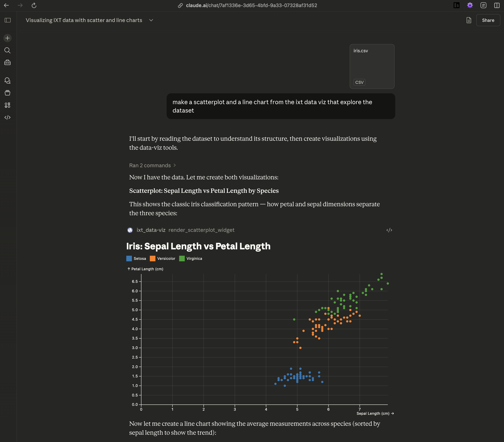
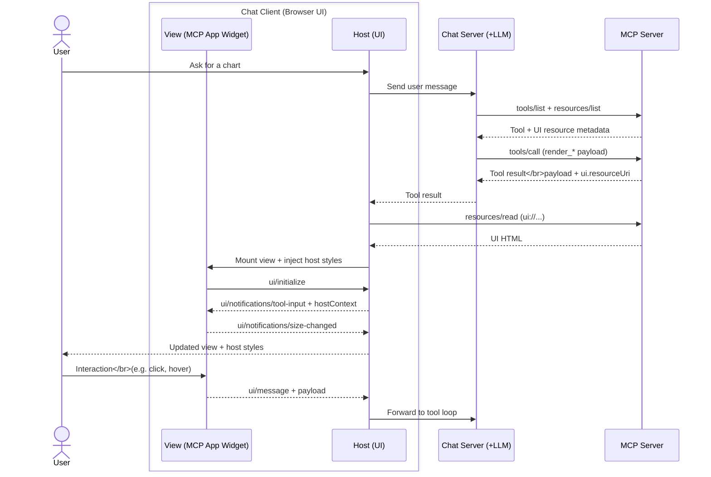

import { createOGImageMetadata } from "@/lib/seo";

export const metadata = createOGImageMetadata({
  id: "059",
  title: "MCP Apps: Generative Data Visualization",
  description:
    "A build log of my MCP Apps experiment: white-label chart widgets that let chat clients render Plot-based visualizations on demand.",
  tags: ["effect", "mcp", "data visualization"],
  date: "2026-04-07",
  repo: "https://github.com/interactivethings/interactivethings-data-viz-mcp-lab",
});

For our recent Innovation Week, I wanted to explore how to build **generative data visualizations** using the new MCP Apps extensions[^1]. Previously I explored agentic chat applications ([053](/labs/053-agentic-chat-app)) and dynamic MCP tools ([057](/labs/057-dynamic-tools)), but this lab focuses on UI: giving LLM chat clients a first-class chart surface that can be rendered on demand. In short: MCP Apps let a chat assistant open real UI inside the chat, not just print text or JSON.



Give it a try with any MCP Apps-capable chat client. I used Claude.ai for testing. TL;DR: connect the MCP URL, upload data, ask for a chart.

1. Open [https://claude.ai/new](https://claude.ai/new)
2. Customize → Connectors → [+]
3. Add this MCP URL:

    ```
    https://lab-dataviz-mcp-server-mcp-516447198205.europe-west6.run.app/mcp
    ```

4. Enable the connector in chat
5. Upload a CSV (or ask for mocked data)
6. Ask for a bar chart, line chart, or scatterplot

## What is an MCP App?

Before MCP Apps, UI in chat meant stuffing a chart spec into markdown and hoping the client knew how to render it. MCP Apps standardize that: the server declares a **UI resource** (HTML) and a **render tool** (schema + `ui.resourceUri`), and the client mounts the UI when the tool is used.

Separation of concerns:

- **Chat Client (browser UI)**: owns UX + theming, mounts the view, and streams UI events back to the host.
- **Chat Server (LLM + tool loop)**: chooses tools and executes calls against MCP servers.
- **MCP Server (this lab)**: hosts UI HTML + tool contracts for widgets.

This split keeps UI portable: swap clients or servers without rewriting widgets.

The widget code runs in the chat client, but it's served by the MCP server. The host bridges UI resources and tool results, so you can swap servers or clients without rewiring the UI.

The LLM sits inside the chat client's tool loop. In practice, the model reasons over the tool schema, not the UI. So good descriptions and sensible defaults guide the chart more than extra prompting. When users interact with the view, the app can send `ui/message` (add a chat message) or `ui/update-model-context` (update context for the next turn) back to the host, which is what feeds the model.



Note: if the view is mounted during execution, the host can stream results with `ui/notifications/tool-result` (and partial input via `ui/notifications/tool-input-partial`).

## What I Built

For the lab, I used my bEvr monorepo template[^2] to build a simple MCP server and three Plot-based widgets: bar chart, line chart, and scatterplot. The server exposes each widget as a UI resource and a render tool, and the widgets connect to the host for theming and event streaming.

- **Widgets**: bar chart, line chart, scatterplot (Plot + React)
- **Server-mcp**: MCP Apps resources + render tools
- **Theming**: host CSS variables injected into widgets

Repo overview:

```txt
.
├── apps/
│   └── server-mcp/         # MCP Apps server (Effect + @effect/ai)
└── packages/
    ├── widget-bar-chart/
    ├── widget-line-chart/
    └── widget-scatterplot/
```

### MCP Server Wiring

With the help of some helpers, wiring up a widget looks like this: define a UI resource with the widget HTML and metadata, then define a render tool that points to that resource and carries the payload schema.

```ts
const BarChartWidgetResourceLayer = makeUiResource(
  "ui://bar-chart",
  {
    name: "Bar Chart",
    description: "Bar chart widget UI",
    html: BarChartWidgetHtml,
    meta: { prefersBorder: false },
  },
);

export const RenderBarChartWidgetTool = makeUiRenderTool(
  "ui://bar-chart",
  {
    name: "render_bar_chart_widget",
    title: "Bar Chart",
    description: "Render the bar chart widget UI",
    parameters: BarChartWidgetPayload,
    success: BarChartWidgetPayload,
  },
);
```

The resource returns HTML with a `text/html;profile=mcp-app` mime type, and the render tool carries a `ui.resourceUri` annotation so chat clients know what to mount.

The real context engineering work lives in the tool schema and annotations. I use `Schema` to define the payload shape and `Tool.annotate` (via helpers) to add UI metadata like the title and resource URI. The model only sees this contract, so good descriptions and sensible defaults matter more than prompt engineering.

The trade-off is context size vs. fidelity. Rich schemas help the model compose better charts, but they also expand context. I found that using one-shot examples in the schema annotations helped guide the model without needing extra prompting. Here is a slimmed-down version of the payload schema to show the shape the model sees (with `annotate` metadata + examples):

```ts
export const BarDatum = Schema.Record(Schema.String, Schema.Union([
  Schema.String,
  Schema.Number,
  Schema.Boolean,
  Schema.Date,
  Schema.Null,
])).annotate({
  description:
    "Single bar data object. Keys are column names used by marks.x and marks.y.",
  examples: [{ category: "Q1", value: 120 }],
});

export const BarChartWidgetPayload = Schema.Struct({
  data: Schema.Array(BarDatum).annotate({
    description:
      "Array of bar data objects. Each object must expose the keys used in marks.x and marks.y.",
  }),
  direction: Schema.Literals(["horizontal", "vertical"]).annotate({
    description:
      "Orientation of bars. Vertical defaults to x=category and y=value; horizontal swaps them.",
  }),
  layout: Schema.Struct({
    title: Schema.String,
    width: Schema.Number,
    height: Schema.Number,
  }).annotate({ description: "Plot layout options. All fields optional." }),
  marks: Schema.Struct({
    x: Schema.String,
    y: Schema.String,
  }).annotate({
    description:
      "Mark channel mapping. Use marks.x and marks.y to select data keys.",
  }),
}).annotate({
  description:
    "Payload for render_bar_chart_widget. Choose marks.x and marks.y to match keys in data objects.",
});
```

### Widget Anatomy

For the widgets themselves, I kept things simple with React and used the `@modelcontextprotocol/ext-apps/react` library to help wire the apps together. Then using Vite's `vite-plugin-singlefile` plugin, I built each widget into a single HTML file that can be served as a UI resource.

Each widget follows a similar lifecycle: decode payload → debounce tool results → connect to host → apply host styles → guard connection/errors → render Plot chart. Here's the core pattern from the WidgetApp:

```tsx
export const WidgetApp = () => {
  const [payload, setPayload] = useState<
    typeof BarChartWidgetPayload.Type | null
  >(null);
  const lastPayloadRef = useRef<string | null>(null);

  const updatePayload = (next: typeof BarChartWidgetPayload.Type) => {
    const serialized = JSON.stringify(next);
    if (lastPayloadRef.current === serialized) return;
    lastPayloadRef.current = serialized;
    setPayload(next);
  };

  const { app, isConnected, error } = useApp({
    appInfo: { name: "widget-bar-chart", version: "0.1.0" },
    capabilities: {},
    onAppCreated: (app) => {
      app.ontoolresult = (params) => {
        const parsed = Schema.decodeUnknownSync(BarChartWidgetPayload)(params);
        if (parsed) updatePayload(parsed);
      };
    },
  });

  useHostStyles(app, app?.getHostContext());

  if (error) return <div>Error: {error.message}</div>;
  if (!isConnected) return <div>Connecting…</div>;
  if (!payload) return <div>Waiting for data…</div>;

  return <BarChart {...payload} app={app} />;
};
```

The key details:

- `useApp` wires the MCP App lifecycle and tool results.
- `useHostStyles` injects theme variables from the host.
- Payloads are encoded and decoded with `Schema` to ensure the model gets a tight contract and to guard against malformed input.

### Plot Rendering + Responsiveness

The actual Plot rendering happens in a small `useEffect`. I also use `ResizeObserver` to push size updates back to the host for responsive layouts.

```tsx
const plot = Plot.plot({
  style: "--plot-background: var(--color-background-primary);",
  ...layoutOptions,
  ...(width ? { width } : {}),
  color: {
    ...(layoutOptions.color ? layoutOptions.color : {}),
    scheme: "Category10",
  },
  marks: [
    isHorizontal ? Plot.ruleX([0]) : Plot.ruleY([0]),
    isHorizontal ? Plot.barX(data, barOptions) : Plot.barY(data, barOptions),
  ].filter(Boolean),
});

containerRef.current.replaceChildren(plot);
```

And for size changes:

```tsx
const observer = new ResizeObserver((entries) => {
  const entry = entries[0];
  if (!entry) return;
  const nextWidth = Math.floor(entry.contentRect.width);
  if (Number.isFinite(nextWidth) && nextWidth > 0) {
    setMeasuredWidth(nextWidth);
  }
  if (!app) return;
  // debounce + sendSizeChanged to host
});
```

All in all, the widgets are around ~200 lines of code each, with most of the logic around payload handling and host communication. The Plot rendering itself is pretty straightforward once the data is in place.

## Not all smooth sailing

The final result is pretty slick, but there were some bumps along the way:

- **ChatGPT Apps SDK**: I tried to support the Apps SDK variant, but ChatGPT didn't detect the UI resource and rendered the tool output as text.
- **Context size**: the combined tool schemas add ~8.2k tokens. Defaults are sensible, but I'll trim schema surface area next.
- **Bundle size**: the widgets are around ~1MB each, mostly from React. While this is fine for a demo, I'll explore Web Components to reduce this in the future.

I have a lot of ideas for improving the widgets and server, but I wanted to stop somewhere before this turned into a full project. The goal was to explore the potential of MCP Apps for generative data viz, and I think this lab shows that off well.

## Lessons Learned

1. **MCP Apps make UI first-class.** It's the missing layer between chat tools and real interaction.
2. **Schema reuse is a superpower.** Sharing the payload schema between server + widget keeps the UI contract tight.
3. **Theming needs to be host-driven.** CSS variables give you a real white-label surface without rebuilding components.

## Conclusion

I learned a lot building this, and MCP Apps feel like the right layer for interactive, on-demand data viz in chat. I’ll keep iterating with more chart types and lighter-weight widgets, but the current repo is ready to explore and build on.

---
[^1]: [SEP-1865: MCP Apps: Interactive User Interfaces for MCP](https://github.com/modelcontextprotocol/ext-apps/blob/main/specification/2026-01-26/apps.mdx)

[^2]: The beVr template is a monorepo starter kit for building MCP servers and apps with Effect and React. It has some nice utilities for wiring up MCP resources and tools, but it's still pretty bare-bones. I built the server and widgets from scratch, so there's room for improvement in terms of developer experience and boilerplate reduction.
