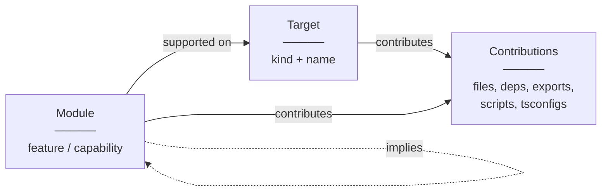
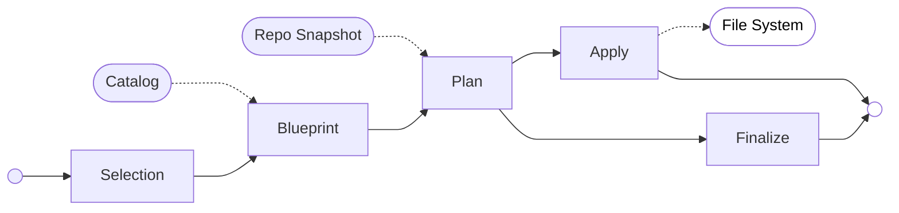

import { createOGImageMetadata } from "@/lib/seo";

export const metadata = createOGImageMetadata({
  id: "060",
  title: "Stack Effect: turning a template into a scaffolding CLI",
  description:
    "Applying domain-driven design to build a scaffolding CLI with Effect, with honest takeaways on LLM-assisted solo development.",
  tags: ["effect", "cli", "ddd", "tui", "scaffolding"],
  date: "2026-05-10",
  repo: "https://github.com/lloydrichards/stack-effect",
});

<GitHubCommitCard owner="lloydrichards" repo="stack-effect" title="Repository activity" className="h-64" />

Have you ever built out a whole new project just because you really wanted to design a nice TUI for it? I think this is known as yak shaving, and in this case what I ended up building was a scaffolding CLI tool called Stack Effect. The idea was to take the [bEvr template](/labs/053) and turn it into a CLI tool that could scaffold out new projects with ease. At the same time I've been watching for a new `create-effect-app` for Effect v4, but the official team doesn't have any interest in maintaining one, so I figured I'd scratch my own itch.

Along the way I learned a lot about applying domain-driven design for developer tooling, how to build CLI tools with Effect, and how to leverage agentic LLM workflows for rapid prototyping. The TUI itself is built on [`effect-boxes`](/labs/049)[^1], which I updated and published as an [npm package](https://www.npmjs.com/package/effect-boxes) for this project, but that deserves its own write-up.

## The bEvr Template Problem

The [bEvr stack](https://github.com/lloydrichards/base_bevr-stack) (Bun + Effect + Vite + React) started as a monorepo template I maintain for building full-stack Effect applications. It includes a React client, an Effect-based API server, shared domain packages, observability, testing, and CI/CD, all wired together with Turborepo and Bun workspaces.

The problem is that a template is a snapshot. Every project starts the same way, and then you spend the next few hours ripping out the parts you don't need and adding the parts you do. If you want to build a simple CLI app, you have to delete the React client and API server. If you want to add a WebSocket layer, you have to set up the server-side support and then wire it into the client. If you want to use a different testing framework, you have to reconfigure the whole thing.

That's what Stack Effect is: a scaffolding system that turns user intent into structured repository changes.

## The Domain

The core of Stack Effect is split into two bounded contexts: the **Catalog** (what's available) and the **Scaffold** (what to do with it). Getting this separation right was probably the most important design decision in the project.

### The Catalog

The Catalog is a read-only registry that describes what you can add to a full-stack application, unaware of what else is already in it. Think of it as the menu where targets are the services for your full-stack application and modules are the features that help those services connect to each other. The catalog defines which combinations are valid through rules and relationships.

A **Target** is a service in your application: a React client, a Bun HTTP server, a CLI, a shared package. Each target has a `kind` and a `name` that together form its identity, so you can have `client/dashboard` and `client/admin` as separate targets of the same kind. There's also a special `init` kind that represents the repository skeleton itself, things like `.gitignore`, the root `package.json`, and workspace configuration.

A **Module** is a feature or capability you attach to a target. Rather than a target knowing everything about itself up front, modules describe the specific pieces: an HTTP API layer, a healthcheck route, RPC support, AI tooling. Modules declare which target kinds they're compatible with, and what other modules they depend on.

The most interesting relationship is **implication**. When features span multiple services, adding a module to one target can imply that a corresponding module is needed elsewhere. For example, if you add a healthcheck API to your client, the server also needs its own HTTP API module and healthcheck route, and both sides share an `HttpApi` definition through a domain package. Implications let the catalog express these cross-service relationships so nothing is left hanging.

Both targets and modules declare their **Contributions** such as files to create, dependencies to install, exports to register, scripts to add, and TypeScript configurations to set up. These are declarative descriptions of intent, not direct filesystem operations. The actual file writes are the scaffold's job.

### The Scaffold Pipeline

The Scaffold takes a user's selection and turns it into actual file changes through a deliberate pipeline:

Each stage has a single responsibility and makes no decisions that belong to the next:

- **Selection** is pure user intent: which targets and modules do I want? It knows nothing about dependencies or the filesystem, just what the user asked for.
- **Blueprint** takes the selection and resolves it against the **Catalog** into a full dependency closure. If you selected a healthcheck API on a client, the blueprint figures out that the server needs its own HTTP API module too, and that both need a shared domain package. The output is a directed graph with nodes for targets and their attached modules, connected by ownership, dependency, and implication edges.
- **Plan** projects the blueprint onto reality by taking a **RepoSnapshot** of the current filesystem. It classifies every path the blueprint wants to touch as `create`, `modify`, `unchanged`, or `conflict`. For modifications, it determines the composition operations needed, things like merging exports into a barrel file or adding a dependency to `package.json`. Any conflicts are surfaced here for the UI to resolve with the user before moving on.
- **Apply** takes the plan (with conflict decisions resolved) and writes files to the **File System**. Writes are atomic via temp file + rename. It produces an `ApplyResult` as an artifact of what was written, useful for logging and debugging.
- **Finalize** also takes the plan and runs post-apply scripts in topological order: install dependencies, lint, format. It runs after Apply has finished since it depends on the files being in place, but it doesn't depend on Apply's result directly, only its side effects. Like Apply, it produces a `FinalizeReport` for logging.

The key design constraint is that each stage is ignorant of the stages around it. The Blueprint knows nothing about the filesystem. The Plan makes no conflict resolution decisions. Apply doesn't care about dependency graphs. This makes each stage independently testable and keeps the boundaries explicit.

### Composition

One of the trickier parts of scaffolding is that not every file is a simple "create this from a template". When you add a module to an existing project, you often need to modify files that already exist: add an import to a barrel file, append a dependency to `package.json`, or wire a new service into an existing composition.

Stack Effect handles this through **CompositionOperations**, a tagged union of idempotent operations:

- **JSON operations**: `json-pkg-exports`, `json-pkg-deps`, `json-pkg-scripts` for modifying `package.json` fields
- **TypeScript operations**: `ts-add-import`, `ts-add-reexport`, `ts-append-call-arg` for modifying source files

Idempotency is key here. Running the same scaffold twice doesn't produce duplicates; if an import already exists, it's silently skipped.

## Learnings

Building Stack Effect was as much an exercise in process as it was in code. I used [OpenCode](https://opencode.ai) throughout the project with a mix of Opus 4.5 and GPT 5.2 Codex, and my experience was honestly mixed.

### Where LLMs Helped

The biggest win was in domain design. I used the LLM as a rubber duck for working through the domain model, using skills like Matt Pocock's `/grill-me`[^2] to deep dive into ideas and find weaknesses in the domain boundaries. Having something that could challenge assumptions on demand, "what happens if a module implies another module that's already attached?", "where does conflict resolution belong?", was genuinely useful for stress-testing the design. Managing context across sessions was a challenge, but maintaining a domain lexicon and ubiquitous language document helped keep conversations grounded.

Without the LLM I think I would have arrived at a similar design eventually, but I also think I would have run out of steam long before getting there. The combination of domain modelling and implementation is a lot of surface area for a solo-dev project, and having something that could keep pace with my thinking, even imperfectly, meant I kept momentum instead of stalling.

### Where LLMs Fell Short

The code quality was not great. Almost everything the LLM produced was verbose, hard to read, and full of imperative patterns: massive indeterminate `for` loops where an `Effect.forEach` or `Array.map` would do, deeply nested logic that should have been composed from smaller functions. The majority of my time was spent refactoring generated code to use proper Effect modules and break things into readable, testable pieces.

I also tried the trending `ralph` approach: generate a PRD, break it into issues, and loop an agent through each one via shell scripts. The results were underwhelming. The code quality was even worse than interactive sessions, and while the output might technically satisfy what was described in the issue, there were always hidden edge cases and bugs that hadn't been thought through. The process has no oversight, like thousands of monkeys trying to write Shakespeare. It's fast, but you spend just as long cleaning up.

Context could also become its own burden. When I wanted to pivot on a design decision, the LLM would keep trying to re-implement old patterns from earlier in the conversation. Sometimes it was easier to start fresh and write the code myself than to fight the model's momentum.

### The Honest Take

If I didn't already have a clear picture of the domain and experience with domain-driven design, I think the process would have fallen apart eventually. The LLM accelerated the work, but it was the quality of the engineer directing it that determined whether the output was useful. It's safe to say that without LLMs I wouldn't have built something of this scope as a side project, but that's a statement about stamina, not about the tool replacing the thinking.

## What's Next

Stack Effect is functional today, both the CLI and the TUI are working, but there's more to come:

- **TUI deep dive**: A follow-up post on the custom TUI components built with `effect-boxes`, including the interactive selection flows and tree-view displays.
- **Web interface**: Using the same Catalog and Scaffold domain logic to build a browser-based project configurator, similar to start.spring.io but for the bEvr stack.
- **Community catalog**: Opening up the module registry so others can contribute their own targets and modules.

If you're curious, the CLI is available at [github.com/lloydrichards/stack-effect](https://github.com/lloydrichards/stack-effect) and `effect-boxes` is on [npm](https://www.npmjs.com/package/effect-boxes).

---

[^1]: [Lab 049 - Effect Boxes](/labs/049)
[^2]: [Matt Pocock's Skills](https://github.com/mattpocock/skills)
