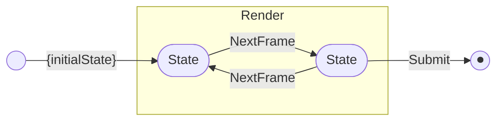

import { createOGImageMetadata } from "@/lib/seo";
import { AnsiTerminal } from "@/components/atom/ansi-terminal";
import {
  builtinSelectExample,
  customSelectExample,
  customSelectSubmittedExample,
  confirmExample,
  textInputErrorExample,
  multiSelectExample,
  horizontalSelectExample,
} from "./examples";

export const metadata = createOGImageMetadata({
  id: "061",
  title: "TUI Components: enhancing Prompt with effect-boxes",
  description:
    "How Prompt.custom and effect-boxes combine into a minimal but powerful component system for terminal interfaces.",
  tags: ["effect", "cli", "tui", "component-library"],
  date: "2026-05-23",
  isFeatured: true,
  repo: "https://github.com/lloydrichards/stack-effect/packages/tui",
});

As promised from [Lab #60](/labs/060-stack-effect-intro), I wanted to dive a bit deeper into how the TUI components are built. In Effect v4, the `Prompt` module provides a powerful low-level API for building interactive terminal prompts through the new `Prompt.custom` function. By combining this with the `effect-boxes` library, I could create a flexible component system that separates layout, rendering, and input handling concerns.

<div className="w-full grid grid-cols-1 md:grid-cols-2 gap-4 my-4">
  <AnsiTerminal
    input={builtinSelectExample}
    title="Prompt.select (built-in)"
    className="my-0"
  />
  <span className="text-sm text-muted-foreground">
    The built-in Prompt.select is a single black box. Functional and simple, but
    what about customization and UX?
  </span>
  <AnsiTerminal
    input={customSelectExample}
    title="Select (custom)"
    className="my-0"
  />
  <span className="text-sm text-muted-foreground">
    With effect-boxes, the custom Select component is built up from atomic
    components like the Hint keybinding bar and PromptChrome wrapper, composed
    into a cohesive layout. The same render contract supports dynamic state and
    conditional styling.
  </span>
</div>

Reusability and consistency are the core of any design system, so being able to build up a suite of TUI components from a shared set of primitives is a huge win. The same rendering and input handling patterns that power the `Select` component also apply to `Confirm`, `TextInput`, `MultiSelect`, and more; all built on top of the same `Prompt.custom` contract.

## The Prompt.custom contract

The entry point is [`Prompt.custom`](https://github.com/Effect-TS/effect-smol/blob/main/packages/effect/src/unstable/cli/Prompt.ts) (part of Effect's `unstable/cli` module). It takes an initial state and three callback functions that define rendering and input handling:

```ts
const Action = Data.taggedEnum<Prompt.ActionDefinition>();

Prompt.custom<State, Value>(initialState, {
  render: (state, action) => Effect<string>,
  process: (input, state) => Effect<Action<State, Value>>,
  clear: (state) => Effect<string>,
});
```

- **`render`** ← Given the current state and an `Action` (why you're rendering),
  produce the ANSI string to write to `stdout`.
- **`process`** ← Given user input and current state, decide what happens next:
  `NextFrame` (re-render with new state), `Submit` (return a value), or `Beep`
  (invalid input).
- **`clear`** ← Cleanup string when the prompt exits.

This contract is basically a state machine with a render function that can conditionally style based on the current state and the reason for rendering. The `Action` tagged enum is a flexible way to encode different render reasons (initial render, user input) and let the render function respond accordingly.



## Pure Render Functions with effect-boxes

The first insight is separating _what_ to render from _when_ and _how_. The
[`renderLayout`](https://github.com/lloydrichards/stack-effect/blob/main/packages/tui/src/components/Select.ts#L29-L73)
function is pure → state in, Box out:

```ts showLineNumbers title="Select.ts" {4-47}
const Select = <A>(options: Prompt.SelectOptions<A>): Prompt.Prompt<A> => {
  const { message, choices } = options;

  const renderLayout = (cursor: number, submitted: boolean) => {
    const label = Box.text(message).pipe(Box.annotate(Ansi.bold));

    const items = choices.map((c, i) => {
      const isSelected = i === cursor;
      const indicator = Box.char(isSelected ? "⏵" : " ").pipe(
        Box.annotate(Ansi.cyan),
      );
      const title = Box.text(c.title).pipe(
        Box.annotate(isSelected ? Ansi.bold : Ansi.dim),
      );
      const description =
        isSelected && c.description
          ? Box.hsep(
              [
                Box.text("·").pipe(Box.annotate(Ansi.dim)),
                Box.text(c.description).pipe(
                  Box.annotate(Ansi.combine(Ansi.dim, Ansi.italic)),
                ),
              ],
              1,
              Box.left,
            )
          : Box.nullBox;

      return Box.hsep([indicator, title, description], 1, Box.left);
    });

    if (submitted) {
      const selected = choices[cursor];
      return Box.hsep(
        [
          Box.text("✔").pipe(Box.annotate(Ansi.green)),
          label,
          Box.text(selected?.title ?? "").pipe(Box.annotate(Ansi.cyan)),
        ],
        1,
        Box.top,
      );
    }

    const content = Box.vcat([label, Box.vcat(items, Box.left)], Box.left);
    return Box.vcat([content.pipe(PromptChrome()), Hint(SelectKeys)], Box.left);
  };
  // ... render and process slots ...
};
```

What matters here is that all the parts are just variables that render differently based on the state (`cursor`, `submitted`). The layout composition is separate from the state management and the render contract.

Finally when the Submit action is triggered, the same `renderLayout` function can render a different view based on the `submitted` state. The layout composition (using `Box.hsep`, `Box.vcat`, etc.) is declarative and doesn't need to worry about the mechanics of when to clear or how to manage the cursor which comes later in the `render` slot.

<AnsiTerminal input={customSelectSubmittedExample} title="Select (submitted)" />

### Shared atoms

Sharable components like [`PromptChrome`](https://github.com/lloydrichards/stack-effect/blob/main/packages/tui/src/components/atom/Panel.ts#L90-L98) and the `Hint` keybinding bar are just more pure Box functions that can be dropped in as needed. The `PromptChrome` component for example is a simple bordered panel with some padding that can wrap any prompt content to provide a consistent visual identity across components:

```ts showLineNumbers title="Panel.ts"
export const PromptChrome = (annotation: Ansi.AnsiAnnotation = Ansi.dim) =>
  Panel.make({
    padding: Box.pad(0, 0, 0, 1),
    border: Box.border("thick", {
      annotation,
      sides: { top: false, bottom: false, right: false },
    }),
    margin: Box.pad(1, 0),
  });
```

Pass `Ansi.red` and you get error styling. The visual identity stays consistent
while the colour communicates state.

## Pattern matching on the Action

A `Box` describes _what_ to show — but the terminal also needs to know _when_ to clear the previous frame and _how_ to manage the cursor. The actual [`render`](https://github.com/lloydrichards/stack-effect/blob/main/packages/tui/src/components/Select.ts#L78-L100) slot wraps `renderLayout` with these concerns:

```ts showLineNumbers {7-28} {30}#warning
const Select = <A>(options: Prompt.SelectOptions<A>): Prompt.Prompt<A> => {
  // ... renderLayout definition ...

  let hasRendered = false;

  return Prompt.custom<number, A>(0, {
    render: Effect.fnUntraced(function* (cursor, action) {
      const layout = Action.$match(action, {
        Beep: () => renderLayout(cursor, false),
        Submit: () => renderLayout(cursor, true),
        NextFrame: ({ state }) => renderLayout(state, false),
        default: () => renderLayout(cursor, false),
      });

      const clear = hasRendered
        ? Cmd.clearLines(renderLayout(cursor, false).rows)
        : Cmd.cursorHide;
      hasRendered = true;

      const cmds =
        action._tag === "Submit"
          ? Box.combine(Cmd.cursorShow, Cmd.cursorNextLine(1))
          : Cmd.cursorHide;

      return yield* Box.renderPretty(
        Box.combine(clear, layout.pipe(Box.combine(cmds))),
      );
    }),
    // process slots...
    clear: () => Effect.succeed(""),
  });
};
```

Here the `Action` tagged enum provided helpers to pattern match on the `_tag` of the action and respond accordingly. On `Submit`, the layout is rendered with the `submitted` state, and the cursor is shown on the next line. On `NextFrame` and `Beep`, the layout is re-rendered without the submitted state, and the cursor is hidden.

What I found though was that using the `clear` callback would cause a flicker effect as the prompt would clear and then re-render. To work around this, I used a `hasRendered` flag to conditionally apply the appropriate clear command: on the first render, I use `Cmd.cursorHide` to hide the cursor without clearing, and on subsequent renders, I use `Cmd.clearLines` to clear the previous layout.

## KeyBinding and Match

The `process` slot maps user input to actions using a [`KeyBinding`](https://github.com/lloydrichards/stack-effect/blob/main/packages/tui/src/lib/KeyBinding.ts) class and a `whenBinding` combinator that plugs into Effect's `Match` module:

```ts showLineNumbers {1-13, 20-37}
const SelectKeys = {
  Down: new KeyBinding({
    keys: ["down", "j", "tab"],
    label: "↓",
    action: "down",
  }),
  Up: new KeyBinding({ keys: ["up", "k"], label: "↑", action: "up" }),
  Submit: new KeyBinding({
    keys: ["enter", "return"],
    label: "enter",
    action: "select",
  }),
};

const Select = <A>(options: Prompt.SelectOptions<A>): Prompt.Prompt<A> => {
  // ... renderLayout definition ...

  return Prompt.custom<number, A>(0, {
    // render slot...
    process: Effect.fnUntraced(function* (input, cursor) {
      return Match.value(input).pipe(
        whenBinding(SelectKeys.Down, () =>
          Action.NextFrame({ state: (cursor + 1) % choices.length }),
        ),
        whenBinding(SelectKeys.Up, () =>
          Action.NextFrame({
            state: (cursor - 1 + choices.length) % choices.length,
          }),
        ),
        whenBinding(SelectKeys.Submit, () => {
          const selected = choices[cursor];
          if (selected) return Action.Submit({ value: selected.value });
          return Action.Beep();
        }),
        Match.orElse(() => Action.NextFrame({ state: cursor })),
      );
    }),
    // clear slot...
  });
};
```

Each `KeyBinding` declares its keys, display label, and action name. The same keymap that drives `process` also feeds the `Hint` component — so the hint bar can never fall out of sync with actual behaviour.

## Lessons and Limitations

While the `Prompt.custom` contract is powerful and flexible, it does require a bit of boilerplate to set up the render and process logic. The separation of concerns is great for reusability, but for very simple prompts it might feel a bit heavy-handed.

What I found to be the main limitation though is the blocking nature of the prompt loop based on user input. This means if data is changing in the background (e.g. a long-running task or progress update), the prompt won't re-render until the user provides input. This is a fundamental limitation of the current design and would require a more significant change to the `Prompt` API to support external events triggering re-renders. The more interesting next step is [queue-driven re-rendering](https://github.com/Effect-TS/effect-smol/pull/2205) which would enable combining an external `Queue` with the prompt loop so events can trigger re-renders. This opens the door to event-driven TUI design: progress updates, background task completion, or even real-time data feeds could all trigger prompt updates without user input.

That said, the current contract already powers several components in [`@repo/tui`](https://github.com/lloydrichards/stack-effect/tree/main/packages/tui): `Confirm`, `TextInput`, `TextArea`, `MultiSelect`, `HorizontalSelect`. Each just fills the three slots differently.

<div className="w-full grid grid-cols-1 md:grid-cols-2 gap-4 my-4">
  <AnsiTerminal input={confirmExample} title="Confirm" className="my-0" />
  <AnsiTerminal
    input={textInputErrorExample}
    title="TextInput (error)"
    className="my-0"
  />
  <AnsiTerminal
    input={multiSelectExample}
    title="MultiSelect"
    className="my-0"
  />
  <AnsiTerminal
    input={horizontalSelectExample}
    title="HorizontalSelect"
    className="my-0"
  />
</div>
