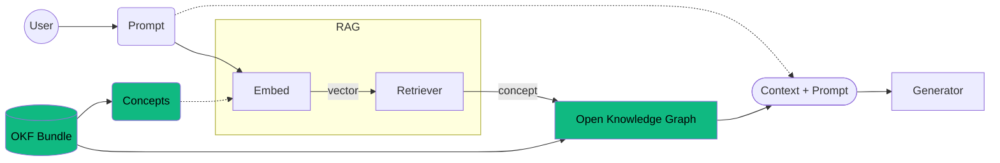
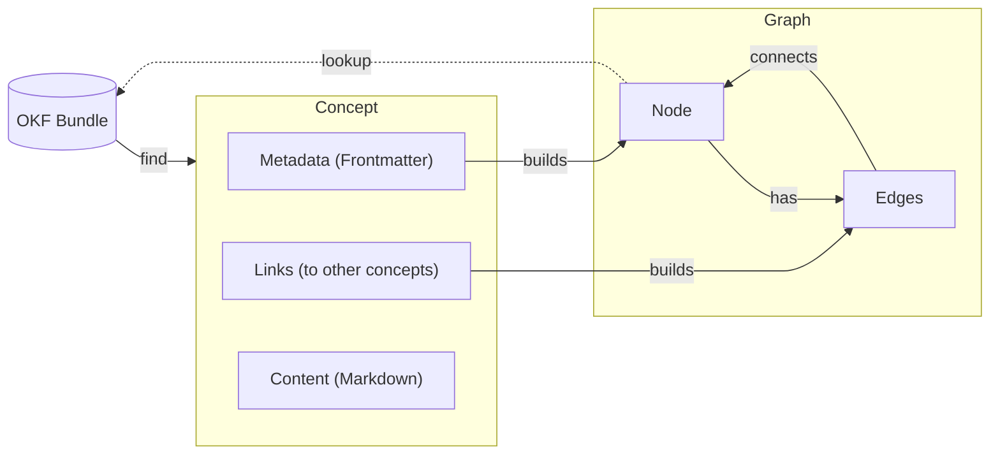
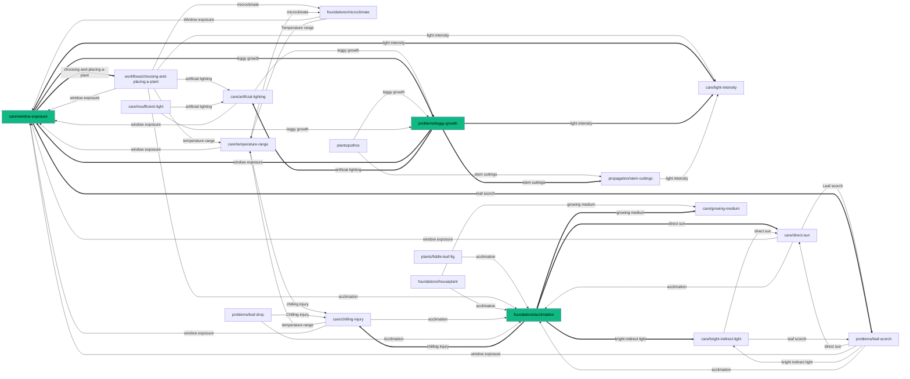

import { createOGImageMetadata } from "@/lib/seo";

export const metadata = createOGImageMetadata({
  id: "062",
  title: "Open Knowledge Graph: Building Better LLM Context from OKF",
  description:
    "Exploring OKF as a storage layer, vector RAG as a concept retriever, and OKG as an application-layer graph for building focused LLM context.",
  tags: ["okf", "knowledge-graph", "rag", "llm", "effect"],
  date: "2026-05-23",
  isFeatured: true,
  repo: "https://github.com/lloydrichards/edu_effect-okf",
});

<GitHubCommitCard
  owner="lloydrichards"
  repo="edu_effect-okf"
  title="Repository activity"
  className="h-64"
/>

A couple of weeks back I got nerd-sniped hard when stumbling across Google's [Open Knowledge Format](https://github.com/GoogleCloudPlatform/knowledge-catalog/blob/main/okf/SPEC.md) (**OKF**). My fascination with documentation and context engineering suddenly intersected with my love of graph theory. While the spec mostly talked about the tree structure of OKF bundles, I started thinking about the graph structure that could be projected from those bundles using the links between concepts, similar to how Obsidian builds a graph from Markdown files.

This got me thinking about how to better build context for LLMs. I have been exploring retrieval-augmented generation (**RAG**) for a while, but the hard part of building useful LLM systems is not always getting more text into the context window. It is getting the right context into the model at the right time. Rock Lambros put it well in [The Context Window Trap](https://www.rockcybermusings.com/p/the-context-window-trap-why-1m-tokens):

> The context window arms race is a distraction. Your agents don't need 200K tokens of capacity. They need the right 2K tokens at the right time.
> ~ Rock Lambros

Grep is efficient at finding information that is already present in the OKF. Vector search is good at finding things that are semantically close to a query. People do not usually reason from isolated chunks of similar text, though. We reason through connected concepts, where one idea leads to another. The links between ideas are often what make the context useful.

## What I Built

To really explore this idea, I created [`edu_effect-okf`](https://github.com/lloydrichards/edu_effect-okf). I used Effect to build isolated services for each layer of the system. Borrowing from previous work on [`edu_effect-rag-builder`](https://github.com/lloydrichards/edu_effect-rag-builder), the system uses a vector retriever to find relevant concepts, then uses a graph projection to find the connected knowledge around those concepts, and finally assembles a focused application-layer graph for a particular question.

The system has four layers:

- **OKF** is the storage layer.
- **Vector RAG** is the concept retriever.
- **The full graph projection** is the topology derived from the OKF bundle.
- **OKG** is the focused application-layer graph assembled for a particular question.

I am using **Open Knowledge Graph**, or **OKG**, as a working term here. I am not treating it as a formal standard. OKF is the format. OKG is the focused graph assembled from OKF concepts for a particular retrieval task.



The interesting part is the layer between `retriever` and `generator`. The retriever gives me semantically relevant concepts, but the graph gives me the surrounding knowledge attached to those concepts. The graph is not just a retrieval structure. It is a way to assemble context that follows relationships instead of only similarity.

## OKF as Ontology-Like Storage

The OKF spec is very simple: a bundle of Markdown files with YAML frontmatter organized in a directory. That simplicity can look boring at first, but boring is a feature when you want knowledge that can be edited, reviewed, and rebuilt into other shapes.

OKF is not a formal ontology language like OWL or RDF. For this experiment, though, it gives me enough structure to model concepts and relationships without giving up human readability. In the age of LLMs, that human-readable, machine-parseable middle ground is exactly what makes it interesting.

The graph is not the source of truth. The OKF bundle is. The graph is a projection that can be rebuilt from the bundle.



This boundary is important. I want the knowledge to live in files that can be edited, diffed, reviewed, and versioned. The retrieval structures are disposable projections built from that durable artifact.

If I change my embedding model, I can rebuild the vector index. If I change my traversal strategy, I can rebuild the graph projection. The OKF remains the stable knowledge bundle, agnostic of the retrieval and reasoning layers.

## A Houseplant Knowledge Base

For a concrete example, I built a small [`house-plants-okf`](https://github.com/lloydrichards/edu_effect-okf/tree/main/house-plants-okf) bundle.

Houseplants are a good domain for this because useful answers are rarely isolated, but the surface area is still small enough to reason about. A question about a monstera might involve leaf symptoms, watering patterns, drainage, light exposure, pests, humidity, time of year, and recent care changes.

The bundle is organized as a directory tree of OKF concepts:

```text
house-plants-okf/
├── index.md
├── care/
├── foundations/
├── pests/
├── plants/
├── problems/
├── propagation/
├── safety/
├── workflows/
└── sources.md
```

The current graph has 67 concepts, 219 edges, and zero unresolved links. That is large enough to expose modeling problems, but small enough that I can still inspect the shape of the graph directly.

```json
{
  "nodes": 67,
  "edges": 219,
  "unresolvedLinks": []
}
```

A natural question might be:

> Why does my new plant seem unhappy since moving it next to the window?

A vector retriever currently finds concepts like:

- `problems/leggy-growth`
- `foundations/acclimation`
- `care/window-exposure`

A good start, but not enough to explain how those concepts relate.

The useful answer probably needs concepts that are not closest in embedding space to the original query. It might need the care-specific `care/direct-sun` concept, the problem-specific `problems/leaf-scorch` concept, or the foundation-specific `foundations/microclimate` concept. Those concepts are not the nearest vector hits, but they are connected to the seed concepts that were retrieved.



This is the main difference from plain vector search. Vector search finds concepts that sound like the question. The graph finds concepts that explain the question.

The local graph neighborhood is intentionally much smaller than the full graph:

```text
Full Graph: 67 nodes, 219 edges
Subgraph: 19 nodes, 47 edges
```

Earlier versions of the bundle pulled in the whole graph for this query. The problem was not the graph data structure. It was the concept modeling.

```text
Before refactoring:
Full Graph: 56 nodes, 419 edges
Subgraph:   56 nodes, 419 edges
```

That was the failure mode I was trying to avoid. If every query returns the whole graph, then the graph is not helping build focused context. It is just a more complicated way to retrieve everything.

## Modeling Concepts for the Terminal

The graph only started making sense once I could see it. Visualizations let me inspect which concepts were being included, why they were included, and where the modeling needed to change to make neighborhoods more meaningful.

Since the terminal struggles with complex graphs, I needed to come up with a visualization that was simple enough to render in a terminal, but still expressive enough to show the relationships between concepts. I settled on a text-based tree structure that shows the selected concept, its incoming links, and its outgoing links.

```text
Concept: problems/monstera-yellow-leaves - Monstera Yellow Leaves

  ╭─── plants/monstera
╭─┴───────────────────────────────╮
│ problems/monstera-yellow-leaves │
╰─┬───────────────────────────────╯
  ├─┬─▶ problems/yellow-leaves-overwatering
  │ ├──▶ care/soil-moisture-check
  │ ╰──▶ problems/root-rot
  ├─┬─▶ problems/yellow-leaves-low-light
  │ ├──▶ care/insufficient-light
  │ ├──▶ care/light-acclimation
  │ ╰──▶ problems/leaf-scorch
  ├─┬─▶ problems/yellow-leaves-pests
  │ ├──▶ pests/quarantine
  │ ╰──▶ workflows/pest-response-workflow
  ╰──▶ problems/root-rot ↗
```

The box is the selected concept. Incoming links appear above it. Outgoing links appear below it. The `↗` marker shows a node that already appeared elsewhere in the rendered neighborhood, which keeps repeated relationships readable without duplicating entire branches.

The graph can also explain paths between concepts. For example, the connection from Monstera to root rot is not a direct claim that "Monstera is root rot." It is a diagnostic route:

```txt
  plants/monstera ▶ problems/monstera-yellow-leaves ▶ problems/yellow-leaves-overwatering ▶ problems/root-rot
```

By playing around with the neighborhood radius and direction, I can see how the graph expands and contracts. Immediate neighbors are usually relevant, but second and third neighbors can be more tenuous. The graph is not a perfect representation of knowledge. It is a projection of the OKF bundle that can be traversed to find connected concepts.

```text
Query: what plant can go above the refrigerator?

Collection: house-plants-okf

Top Local Neighborhoods:
1. care/temperature-range (0.5773)                 2. care/chilling-injury (0.5989)                   3. plants/monstera (0.5996)

    ╭─── foundations/acclimation                       ╭─── foundations/microclimate                  ╭─────────────────╮
    ├─── problems/leaf-drop                            ├─── foundations/houseplant                    │ plants/monstera │
  ╭─┴─ care/chilling-injury                            ├─── workflows/choosing-and-placing-a-plant    ╰─┬───────────────╯
  │ ╭─── care/humidity-stress                        ╭─┴─ care/temperature-range                        ╰─┬─▶ problems/monstera-yellow-leaves
  │ ├─── foundations/houseplant                      │ ╭─── care/direct-sun                               ├──▶ problems/yellow-leaves-overwatering
  │ ├─── plants/maidenhair-fern                      │ ├─── foundations/houseplant ↗                      ├──▶ problems/yellow-leaves-low-light
  │ ├─── workflows/choosing-and-placing-a-plant      │ ├─── plants/fiddle-leaf-fig                        ├──▶ problems/yellow-leaves-pests
  ├─┴─ foundations/microclimate                      │ ├─── problems/leaf-drop                            ╰──▶ problems/root-rot
  ├─── foundations/houseplant ↗                      │ ├─── problems/leaf-scorch
  ├─── workflows/choosing-and-placing-a-plant ↗      │ ├─── workflows/choosing-and-placing-a-plant ↗
╭─┴──────────────────────╮                           ├─┴─ foundations/acclimation
│ care/temperature-range │                           ├─── problems/leaf-drop ↗
╰─┬──────────────────────╯                         ╭─┴────────────────────╮
  ├──▶ care/chilling-injury ↗                      │ care/chilling-injury │
  ├──▶ care/watering                               ╰─┬────────────────────╯
  ├─┬─▶ care/window-exposure                         ├──▶ care/temperature-range ↗
  │ ├──▶ care/light-intensity                        ├─┬─▶ care/window-exposure
  │ ├──▶ workflows/choosing-and-placing-a-plant ↗    │ ├──▶ care/light-intensity
  │ ├──▶ problems/leggy-growth                       │ ├──▶ workflows/choosing-and-placing-a-plant
  │ ╰──▶ problems/leaf-scorch                        │ ├──▶ problems/leggy-growth
  ╰──▶ foundations/microclimate ↗                    │ ╰──▶ problems/leaf-scorch
                                                     ╰──▶ foundations/acclimation ↗

Full Graph: 67 nodes, 219 edges

Subgraph: 38 nodes, 116 edges
```

This is the useful bit: vector search picked up temperature as relevant to the refrigerator question, but the graph neighborhood pulled in light exposure, watering, and microclimate. Those are not the closest vector hits, but they are connected to the temperature concepts that were retrieved.

## Hybrid Retrieval

The hybrid flow looks like this:

1. User asks a question.
2. Question is embedded.
3. Retrieve related concept IDs from the vector index.
4. Map those concept IDs to graph nodes.
5. Extract neighborhoods around those nodes.
6. Compose the neighborhoods into a focused OKG.
7. Render the OKG into a context package.
8. Give that context to the LLM.

The vector index and the graph need to share stable identity. In this experiment, that identity is the OKF concept ID.

```text
vector hit -> conceptId -> graph node -> graph neighborhood
```

That small bridge is what lets RAG and graph traversal work together. The vector database does not need to know about topology. The graph does not need to know how to embed natural language. OKF gives both projections the same stable concept IDs.

The implementation shape is roughly:

```ts
const subgraph = await rag
  .retrieve(query) // get concept IDs from vector index
  .pipe(
    Array.map(graph.nodeIndex.get), // map concept IDs to graph nodes
    Array.map(neighborhood(graph.graph, { radius: 2 })), // extract neighborhoods around those nodes
    Array.reduce(
      Graph.directed<ConceptNode, ConceptEdge>(),
      (acc, g) => Graph.compose(acc, g, (n) => n.id), // compose neighborhoods into a single graph
    ),
  );
```

That is the whole trick in miniature: vector retrieval finds concept IDs, the graph maps those IDs to nodes, and neighborhood composition builds the focused OKG.

## What I Learnt

The hard part was not building a graph. The hard part was deciding what shape of graph is useful enough to become LLM context.

A few lessons stood out:

- **Stable concept IDs matter.** The whole system works because the vector index and graph projection both point back to the same OKF concept IDs.
- **The graph should be disposable.** OKF remains the source of truth. Vector indexes, graph projections, diagrams, and context packages can all be rebuilt from it.
- **Vector search finds a starting point.** It is good at finding concepts that sound related to the query, but it does not explain what else should come with them.
- **Graph traversal adds the surrounding knowledge.** The useful context often lives one or two links away from the vector hits.
- **Modeling quality matters more than traversal cleverness.** If every concept links to everything, every query returns the whole graph. Focused context depends on focused concept boundaries.
- **Representation is the awkward part.** JSON is machine-readable, Markdown is prompt-readable, diagrams are human-debuggable, and terminal trees are useful for quick inspection. None of them is the one true representation.
- **Explainability needs to be part of the context package.** If a concept appears in the final OKG, I want to know whether it was a direct vector hit, a neighbor, a bridge between paths, or shared by multiple retrieved neighborhoods.

That last point feels especially important. A graph-based context system should not just return more context. It should be able to explain why each piece of context is there.

```ts
type ContextPackage = {
  query: string;
  seeds: ConceptNode[];
  concepts: ConceptNode[];
  edges: ConceptEdge[];
  reasons: Array<{
    conceptId: string;
    whyIncluded: string;
  }>;
};
```

That is the difference I am interested in: moving from a bag of similar chunks to a connected, inspectable context package.

## Where This Is Going

I feel like the concepts have a useful shape now. The next step is to build something more complete around OKG and test whether this actually improves LLM answers in practice.

I have already been doing some work with the `Effect/Graph` module to introduce set operators for graph composition. Next, I want to explore how composition and traversal can work together to build more complex context packages. I also want to make those packages more explainable, so users can understand why each piece of context was included.

Having already built out the various layers for this application, I want to dive deeper into each one:

- Open Knowledge Framework (OKF) -> explore LLM skills, CLI validation, remote access, etc.
- Vector RAG -> fine-tune what's embedded and how the retriever works, try BM25 and other retrieval strategies.
- Graph traversal -> use topology and set operators to build more complex context packages.
- Open Knowledge Graph (OKG) -> explore the most effective context package representation.

That feels like a useful application layer for OKF. It is a way to move from similar text to connected knowledge. The result is not bigger context for its own sake. It is a connected, inspectable context package.
