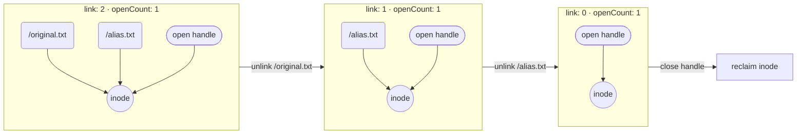
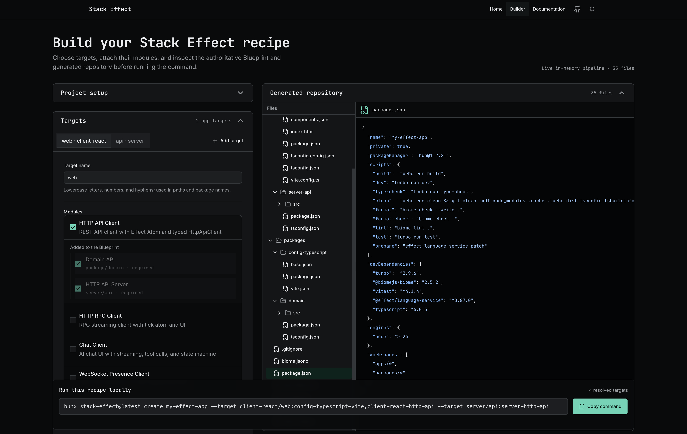
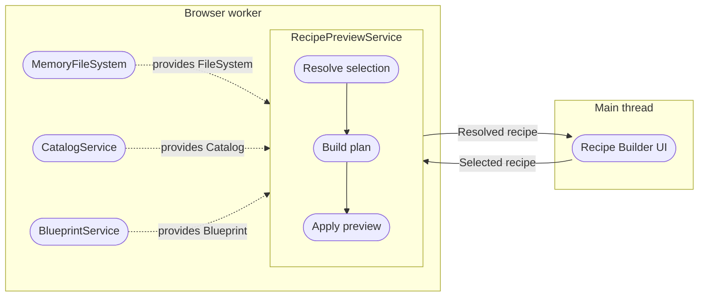
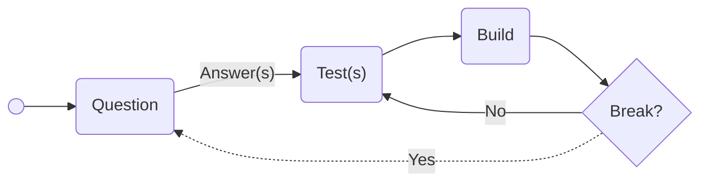

import { createOGImageMetadata } from "@/lib/seo";
import { FigureCard } from "@/components/molecule/plot-figure";
import { Figure1Plot } from "./fig-1";
import { Figure2Plot } from "./fig-2";
import { Figure3Plot } from "./fig-3";

export const metadata = createOGImageMetadata({
  id: "063",
  title: "Human in the loop: Building a filesystem with LLMs",
  description:
    "Exploring how LLMs can accelerate learning and implementation in an unfamiliar systems domain, while human steering ensures correctness and usability.",
  tags: ["effect", "llm", "filesystem", "data-visualization"],
  date: "2026-08-11",
  isFeatured: true,
  repo: "https://github.com/Effect-TS/effect/pull/6573",
});

Like everyone else in the software industry, I've been exploring how best to use LLMs as a tool for building software. This is an incredibly data-rich domain, so alongside experimenting with the tools themselves, I've been trying to understand what they actually cost, where they help, and where I still need to do the hard thinking. This article is one case study in what I expect will become a wider series about how I use LLMs to learn and build.

What started as a feature request quickly sent me down a rabbit hole of learning what inodes and POSIX semantics are, but armed with my AI harness and the new GPT-5.6 models, I was able to build an in-memory implementation of Effect's `FileSystem` service in record time. While LLMs helped me move through an unfamiliar systems domain quickly, this was far from an autonomous process.

## Think contracts, not implementation

One of my favorite parts of Effect is the separation between a service and its implementation. The `FileSystem` types[^1] already described the available operations, and the Node adapter supplied a working interpretation of many edge cases. What was missing was a reusable description of the observed behavior from any implementation.

In PR #6555[^2], I extracted that behavior into a `FileSystemTest.suite`, covering paths, temporary resources, streams and sinks, open modes, cursors, copy and rename, lifecycles, and capability boundaries. The interface describes what callers can ask for; the suite makes a tested profile of those expectations executable; each adapter decides how to satisfy it.

The intended adapter boundary is deliberately small:

```ts
// Node adapter
FileSystemTest.suite("node", NodeFileSystem.layer);

// Memory adapter
FileSystemTest.suite("memory", MemoryFileSystem.layer);
```

One shared test captures a particularly surprising part of that contract:

```ts
it.effect(
  "should keep unlinked contents accessible when a file handle remains open",
  () =>
    Effect.gen(function* () {
      const { fs, path } = yield* makeTestContext;
      const filePath = path("unlinked.txt");

      yield* fs.writeFileString(filePath, "content");
      const file = yield* fs.open(filePath, { flag: "r+" });

      yield* fs.remove(filePath);

      assert.isFalse(yield* fs.exists(filePath));
      assert.strictEqual(
        decoder.decode(yield* readAllocUpTo(file, 7)),
        "content",
      );
      assert.strictEqual((yield* file.stat).size, FileSystem.Size(7));
    }),
);
```

Removing the pathname does not invalidate an already-open handle. A naive implementation would fail here because it does not preserve the identity referenced by the handle. The shared suite[^2] catches observable divergences across the cases it covers while providing evidence for the contract making gaps easy to identify.

## LLMs for learning the model

Thankfully I didn't need to start from scratch. [Fubhy](https://github.com/fubhy), from the Effect team, had already explored the problem space in `effect-smol` PR #456, using inodes and a POSIX-like model.[^3] This gave me the best opening question to the problem: **what the hell is an inode?**

This is where I think LLMs really shine as a learning environment. I used a [Report Builder](https://github.com/lloydrichards/skills/tree/main/skills/report-builder) workflow to turn questions and implementation diffs into documents I could read on the train, at lunch, or after work. It was like building a curriculum on demand.

Despite working with a filesystem every day, I'd never given much thought to how one actually works under the hood. My first instinct was a representation using a nested map from paths to bytes. That sounds reasonable until you remove a path and discover that an already-open handle can still read the file. Names, stored objects, and open references all have different lifetimes.



One of the most useful reports, [_MemoryFileSystem implementation surface_](/labs/063-memory-filesystem/memory-filesystem-implementation-surface.pdf), made the diagram concrete. Directory entries give objects names, inodes hold their identity and contents, and descriptors retain open references with their own cursor and mode. Removing the last name takes `nlink` to zero, but the inode remains alive until `openCount` also reaches zero. That explanation became an implementation rule I could use to challenge the code, not just an interesting filesystem fact. This is a model for the tested POSIX-like profile, not a claim of full POSIX compliance.

## Breaking up the work

Because every session was logged, I could reconstruct the work across five phases:

1. contract
2. implementation
3. explanation
4. audit
5. hardening

The work was divided into bounded slices. Implementation sessions were often alternated with review, explanation, or targeted audits; not every session followed the same loop.

<FigureCard
  title="From contract to hardening"
  description="Sessions are editorially serialized from first to last; width is the count of active five-minute buckets, not elapsed duration or effort. The staircase groups them into five overlapping development phases."
>
  <Figure1Plot
    ariaLabel="Ordered development sessions grouped into five editorial phases"
    minHeight={350}
    minWidth={900}
  />
  <p className="text-xs text-right">Method and data[^6]</p>
</FigureCard>

While working, the process felt more focused on implementation than it looks in retrospect. The sequence repeatedly returns to explanation, audit, and hardening. The chart does not measure labor or elapsed effort, but it does show that “the feature works” was not the endpoint: substantial recorded activity remained after the core implementation sessions.

Once the model was clear, the core lifetime rule was tiny:

```ts
const reclaimInode = (state: State, entry: InodeEntry): State =>
  entry.nlink === 0 && entry.openCount === 0
    ? { ...state, inodes: HashMap.remove(state.inodes, entry.ino) }
    : state;
```

Removing a directory entry decrements `nlink`; closing a descriptor decrements `openCount`. Both transitions pass through this rule.

The invariant looked correct, but hostile reviews found that the transition was not always safe. The original unlink flow could mutate the namespace before obtaining its timestamp. If the fiber was interrupted between those steps, the pathname was gone but the inode had not passed through reclamation, leaving unreachable data behind.

> The hostile review did not change the invariant. It proved that every transition into that invariant had to be interruption-safe.

What I found was that this back and forth between implementation that looked correct, hostile reviews that found a gap, and then a fix that restored the invariant was an important loop that hinged on the test suite.

## Human behind the wheel

Across the 42.5-hours working on this feature, the trace records 223 user turns and 1.82M model output tokens, which was useful information to understand the workflow. The chart below normalizes both series to their final totals to show when recorded steering points and model production accumulated. The numbered dots mark the first recorded turn assigned to each editorial phase.

<FigureCard
  title="Steering cadence versus model production"
  description="Both series are normalized to their final totals. Prominent lines break across gaps of more than 30 minutes, while faint lines preserve the cumulative connection; numbered dots mark each editorial phase entry."
>
  <Figure2Plot
    ariaLabel="Cumulative recorded user turns compared with cumulative model output tokens, annotated with five editorial phase entries"
    minHeight={390}
    minWidth={820}
  />
  <ol className="mt-4 flex gap-x-5 gap-y-2 text-muted-foreground text-xs">
    <li className="flex items-start gap-2">
      <span className="mt-0.5 inline-flex size-4 shrink-0 items-center justify-center rounded-full bg-chart-1 font-semibold text-[10px] text-background">
        1
      </span>
      <span>Contract</span>
    </li>
    <li className="flex items-start gap-2">
      <span className="mt-0.5 inline-flex size-4 shrink-0 items-center justify-center rounded-full bg-chart-2 font-semibold text-[10px] text-background">
        2
      </span>
      <span>Implementation</span>
    </li>
    <li className="flex items-start gap-2">
      <span className="mt-0.5 inline-flex size-4 shrink-0 items-center justify-center rounded-full bg-chart-3 font-semibold text-[10px] text-background">
        3
      </span>
      <span>Explanation</span>
    </li>
    <li className="flex items-start gap-2">
      <span className="mt-0.5 inline-flex size-4 shrink-0 items-center justify-center rounded-full bg-chart-4 font-semibold text-[10px] text-background">
        4
      </span>
      <span>Audit</span>
    </li>
    <li className="flex items-start gap-2">
      <span className="mt-0.5 inline-flex size-4 shrink-0 items-center justify-center rounded-full bg-chart-5 font-semibold text-[10px] text-background">
        5
      </span>
      <span>Hardening</span>
    </li>
  </ol>
  <p className="text-xs text-right">Method and data[^7]</p>
</FigureCard>

What the slopes show is a kind of rhythm across the phases where either I'm asking more questions or the LLM is producing more content and where these converged and diverged. With the logs it is possible to dive deeper into two moments from the logs to show what was actually happening around them.

The first was a short decision about glob support. The agent recommended implementing `*`, `?`, and `**` while deferring character classes, braces, and other Node-specific syntax. My response was only one sentence:

> “We can use a simplified version of glob here with your recommendations, but we should add an inline comment that this is still a work in progress.”

That sentence kept the current scaffolding use case from quietly growing into a second glob library, while the comment and tests recorded the compatibility boundary.

The clearest divergence came during the explain-diff session. Across 23 recorded turns it produced 493k output tokens: the turn series moved from roughly 62% to 74% of its final total while the output series moved from roughly 57% to 85%.

That work went into exploring and representing the implementation rather than adding another filesystem method. The report reached a useful boundary: keep the inode model, but rebuild the resolver and lifecycle rules. The long run produced the material; deciding which recommendation should constrain the implementation was still mine.

One moment was a tiny correction; the other was a long production run. Neither shape proves the work was good or efficient, but together they can show why counting prompts isn't the whole story.

What is missing from this chart is the cognitive load I was under. While the LLM could generate code, I still had to review previous work, read reports, validate test results, and decide what the next session should attempt. Completing this initial lifecycle in just under two days felt highly productive, but I do not think that pace would be sustainable over a longer period.

## Put it to work

The best part of this work was having a real use almost immediately. [Stack Effect](../060-stack-effect-intro/) needed a web-based recipe builder, and I wanted it to run the same planning and apply-preview pipeline as the CLI rather than a simplified browser-only imitation. To do that, the builder needed a filesystem that did not depend on Node and could not write to the user's host disk.

[Stack Effect Builder](https://stack-effect.lloydrichards.dev/builder)

Stack Effect currently keeps its own repository-local adaptation of the PR implementation (PR #6573.[^5]). The upstream feature was still under review, but I wanted to keep building the product, so keeping the implementation local gave me room to integrate and evolve it without pretending I was consuming a finished adapter.



_The recipe builder runs the real planning and apply-preview pipeline in a browser worker, then exposes the generated virtual repository for inspection without writing it to the host filesystem._



The worker resolves the selected recipe, builds a plan, and runs `ApplyPreview` against a fresh virtual `/workspace`. The `MemoryFileSystem` is a provided dependency rather than a processing step. Typed RPC carries the encoded result back to the UI where command execution and applying files to a real repository remain separate paths.

A focused service test makes the boundary observable:

```ts
expect(result.files.map((file) => file.path)).toEqual(["src/index.ts"]);
expect(yield * hostFileSystem.exists("/workspace/src/index.ts")).toBe(false);
```

The generated path appears in the preview result while the host-backed test filesystem remains untouched.

## Learnings

Looking back, the part I would keep is the tight loop between learning and testing. Reports were useful when they changed something I could predict and put into a test. Without that step, I was mostly collecting interesting filesystem facts.

Where I wasted time was letting output stay vague for too long. A polished report was not automatically useful, and neither was a hostile review that only said something looked risky. Next time I would put the exit condition into the brief: give me a prediction, counterexample, test, or decision.

<FigureCard
  title="Where the money went"
  description="Each phase total is split by the model with API costs"
>
  <Figure3Plot
    ariaLabel="Recorded model cost in Swiss francs by development phase and model"
    minHeight={300}
    minWidth={760}
  />
  <p className="text-xs text-right">Method and data[^8]</p>
</FigureCard>

CHF 249.53 is a lot of model usage for one feature. Implementation and explanation account for about 59% of that total, including CHF 76.99 for the largest explanation session alone. My subscription changed what I paid directly, but it did not make that usage economically free.

I still think it was worth it. The adapter went on to power a real Stack Effect workflow, and I moved through a domain that otherwise would have taken far longer to unpack. I am less convinced the pace was sustainable. The model could keep producing, but I still had to read, review, validate, and decide what happened next. I would use the process again, but in shorter loops with stricter exit criteria.

## Conclusion

I started this project asking **what the hell is an inode?** By the end I could reason about why an unlinked file stays alive, spot where interruption could break that rule, and use the resulting adapter in a real browser workflow. That is a pretty good result from one rabbit hole.



The useful pattern was simple: ask questions, turn the answers into tests, build something, and then try to break it. I want to keep exploring where that loop works, where it falls apart, and how it changes the kind of software I can take on. Already at the time of writing, I have newer loops and patterns that feel more efficient, but this needs data to explore.

---

[^1]: **Effect FileSystem.** [Effect's `FileSystem` API reference](https://effect-ts.github.io/effect/platform/FileSystem.ts.html) defines the service operations implemented by platform adapters.

[^2]: **Shared behavioral contract.** [PR #6555](https://github.com/Effect-TS/effect/pull/6555) extracted and strengthened the cross-platform contract. The article references the [shared suite at the point it was extracted](https://github.com/lloydrichards/open_effect/blob/92c7c6625ff/packages/effect/test/FileSystemTest.ts).

[^3]: **Inode model.** [effect-smol PR #456](https://github.com/Effect-TS/effect-smol/pull/456) provided the starting point. The model draws on the Linux [`inode(7)` documentation](https://man7.org/linux/man-pages/man7/inode.7.html) and the POSIX [`link` specification](https://pubs.opengroup.org/onlinepubs/9699919799/functions/link.html).

[^4]: **Corrected transitions.** [`remove` obtains its timestamp before detaching the entry](https://github.com/lloydrichards/open_effect/blob/63d67049ad0/packages/effect/src/internal/memoryFileSystem.ts#L878-L905), and [descriptor close becomes idempotent before applying the same reclamation rule](https://github.com/lloydrichards/open_effect/blob/63d67049ad0/packages/effect/src/internal/memoryFileSystem.ts#L1496-L1522).

[^5]: **Upstream implementation.** [MemoryFileSystem PR #6573](https://github.com/Effect-TS/effect/pull/6573) is the implementation adapted by Stack Effect while the upstream feature remains under review.

[^6]: **Lifecycle analysis.** The analysis covers 22 July 20:23 to 24 July 14:53, Europe/Zurich: a 42.5-hour lifecycle window containing 21 sessions, 4,045 API calls, and 4,897 tool events. “Active minutes” totals 1,135 minutes across five-minute buckets containing recorded API calls; it is not elapsed labor, model latency, or cognitive effort. Phase assignments are editorial, and delegated work can overlap. [Download Figure 1 session data (CSV)](https://github.com/lloydrichards/proj_portfolio-website/blob/main/src/app/labs/%28content%29/063-llm-memory-filesystem/data/fig-1.csv).

[^7]: **Turns and model output.** Figure 2 compares 223 equally weighted recorded user turns with 1,822,569 model output tokens after normalizing each series to its own final total. The trace also contains 19,520,674 direct input tokens, 403,191,552 cache-read tokens, and 729,282 reasoning tokens. Reasoning tokens are reported separately and may overlap output accounting. [Download Figure 2 turn and token data (CSV)](https://github.com/lloydrichards/proj_portfolio-website/blob/main/src/app/labs/%28content%29/063-llm-memory-filesystem/data/fig-2.csv).

[^8]: **Model cost.** Cost uses the fixed CHF/USD exchange rate captured during the original analysis. CHF 249.53 is a recorded model-cost equivalent, not an invoice; implementation and explanation account for 59.39% of it. [Download Figure 3 cost data (CSV)](https://github.com/lloydrichards/proj_portfolio-website/blob/main/src/app/labs/%28content%29/063-llm-memory-filesystem/data/fig-3.csv).
