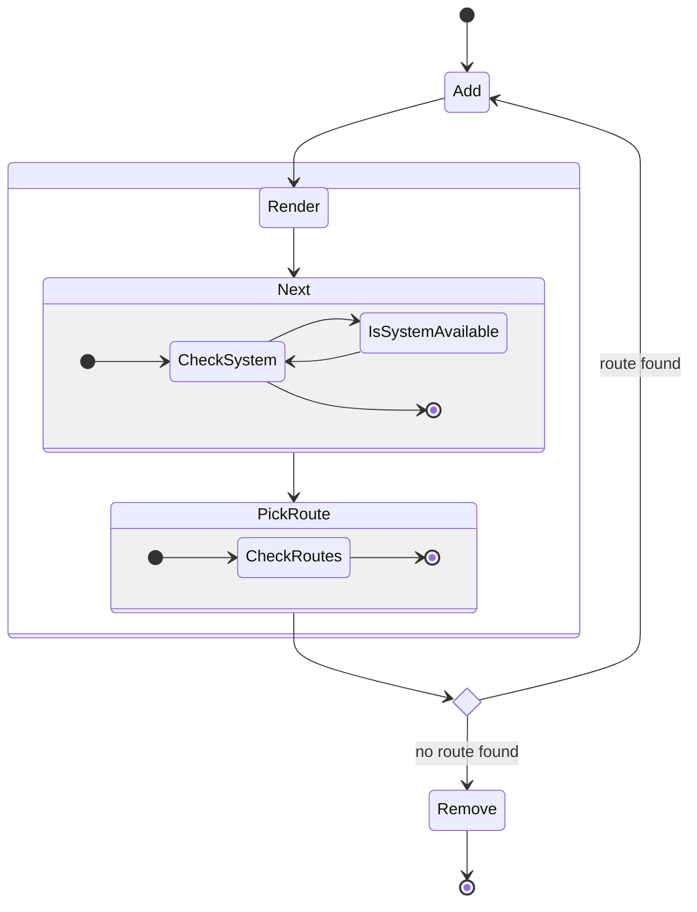

As part of my internship at
[Interactive Things](https://interactivethings.com/), I worked on developing an
interactive data visualization as a final graduation project. I was responsible
for the collecting data, designing and developing the visualization. I initially
started with the idea to explore how recycling in Switzerland works and see what
sorts of data I could find.

While the early design stages of the project followed a similar double-diamond
design process, I'm presenting here the final iteration of ideas and how they
came together.

## Data Collection

The data was collected through several interviews of various stakeholders in
Switzerland's recycling system. Initially this included multiple waste streams
such as glass, paper, and aluminum. However, as the project progressed, I
decided to focus on plastic as it was the most interesting and complex material
to work with. Through research and refinement, I was able to build these flow
charts of how each type of plastic is recycled as the various materials and
products it can be turned into.


There are 6 flow charts in total for the 7 types of recyclable plastics (OTHER
didn't need a flow chart). Depending on the types of facilities available in the
country,greatly effects the materials that possible to be produced and thus
result in more plastic being able to kept in the system

## Visualization

The initial design of the visualization was a combination of all of the flow
charts, showing the complete web of interconnected materials and products that
plastic can be turned into. What was interesting about this visualization was
how certain parts of the flow were so important to continue transforming the
plastics into more usable materials. Without these parts, most plastic was
destined for the landfill.


<div className="mt-2 flex justify-end text-sm">
  See the [Full
  Visualization](/images/projects/2000/lifeofplastic-flowchart.png)
</div>

But this visualization wasn't very interactive and didn't allow for the user to
explore the data in a meaningful way. My plan was to highlight the importance of
each part by showing the web of facilities and products that were connected to
it. This would allow the user to see how important each part was to the
recycling system and how it could be improved.


Grouping linear portions of the flow chart into containers and blocks it wa
possible to abstract the processes into "facilities" with various input and
outputs that could be connected to other facilities. Being able to toggle on and
off these facilities allowed the user to see how the system would be affected if
a certain facility was removed.

## Design

The design of the visualization was built from an isomorphic frameworks that
could be used to create a variety of models. Taking simple line drawings of the
facilities, using iconography for the plastic materials, and a bit of Escher
inspired layouts, the design was able to be both playful and informative.


Each facility would be broken up into the various processes that were connected
by pipes to show the various material streams. At one point there were hundreds
of pipes connecting the various facilities, but this was too complex and was
simplified to show only the most important connections.


All in all, 54 facilities were created to show all the possible processes along
with a collection of pipes, bins, buttons and supporting text features.


## Development

With the design in place, it was time to start building the visualization and
interactions for the web. I chose React and D3 to build the visualization as it
allowed for a lot of flexibility in how the data could be displayed and
interacted with. The data was stored as a series of routes
[nodes](https://github.com/interactivethings/LifeofPlastic/tree/master/components/LifePlastic/Routes)
and
[edges](https://github.com/interactivethings/LifeofPlastic/blob/master/components/LifePlastic/data/RootRoutes.tsx)
that represented the flow of materials and products through the system.

Each edge was able to determine the next material based on a probability taken
from my research:

```typescript
export const RootRoutes: Array<RouteType> = [
  {
    parent: "Brick-ESP",
    require: "PSGrinder",
    possible: ["Regrind-PS", "ESP-Garbage"],
    toWaste: "Missing-PS-Grinder",
    probability: [19, 1], // 95% to Regrind-PS, 5% to ESP-Garbage
  },
];
```

When a Brick of ESP (Expanded Polystyrene) was sent to the PS Grinder, there was
a 95% chance it would be turned into Regrind PS and a 5% chance it would be sent
to the Garbage. While this is never explicitly shown in the visualization, it
was important to have this data to determine the flow of materials and provide
an element of complexity to the system.

Add material is added to the system there is a state machine that determines the
next step in the process. This is done by checking if the system is available
and then checking if there is a route available for the material. If there is no
route available, the material is removed from the system and sent to the
garbage, else the next material is added to the system, and the process
continues.



The whole logic could be contained in around
[140 lines of code](https://github.com/interactivethings/LifeofPlastic/blob/32924a2b8366326522e1ed0bf0e58161e582ac8a/pages/index.tsx#L86-L223)
consisting of 2 states for the materials and systems and 4 for the various UI
states.

The application works by mapping over the `materials` state and for each item
animating the path using `animejs` and using the callback function `nextPath` to
add more material to the `materials` state. This allows for a continuous flow of
materials through the system.

```typescript
const nextPath = (item: MaterialType) => {
  const currentPath = RootRoutes.find((i) => i.parent === item.name);
  if (currentPath) {
    const nextPath = pickPath(currentPath); // Pick the next path based on the probability
    if (nextPath.type != "undefined") {
      for (var x = 0; x < nextPath.amount; x++)
        nextMaterial(setMaterials)(item, nextPath); // Add the next material to the system
    } else {
      addGarbage(setMaterials)(item); // If there is no path, send the material to the garbage
    }
  } else {
    addGarbage(setMaterials)(item); // If there is no current path, send the material to the garbage
  }
};

const nextMaterial =
  (setState: (value: React.SetStateAction<AssemblyLine>) => void) =>
  (parent: MaterialType, nextPath: PathType) => {
    const newId = nanoid();
    if (nextPath.type != "undefined") {
      setState((state) => {
        const modifiedMaterials = state.materials.concat([
          {
            name: nextPath.name,
            delay: Math.floor(Math.random() * 10) * 100,
            id: newId,
            type: nextPath.type,
            plastic: nextPath.plastic,
            version: parent.version,
            path: `#${nextPath.name}`,
            highlight: parent.highlight,
          },
        ]);
        const materials = modifiedMaterials.filter((i) => parent.id != i.id);
        return { ...state, materials };
      });
    }
  };
```

## Conclusion

While the final visualization lost a bit of its original charm with so many
moving parts, it was still a lot of fun to build and explore the complexities of
the recycling system. I learned a lot about the various materials and products
that can be made from plastic and how important it is to keep these materials in
the system. I hope that this visualization can help others understand the
importance of recycling and how they can help to keep plastic out of the
landfill.

The project is open source and can be found on
[GitHub](https://github.com/interactivethings/LifeofPlastic) and the
visualization can be found
[here](https://life-of-plastic.interactivethings.io/).
